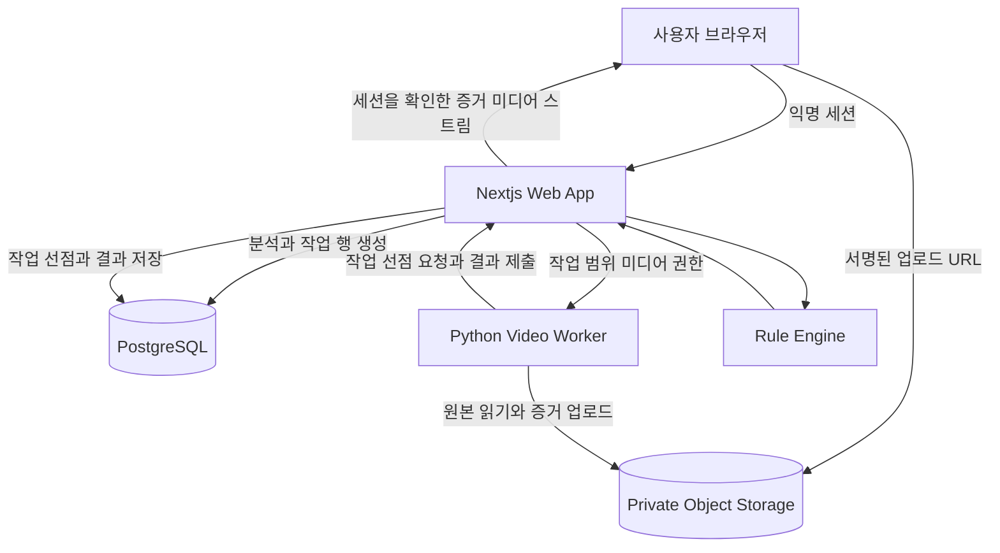

# K리그 규정 기반 영상 판정 분석 시스템

사용자가 분석 권한을 가진 K리그 하이라이트 영상 파일을 업로드하면 전체 영상을 검수해 판정 확인이 필요한 장면을 찾고 해당 시즌의 IFAB 경기규칙과 K리그 대회요강을 근거로 파울과 득점과 VAR 개입 가능성을 설명하는 판정 보조 시스템

> 본 프로젝트의 분석 결과는 KFA와 한국프로축구연맹과 IFAB 또는 심판위원회의 공식 판정이 아님
> 제공된 영상과 공개된 규정에 기반한 기술적 판정 보조 의견이며 오심을 확정하지 않음

---

## 1 문제 정의

축구 팬은 경기 하이라이트에서 파울과 핸드볼과 차징과 득점 취소 장면을 보지만 왜 그런 판정이 나왔는지 확인하기 어려움

하이라이트 영상은 리플레이 중심으로 편집되고 결정적인 정상 속도 장면과 다른 각도가 빠질 수 있음
영상 플랫폼의 iframe과 재생 제한에 의존하면 URL이 유효해도 분석이 중단될 수 있음
규정과 대회요강과 실제 영상 사실을 한 화면에서 대조하는 도구도 부족함

이 프로젝트는 팬이 이해하기 어려운 장면을 찾아 영상 근거와 적용 규정과 확인되지 않은 사실을 함께 제시하는 문제를 해결

## 2 솔루션 개요

사용자가 분석 권한을 확인한 하이라이트 영상 파일을 업로드하면 전체 영상을 비동기로 검수

```text
영상 업로드
→ 실제 미디어 검증
→ 전체 영상 샷 분할과 리플레이 구분
→ 판정 확인 후보 탐지
→ 낮은 신뢰도 후보 포함
→ 핵심 프레임과 짧은 증거 클립 생성
→ 관찰 사실 추출과 사용자 보정
→ IFAB 경기규칙과 K리그 대회요강 대조
→ VAR 범주와 시한과 문턱과 절차 분석
→ 근거와 한계가 포함된 결과 표시
```

판정 결론을 공식 오심으로 확정하지 않음
관측된 사실과 규정이 요구하는 조건과 영상 한계를 분리해 기술적 판정 보조 의견으로 제공

## 3 주요 기능 정의

### 화면 디자인 기준

NHN Cloud형 랜딩 구조를 참고해 짙은 코발트 영웅 영역과 밝은 정보 섹션과 얇은 선형 구분과 빨간 강조색을 사용

- 첫 화면은 짧은 설명과 `영상 분석 시작하기` 한 개의 주 행동만 제공
- 주요 솔루션과 분석 기능과 검토 범위와 판정 근거 순서로 내용을 배치
- 메인과 각 검토 범위의 분석 진입점은 `/analyze` 독립 페이지로 연결
- 업로드 화면은 별도 Client Component로 분리하고 랜딩과 분석 페이지의 서버 영역은 Server Component로 유지
- 업로드 진행률은 120ms 단위로 묶고 막대 폭 대신 `transform`만 변경
- 영상과 증거 영역은 고정된 비율과 최소 높이를 사용해 레이아웃 이동을 줄임
- 브랜드 로고와 메인 영웅 이미지와 검토 범위 이미지는 `web/src/assets`에서 정적 import하고 문구와 버튼은 코드로 렌더링

| 기능 | 설명 |
|---|---|
| 업로드 분석 | 약 30분 하이라이트 전체를 비동기로 처리 |
| 후보 탐지 | 파울과 핸드볼과 차징과 터치와 득점 취소 관련 장면 탐색 |
| 낮은 신뢰도 표시 | 탐지 기준을 통과한 후보는 신뢰도가 낮아도 숨기지 않음 |
| 실제 증거 제시 | 영상에서 추출한 핵심 프레임과 충돌 전후 짧은 클립 표시 |
| 사실 확인과 보정 | 접촉과 강도와 재생속도와 카메라 충분도 확인 및 수정 |
| 규정 대조 | 경기 날짜와 대회에 맞는 IFAB 판본과 K리그 대회요강 적용 |
| VAR 분석 | 검토 범주와 검토 시한과 명백한 오류 문턱과 절차를 별도 표시 |
| 익명 접근 | 로그인 없이 같은 브라우저 세션의 결과만 조회 |
| 자동 만료 | 원본과 증거와 임시 결과를 TTL 정책에 따라 삭제 |

## 4 데이터 및 기술 활용

| 영역 | 활용 기술과 데이터 |
|---|---|
| 웹과 API | Next.js App Router와 TypeScript와 Zod |
| 상태와 관계 데이터 | PostgreSQL과 Drizzle ORM과 명시적 SQL 마이그레이션 |
| 영상 파일 | Private Object Storage와 객체 키와 체크섬과 TTL 메타데이터 |
| 영상 처리 | Python Worker와 FFmpeg와 ffprobe와 OpenCV와 PyTorch |
| 규정 데이터 | IFAB 판본 JSON과 K리그 대회 적용 옵션과 조항 단위 인용 |
| 핵심 저장 모델 | 익명 세션과 업로드와 분석과 Job과 후보와 사실 Revision과 Evidence와 DecisionResult |
| 아키텍처 | Next.js 제어 영역과 Python 영상 Worker를 분리한 모듈형 모놀리스 |
| 일관성 | Analysis와 Job과 IdempotencyRecord를 한 트랜잭션에서 생성 |

영상 바이트는 PostgreSQL에 저장하지 않음
규정 원문 전문도 저장하지 않고 조항과 판본과 출처와 체크섬을 저장

## 5 시나리오

```text
1 경기와 시즌 선택
2 분석 권한 확인
3 하이라이트 파일 업로드
4 파일 형식과 길이와 코덱 검증
5 전체 영상 비동기 분석 시작
6 후보 목록에서 높은 신뢰도와 낮은 신뢰도 장면 확인
7 실제 프레임과 짧은 증거 클립 재생
8 관찰 사실과 관측 재생속도 확인
9 IFAB 조항과 K리그 대회요강과 VAR 게이트 확인
10 규정 적용 결과와 다른 해석과 영상 한계 확인
```

예를 들어 득점이 공격 측 밀기로 취소된 장면은 다음 순서로 표시

- 영상에서 접촉과 강도와 정상 속도 장면 확인 여부 표시
- IFAB Law 12가 요구하는 반칙 강도 조건 표시
- 득점 상황이 VAR 검토 범주에 해당하는지 표시
- 재개 여부와 명백하고 분명한 오류 문턱과 검토 절차 표시
- 강도가 슬로우모션에서만 확인되면 `INCONCLUSIVE`와 사유 표시
- 관측 판정과 규정 적용 결과가 다르더라도 오심 확정 문구는 사용하지 않음

## 6 기대 효과 및 추후 확장성

기대 효과

- 팬이 판정 결과만 보지 않고 영상 근거와 규정 조건을 함께 확인
- 낮은 확신도의 장면도 직접 검토해 모델의 놓친 가능성을 확인
- IFAB와 K리그 대회요강의 차이를 숨기지 않고 적용 근거를 비교
- 사실 추출과 규칙 적용과 공식 발표를 분리해 결과 재현성 확보
- 임시 영상과 증거를 TTL로 관리해 불필요한 미디어 보존 최소화

추후 확장

- `CompleteUpload` API와 업로드 화면 연결
- Object Storage Adapter와 Cleanup Worker 연결
- 핸드볼과 차징과 오프사이드 규칙 유형 확대
- 전체 영상 샷 탐지와 선수와 공 추적 자동화
- PostgreSQL Job Table에서 Redis Queue로 단계적 전환
- k6와 EXPLAIN ANALYZE와 운영 품질 지표 추가
- 공식 사례를 별도 Curated 데이터로 적재해 회귀 검증

---

## 세부 설계 참고

아래부터는 위 기능을 구현하기 위한 규정 데이터와 아키텍처와 데이터 모델과 API와 테스트 설계

---

### 1 프로젝트 목표

**이 프로젝트는 이 판정이 맞았는가보다 이 상황에 적용되는 규정과 영상에서 확인된 사실을 제시함**

IFAB 경기규칙과 K리그 대회요강의 적용 범위가 다르면 어느 한쪽을 임의로 고르지 않고 두 조항과 차이를 함께 표시함 대표 사례는 [3절](#3-규정-데이터-구성)의 2차 경고 퇴장 범주임

핵심 목표는 다음과 같음

- 약 30분 분량의 하이라이트 전체를 검수하고 판정 확인이 필요한 후보 장면을 자동 탐색
- 신뢰도가 낮은 후보도 숨기지 않고 신뢰도와 근거 부족 사유를 함께 표시
- 영상에서 접촉 시점과 접촉 부위와 팔의 사용과 선수 이동 변화 등 관찰 가능한 사실을 추출
- 경기 날짜와 대회를 기준으로 적용 규정 판본 선택
- **그 상황에 걸리는 조항을 계층별로 제시하고 계층 간 차이가 있으면 차이 자체를 노출**
- **각 조항이 요구하는 사실값이 영상에서 어디까지 확인됐는지 표시**
- 올바른 판정과 VAR 개입 가능성을 별도로 분석
- 관측 판정이 그 안에서 어디에 놓이는지 비교 — **결론이 아니라 참고 항목**
- 근거 조항과 반대 해석과 영상 한계를 함께 제시
- 실제 영상에서 추출한 핵심 프레임과 짧은 증거 클립을 설명과 함께 제시
- 사용자가 핵심 프레임과 사실값을 직접 보정할 수 있도록 설계

### 제품 범위

- 누구나 접속 가능한 공개 웹 서비스
- 회원가입과 로그인 없음
- 분석 결과 공유 기능 없음
- 사용자별 장기 분석 이력 없음
- 같은 익명 브라우저 세션에서 보존 기간 동안만 결과 조회 가능
- YouTube URL은 출처 메타데이터로만 선택적으로 입력
- 실제 분석 입력은 사용자가 권한을 확인한 업로드 영상 파일

### 핵심 결정과 선택 이유

| 결정 | 프로젝트 적용 | 선택 이유 |
|---|---|---|
| 업로드 우선 입력 | 사용자가 권한을 확인한 하이라이트 파일을 직접 업로드 | iframe과 원본 플랫폼 재생 제한에 분석 성공 여부가 좌우되지 않게 하기 위함 |
| 전체 영상 비동기 분석 | 약 30분 하이라이트를 작업 큐에서 처리 | HTTP 연결을 오래 유지하지 않고 장면 탐색부터 규정 적용까지 수행하기 위함 |
| 낮은 신뢰도 후보 포함 | 모든 후보에 탐지 신뢰도와 근거 부족 사유 표시 | 모델이 확신하지 못한 장면도 팬이 직접 확인할 수 있게 하기 위함 |
| 실제 증거 미디어 제공 | 충돌 전후 프레임과 짧은 클립을 결과에 표시 | 판정 설명이 어떤 영상 근거에서 나왔는지 사용자가 바로 확인하게 하기 위함 |
| 공식 판정과 분리 | 오심 확정 대신 규정 적용 결과와 다른 해석과 영상 한계를 표시 | 제한된 방송 영상만으로 공식 판정을 단정하지 않기 위함 |
| 로그인 없는 익명 세션 | 회원 기능 없이 같은 브라우저의 분석만 조회 허용 | 분석 흐름에 집중하면서 다른 사용자의 결과 접근은 차단하기 위함 |
| Nextjs와 Python Worker | Web과 규칙 적용은 TypeScript로 구성하고 영상 연산은 Python으로 분리 | 화면 개발과 영상 분석 생태계의 장점을 각각 사용하기 위함 |
| PostgreSQL과 Object Storage | 상태와 판정 데이터는 PostgreSQL에 저장하고 미디어 파일은 Object Storage에 저장 | 트랜잭션 데이터와 대용량 파일의 저장 방식과 삭제 정책이 다르기 때문 |

---

### 2 핵심 원칙

```text
영상 분석 모듈
→ 장면에서 확인 가능한 사실 추출

규칙 엔진
→ 추출된 사실과 적용 규정 대조

설명 모듈
→ 판정 근거 · 다른 해석 · 분석 한계 제공
```

영상 모델이 직접 파울 여부를 결정하지 않음

판정은 규칙 엔진이 수행하며 영상 모델은 아래와 같은 사실 데이터만 생성함

```json
{
  "contact_type": "PUSHING",
  "fact_schema_version": 2,
  "contact_detected": { "value": true, "observed_at_speed": "NORMAL", "shot_ids": ["s3"] },
  "contact_frame": { "value": 327, "observed_at_speed": "SLOW", "shot_ids": ["s4"] },
  "actor_body_part": { "value": "right_forearm", "observed_at_speed": "SLOW", "shot_ids": ["s4"] },
  "opponent_body_part": { "value": "upper_body", "observed_at_speed": "SLOW", "shot_ids": ["s4"] },
  "arm_extension": { "value": true, "observed_at_speed": "SLOW", "shot_ids": ["s4"] },
  "severity": { "value": "RECKLESS", "observed_at_speed": "NORMAL", "shot_ids": ["s3"] },
  "opponent_displacement": { "value": "clear", "observed_at_speed": "NORMAL", "shot_ids": ["s3"] },
  "before_goal": { "value": true, "observed_at_speed": "NORMAL", "shot_ids": ["s3"] },
  "inside_penalty_area": { "value": false, "observed_at_speed": "SLOW", "shot_ids": ["s5"] },
  "camera_sufficiency": "medium"
}
```

`arm_extension`처럼 규정 요건이 아닌 값도 관찰 사실로는 수집함
다만 이런 값이 판정 조건으로 직접 쓰이지는 않음 판단 요건은 규칙 엔진 쪽에만 존재함

### 사실값에는 관측 조건이 함께 붙음

값만으로는 부족함 **어느 컷에서 어느 재생속도로 봤는지**가 판정 가능 여부를 바꾸기 때문임

```text
IFAB VAR 프로토콜 (2025/26 · 2026/27 동일 문구)

"The VAR can 'check' the footage in normal speed and/or in slow motion
 but, in general, slow-motion replays should only be used for facts,
 e.g. position of offence/player, point of contact for physical
 offences and handball, ball out of play (including goal/no goal);
 normal speed should be used for the 'intensity' of an offence or to
 decide if it was a handball offence"
```

| 슬로우모션 관측으로 충분 | 정상 속도 관측이 필요 |
|---|---|
| 반칙·선수 위치 | **반칙의 강도 (`severity`)** |
| 접촉 지점 (`contact_frame` `*_body_part`) | **핸드볼 성립 여부** |
| 볼 아웃 득점·노득점 | |

하이라이트는 슬로우모션 리플레이 비중이 높지만 IFAB VAR 프로토콜은 반칙 강도와 핸드볼 판단에 정상 속도 사용을 요구함 따라서 정상 속도 컷이 없으면 `severity`와 핸드볼 판정을 `INCONCLUSIVE`로 처리함

프로토콜의 `should`보다 엄격한 하드 게이트를 적용해 제한된 영상으로 단정적인 판정을 내리지 않게 함

두 개의 게이트가 있음

- `camera_sufficiency` — **각도**의 게이트
- `observed_at_speed` — **속도**의 게이트

둘 다 표시용 정보가 아니라 **판정을 막는 게이트**임 [11절](#11-규칙-엔진-설계) 참고

### 심판 개인은 이 시스템의 대상이 아님

**심판 개인 식별 정보는 어떤 형태로도 저장하거나 표시하지 않음**
보도에 실명이 있어도 저장하지 않음 심판 개인에 대한 명예훼손 위험을 줄이고 분석 범위를 판정 구조에 한정하기 위함

이 규칙이 적용되는 곳은 다음과 같음

| 대상 | 규칙 |
|---|---|
| `official_verdicts.quote` | 발표문에 이름이 있으면 제거하고 저장함 (8절) |
| 현장 설명 인용 | 발화자를 특정하지 않음 |
| 라벨 사례 레코드 | 심판·심판진 식별자를 넣지 않음 (13절) |
| `fact_signature` | 경기·심판 식별자를 포함하지 않음 — 구현할 `var-20`이 검사 |
| 결과 문구 | 판정 자체만 다루고 개인을 지목하지 않음 (16절) |

선수명은 사건 식별에 필요한 경우 유지하되 판정 대상이 아닌 플레이 당사자 정보로만 사용함 합성 픽스처에는 사람 식별 정보를 넣지 않음

---

### 3 규정 데이터 구성

규정 자료는 `rules/` 아래에 발행 주체별로 보관하며 항목마다 확보 상태를 함께 표기함

### IFAB 경기규칙

파울 핸드볼 득점 징계 재개 방식 VAR 개입 범위의 기준임

```text
rules/ifab/
├── 2024-25/   확보 (원문 PDF, 230p)
├── 2025-26/   확보 (원문 PDF, 230p)
└── 2026-27/   확보 (원문 PDF, 260p)
```

**판본 간 차이는 문구 수정에 그치지 않음** 2026/27 개정에서 VAR 검토 범주가 4개에서 5개로 늘었음

```text
2025/26                                      2026/27
a. Goal/no goal                              a. Goal/no goal
b. Penalty kick/no penalty kick              b. Penalty kick/no penalty kick
c. Direct red cards                          c. Red cards          ← 범주명 변경
   (not second yellow card/caution)             └ • clearly incorrect second caution  ← 불릿 신규
d. Mistaken identity                         d. Mistaken identity
                                             e. Clearly incorrectly awarded    ← 범주 신규
                                                corner kick ... (competition option)

개정 표기 원문: "only in relation to four five categories"
                 (four 삭제선 · five 삽입)
```

**두 개의 서로 다른 변경이 한 번에 일어났음**

| | 무엇이 | 층위 |
|---|---|---|
| 2차 경고 | `c` 범주 **안의 불릿** 추가 + 범주명에서 제외 문구 삭제 | 범주 내부 |
| 코너킥 | `e` **범주 자체**가 신설 | 범주 목록 |

4→5를 만든 건 코너킥임 2차 경고는 범주 수를 늘리지 않았음
둘을 같은 층위로 취급하면 범주 목록을 한 칸 잘못 세게 됨

그리고 `e`에는 **`competition option`**이 붙어 있음
IFAB이 열어둔 선택지일 뿐이고 실제 적용 여부는 대회가 정함
따라서 2026/27을 적용하더라도 **K리그가 코너킥 범주를 채택했는지는 대회요강에서 따로 확인해야 함**
바로 아래 3계층 권위 구조가 필요한 이유가 이것임 — IFAB이 "할 수 있다"고 한 것을 대회가 "한다"고 해야 성립함

효과는 두 갈래임

- 2025/26까지 **2차 경고 퇴장은 검토 대상이 아니었으나 2026/27부터 검토 대상임**
- 코너킥 오심은 2026/27 + **채택한 대회**에서만 검토 대상임

판본을 하드코딩했다면 이 개정을 놓친 채 "검토 대상 아님"을 계속 출력했을 항목임
규칙을 데이터로 두는 이유가 이 한 건에 다 들어 있음

### KFA 한국어 대조판

IFAB 영문 원문과 공식 한국어 표현을 연결하는 **준거 문서**임

```text
rules/kfa/
└── 2025-26/   미확보
```

용어 번역이 판정 설명 문구의 신뢰도를 좌우하므로 1단계 착수 전에 확보함
확보 전까지는 `plain_korean`만 채우고 `official_korean`은 비워 둔 채 `review_status`로 구분함

참고 자료가 아니라 준거 문서로 두는 이유는 대회요강이 IFAB 원문을 한국어로 옮기면서
**범위가 달라진 표현**을 쓰기 때문임 아래 대회요강 항목과 규정 판본 매핑을 참고함

### K리그 대회요강

K리그에서 적용되는 운영 절차와 VAR 운영 규정을 확인하는 자료임

```text
rules/kleague/
├── 2025/
│   ├── kleague1/   확보 (HTML + PDF)
│   └── kleague2/   확보 (HTML + PDF)
└── 2026/
    ├── kleague1/   확보 (HTML + PDF)
    └── kleague2/   확보 (HTML + PDF)
```

각 폴더에는 HTML과 PDF 스냅샷을 함께 보관하고 출처와 취득 시점을 `metadata.json`에 기록함

```text
competition-regulations.html   확보 (보존용 · 파싱 소스 아님)
competition-regulations.pdf    확보 (파싱 소스)
metadata.json                  미작성
```

**파싱 소스는 PDF임** HTML은 보존용으로만 둠 원문 확인 결과:

- HTML 파일에 서로 다른 대회요강 2~3개가 한 페이지에 병합되어 있고 그 결과 **`제24조`가 파일 안에 여러 번 등장**함 조 번호로 조회하면 어느 대회의 조항인지 특정할 수 없음
- `kleague1`과 `kleague2` HTML은 파일별로 다르므로 각 파일의 출처와 체크섬을 별도로 기록
- 같은 연도의 PDF는 리그별로 정상 분리되어 있고 조 번호도 유일함

### 계층 간 표현 차이

동일 사안을 IFAB 원문과 대회요강이 다르게 적고 있음 번역 뉘앙스가 아니라 **적용 범위가 달라지는 차이**임

| 항목 | IFAB 2025/26 | K리그 대회요강 제25조 |
|---|---|---|
| 범주 수 | 4개 (2026/27부터 5개) | "4가지 상황" |
| 퇴장 | `Direct red cards (not second yellow card/caution)` | "퇴장 상황" — **2차 경고 제외 단서 없음** |
| 선수 확인 오류 | `Mistaken identity` | "징계조치 오류" — 더 넓게 읽힐 수 있음 |

어느 쪽을 적용할지는 판정마다 달라지므로 **`rules` 테이블에 `authority`를 두고 계층별로 따로 저장함**
차이가 있는 조항은 양쪽을 모두 인용하고 충돌 사실 자체를 결과 화면에 노출함

### 규정 판본 매핑

**조회 키는 `(competition, match_date)`이며 현재 확인된 값은 시즌당 단일 판본임**

IFAB 경기규칙은 매년 7월 1일에 발효하고 K리그 시즌은 2~3월에 개막함 IFAB은 발효일에 이미 진행 중인 대회가 다음 시즌까지 적용을 미룰 수 있도록 허용하며 **대회요강 확인 결과 K리그는 시즌 개막 시점 판본을 그 시즌 내내 쓰는 것으로 읽힘**

```text
competition  season  effective_from  effective_to  ifab_edition  verification
kleague1     2025    2025 개막        2025 종료      2024-25       INFERRED
kleague2     2025    2025 개막        2025 종료      2024-25       INFERRED
kleague1     2026    2026 개막        2026 종료      2025-26       INFERRED
kleague2     2026    2026 개막        2026 종료      2025-26       INFERRED
```

`verification`을 `CONFIRMED`가 아니라 `INFERRED`로 두는 이유는 근거가 간접적이기 때문임

**직접 근거 — 다만 조 한정 적용**

```text
2025 대회요강 제35조(뇌진탕 교체) 9항
  "본조에 명시되지 않은 사항은 '2024/25 IFAB 경기규칙서'의 내용에 따른다"

2026 대회요강 제36조(뇌진탕 교체) 7항
  "본조에 명시되지 않은 사항은 '2025/26 IFAB 경기규칙서'의 내용에 따른다"
```

판본을 명시한 유일한 조항인데 **`본조` 즉 뇌진탕 교체 조에 한정**되어 있음 대회요강 전체의 판본 지정이 아님

**전체 준거 조항은 판본을 특정하지 않음**

```text
제24조 (경기규칙)
  2025 "본 대회의 경기는 FIFA 및 KFA의 경기규칙에 따라 실시되며..."
  2026 "본 대회의 경기는 FIFA의 경기규칙에 따라 실시되며..."
```

2026년에 `및 KFA`가 빠졌음 부칙의 준용 순서도 리그별로 다름 — 2026 K리그1은 `K리그 규정 · KFA규정 · FIFA규정` K리그2는 `K리그 규정 · FIFA 규정`으로 **KFA가 빠져 있음** 계층 구조가 연도와 리그에 따라 움직임

**보강 근거**

2026 대회요강 제25조는 VAR을 "**4가지 상황**"으로 적음 IFAB 2026/27은 5개임 개수가 2025/26과 일치하므로 2026 시즌이 2025/26 판본 위에 있다는 쪽을 뒷받침함

**그래서 이렇게 다룸**

- 조회 키는 `match_date`로 유지함 시즌 중 전환이 확인되면 데이터 행만 추가하면 되고 스키마를 바꾸지 않음
- 현재 데이터는 시즌당 1행임 근거가 간접적이라는 사실을 `verification_status`에 남김
- 7월 1일 이후 경기 결과에는 `applied_rule_version_id`와 `verification_status`와 선택 근거를 함께 표시

### 원문 파일 관리

규정 원문은 PDF만 74MB이며 대회요강 HTML도 포함됨
현재 작업공간의 원문은 로컬 조사 자료로 사용
공개할 저장소에는 저작권과 재배포 범위를 고려해 원문을 포함하지 않을 계획

- Git을 다시 활성화하기 전에 비활성 Git 기록의 원문 추적 여부를 확인하고 처리 방식을 결정
- 공개 저장소 생성 전에 `rules` 아래 PDF와 HTML을 차단하는 `.gitignore` 작성
- 버전 관리 대상은 조항 단위 파싱 결과와 원문 체크섬과 출처 metadata
- 원문이 필요한 개발자는 발행처에서 직접 내려받고 체크섬으로 판본 확인
- 규정 검색 API는 조항 단위 인용과 출처만 반환하고 원문 전문을 서빙하지 않음
- Git LFS는 용량 문제만 해결하고 재배포 문제는 해결하지 못하므로 사용하지 않음

---

### 4 시스템 아키텍처

### 설계 목표

- 약 30분 분량의 영상을 HTTP 연결과 분리해 비동기로 분석
- 낮은 신뢰도의 후보 장면까지 누락 없이 결과에 포함
- 영상 관찰과 규정 적용과 설명 생성을 서로 독립적으로 교체 가능하게 구성
- 규정 판본과 모델 버전과 사실값과 증거 자료를 함께 고정해 결과를 재현
- 공개 익명 서비스의 업로드 남용과 작업 중복과 결과 무단 조회를 차단
- 증상만 가리는 예외 분기보다 잘못된 상태가 만들어지는 원인을 경계와 불변식에서 제거

### 실행 구조

**공개 익명 웹 기반 비동기 배치 미디어 분석 시스템**

제어 영역은 Nextjs와 TypeScript 기반 모듈형 모놀리스로 구성
영상 연산 영역은 Python Worker로 분리
PostgreSQL은 분석 상태와 사실 Revision과 판정 결과를 저장
Object Storage는 비공개 영상과 증거 미디어의 바이트 저장소
작업 큐는 비동기 실행과 재시도 경계



### 코드 계층과 의존 방향

Nextjs Route Handler는 Application Use Case만 호출
Application Use Case는 Domain과 입출력 포트만 사용
PostgreSQL과 Queue와 Object Storage 구현은 Adapter에서 포트를 구현
Rule Engine은 Nextjs와 ORM 없이 단독 테스트 가능하게 구성

이 방향을 선택한 이유는 규정 변경과 영상 모델 변경과 저장 기술 변경을 서로 분리하기 위함

```text
1 Entities
  ProcessingJob
  IncidentCandidate
  ObservedFact
  RuleVersion
  DecisionResult
  EvidenceReference

2 Use Cases
  CreateUpload
  SubmitAnalysis
  ClaimProcessingJob
  ReportWorkerProgress
  RecordObservedFacts
  EvaluateIncident
  CompleteAnalysis
  ExpireAnalysis
  IngestWorkerResult

3 Interface Adapters
  Route Handler
  Server Action
  Presenter
  Repository 구현체
  Processing Job Adapter
  Object Storage Adapter
  Worker Result Ingest Adapter

4 Frameworks and Drivers
  Nextjs
  TypeScript
  PostgreSQL
  Drizzle ORM
  Redis
  Python
  FFmpeg
  OpenCV
  PyTorch
```

React Component와 Route Handler는 엔티티와 규칙을 직접 만들지 않음
Route Handler는 입력 검증과 유스케이스 호출과 응답 변환만 담당
ORM 모델을 도메인 엔티티로 사용하지 않음
도메인 객체가 HTTP Request와 ORM Client와 환경 변수를 참조하지 않음

### 모듈 배치

```text
web
  Frameworks and Drivers
  화면과 HTTP 진입점과 조립 지점

web/src/application
  유스케이스와 입력 포트와 출력 포트

web/src/adapters
  PostgreSQL Processing Job과 Object Storage와 Worker 포트 구현

web/src/rules/engine
  결정론적 규칙 인터프리터

web/src/rules/data
  판본별 규칙과 대회별 적용 옵션

web/src/shared
  공통 상태값과 결과 타입

web/src/config
  업로드 제한과 TTL과 Queue 상한의 버전 정책

workers/video
  Python 영상 파이프라인과 사실값 추출
```

도메인 로직은 `web/src/application`과 `web/src/rules/engine` 안에 유지
Nextjs 전용 코드는 `web` 밖으로 전파하지 않음
Python Worker와의 계약은 버전이 있는 JSON Schema 또는 OpenAPI로 고정

### Worker 통신 경계

Python Video Worker와 TypeScript Cleanup Worker에는 PostgreSQL 접속 정보를 제공하지 않음
모든 도메인 조회와 상태 변경과 결과 저장은 `Next.js` 내부 Worker API만 사용
Python Video Worker는 `VALIDATE_VIDEO`와 `ANALYZE_VIDEO`만 선점
TypeScript Cleanup Worker는 `DELETE_VIDEO_ASSET`과 `PURGE_ANALYSIS`만 선점

1 Worker가 `POST /internal/jobs/claim`으로 작업을 요청
2 `Next.js`의 `ClaimProcessingJob` 유스케이스가 PostgreSQL에서 `FOR UPDATE SKIP LOCKED`로 한 작업을 선점
3 응답에 `job_id`와 `job_revision`과 Lease Token과 입력 영상용 단기 읽기 권한과 증거 업로드용 제한 권한 포함
4 Worker가 `POST /internal/jobs/{jobId}/progress`로 Lease를 갱신하고 현재 Analysis 단계를 보고
5 Worker가 영상을 처리하고 증거 프레임과 클립을 작업 전용 Object Key 범위에 업로드
6 Worker가 `POST /internal/worker-results`로 작업 유형에 맞는 결과 제출
7 `IngestWorkerResult` 유스케이스가 계약 버전과 작업 Revision과 Lease Token과 TTL을 검사한 뒤 도메인 테이블을 한 트랜잭션으로 저장

`VALIDATE_VIDEO` 결과에는 실제 형식과 코덱과 길이와 해상도와 FPS와 트랙 수와 검증 오류 포함
`ANALYZE_VIDEO` 결과에는 Shot과 재생속도와 후보와 사실값과 증거 메타데이터 포함
`DELETE_VIDEO_ASSET` 결과에는 원본 객체 삭제 확인 포함
`PURGE_ANALYSIS` 결과에는 증거 객체 삭제 확인과 임시 DB 행 삭제 대상 포함
실패 결과에는 `failure_code`와 `retryable`을 포함하고 Lease 만료는 같은 작업의 새 시도로 재선점

내부 API는 브라우저의 익명 세션 쿠키를 받지 않고 배포 환경의 서비스 자격 증명과 요청 서명을 검사
Worker 권한은 할당된 영상 읽기와 지정된 증거 Object Key 쓰기로 제한하며 Bucket 목록 권한은 부여하지 않음
이 구조를 택한 이유는 영상 도구가 바뀌어도 상태 전이와 소유권과 결과 저장 규칙을 Nextjs Application 계층 한곳에서 유지하기 위함

### 선택한 아키텍처와 이유

| 선택 | 프로젝트 적용 | 선택 이유 |
|---|---|---|
| 모듈형 모놀리스 | Nextjs 제어 영역을 하나의 배포 단위로 구성 | 초기 규모에서 모듈 간 트랜잭션과 배포를 단순하게 유지하기 위함 |
| Python Worker 분리 | FFmpeg와 OpenCV와 PyTorch 작업만 별도 프로세스로 실행 | 무거운 영상 연산이 Web 요청 처리와 자원을 경쟁하지 않게 하기 위함 |
| 선택적 헥사고날 경계 | PostgreSQL Job Table과 Storage와 Worker 연결부에 포트와 어댑터 적용 | 외부 기술을 바꿀 때 유스케이스와 규칙 엔진을 수정하지 않기 위함 |
| 선택적 DDD | Rule Knowledge와 Adjudication과 Evidence Revision에 Aggregate와 값 객체 적용 | 규정 판본과 사실 Revision과 판정 용어의 불변식을 한곳에서 관리하기 위함 |
| CQRS lite | 분석 결과 조회용 View Model만 쓰기 모델과 분리 | 후보와 증거와 규정 인용을 빠르게 조립하면서 별도 읽기 DB 운영은 피하기 위함 |
| 명시적 Dependency Injection | 생성자와 함수 인자로 Repository와 Storage와 Queue 포트 전달 | 테스트에서 외부 구현을 쉽게 교체하고 런타임 Container 의존을 피하기 위함 |
| 작은 Repository | Analysis와 RuleVersion처럼 Aggregate 단위 인터페이스만 정의 | 유스케이스에 필요한 조회 의도를 드러내고 Generic CRUD 계층을 피하기 위함 |
| ORM 트랜잭션 | Drizzle의 트랜잭션 함수를 Unit of Work로 사용 | 별도 Unit of Work 계층을 만들지 않고 실제 커밋 범위를 코드에 드러내기 위함 |

### 적용할 패턴과 이유

Java Runtime은 사용하지 않음
아래 패턴은 TypeScript와 Python 코드에 적용

| 패턴 | 적용 위치 | 목적 |
|---|---|---|
| Strategy | 밀기와 핸드볼과 차징과 오프사이드 평가기 | 사건 유형 확장 시 기존 평가기 변경 방지 |
| Factory | 경기 날짜와 대회에 맞는 RuleSet 생성 | 판본 선택 로직의 단일화 |
| Adapter | DB와 Processing Job과 Storage와 Python Worker | 외부 기술 세부사항 격리 |
| Repository | Analysis와 RuleVersion Aggregate | 도메인 의도가 드러나는 조회와 저장 |
| State Machine | ProcessingJob과 Analysis 상태 전이 | 불가능한 전이와 중복 실행 차단 |
| Interpreter | 데이터 기반 규칙 실행 | 규정 개정을 조건문 증식 없이 반영 |
| Specification | 규정 요건과 영상 사실값 대조 | 조건 조합의 재사용과 테스트 용이성 확보 |
| Pipeline | Python 영상 처리 단계 | 샷 분할과 탐지와 추적과 사실 추출의 순서 보장 |
| Outbox | Redis Queue로 전환한 뒤 DB 작업과 Queue 발행 연결 | DB 커밋 뒤 Queue 발행이 누락되는 상황을 막기 위함 |

교체 가능성이 크거나 복잡한 상태 규칙을 지켜야 하는 경계에만 패턴을 적용하고 나머지는 함수와 값 객체로 구현

### 코드 작성 기준

| 기준 | 프로젝트 적용 |
|---|---|
| 낮은 결합도와 높은 응집도 | 영상 처리와 규칙 적용과 저장 처리를 서로 다른 모듈로 분리 |
| 모듈 제어 영역과 영향 영역 일치 | Python Worker는 사실값과 증거만 만들고 판정 결과를 직접 수정하지 않음 |
| 복잡도와 중복 감소 | 공통 상태값과 Worker 계약과 업로드 정책을 각각 한 패키지에서 관리 |
| 예측 가능한 기능 | Analysis 상태 전이와 Rule Engine 결과를 명시적 타입으로 제한 |
| 이해 가능한 모듈 크기 | Use Case 하나가 분석 요청과 작업 선점과 판정 저장 중 한 흐름만 담당 |
| 하나의 공개 진입점과 결과 계약 | 모듈마다 Application Port와 반환 타입을 하나의 공개 API로 제공 |
| 인덱스와 기능 코드의 영향 차단 | 숫자 코드와 배열 위치 대신 이름이 있는 타입과 ID 사용 |
| 계층 관계 확인 | 금지 import를 ESLint 또는 dependency cruiser로 CI에서 검사 |

| 클래스 원칙 | 프로젝트 적용 |
|---|---|
| SRP | 업로드 검증과 작업 생성과 규칙 평가와 증거 생성의 변경 이유를 분리 |
| OCP | 새 사건 유형은 Strategy를 추가하고 새 저장 기술은 Adapter를 추가 |
| LSP | PostgreSQL과 테스트 Repository가 같은 성공과 실패와 트랜잭션 계약을 제공 |
| DIP | Use Case가 Drizzle과 Object Storage SDK가 아닌 Repository와 Storage Port에 의존 |

### PostgreSQL 트랜잭션 적용

ACID는 PostgreSQL 안에서 함께 바뀌어야 하는 데이터에만 적용
Object Storage와 Queue를 DB 트랜잭션에 포함할 수 있다고 가정하지 않음
MVP는 PostgreSQL Job Table과 멱등성 키와 보상 정리 작업으로 외부 부작용을 연결
Redis Queue로 전환할 때 Outbox Relay 추가

| 트랜잭션 | 같은 트랜잭션에서 보장할 것 |
|---|---|
| 익명 세션 생성 | 세션 해시와 만료 시각 생성 |
| 업로드 완료 | VideoAsset의 `UPLOADING` 상태 확인과 `VALIDATE_VIDEO` ProcessingJob 생성 |
| 분석 제출 | 업로드 검증 완료 확인과 Analysis와 `ANALYZE_VIDEO` ProcessingJob과 IdempotencyRecord 생성 |
| 작업 선점 | `QUEUED`에서 `PROCESSING` 전이와 실행 시도 번호 증가 |
| 사실값 확정 | 사실 스냅샷과 스키마 버전과 모델 버전 저장 |
| 판정 생성 | 불변 DecisionResult와 규정 판본과 인용 스냅샷 저장 |
| 분석 완료 | 모든 필수 산출물 존재 확인과 `COMPLETED` 전이 |
| 만료 시작 | `EXPIRED` 전이와 미디어 삭제 Job 생성 |

#### 원자성

상태 변경과 ProcessingJob 생성을 같은 트랜잭션에 기록
판정 결과는 인용과 규정 판본과 엔진 버전이 모두 있을 때만 저장

#### 일관성

허용된 상태 전이만 조건부 UPDATE로 수행
모든 DecisionResult는 최소 한 개의 규정 인용을 가져야 함
EvidenceReference는 같은 분석에 속한 IncidentCandidate만 참조

#### 격리성

동일 작업을 여러 Worker가 동시에 선점하지 못하도록 원자적 선점 사용
사실값 수정과 판정 실행이 경합하면 사실 버전 또는 낙관적 잠금으로 오래된 입력의 결과 저장 차단

#### 지속성

완료 응답은 PostgreSQL 커밋과 필수 증거 미디어 업로드 확인 뒤에만 반환
Worker가 중단되어도 재시도 가능한 체크포인트와 시도 이력을 보존

### 재시도와 실패 복구

- 분석 제출은 익명 세션과 요청 키의 유일 제약과 요청 본문 해시로 중복 생성 차단
- 같은 요청 키와 같은 본문은 기존 `analysis_id` 반환
- 같은 요청 키와 다른 본문은 `409 IDEMPOTENCY_KEY_REUSED` 반환
- Worker 작업은 `analysis_id`와 `attempt`를 기준으로 중복 실행을 감지
- Evidence Object Key는 결정적으로 생성해 재시도가 중복 파일을 만들지 않게 함
- 완료된 판정 결과는 덮어쓰지 않고 새 Revision으로 생성
- Object Storage 업로드 후 DB 커밋 실패 시 고아 객체 정리 작업 수행
- DB 만료 후 Object Storage 삭제 실패 시 삭제 Job을 재시도
- 알 수 없는 규정 판본과 대회 옵션은 기본값으로 추측하지 않고 명시적 실패로 처리

### 데이터 저장 위치와 선택 이유

| 데이터 | 저장 위치 | 변경 경로 | 선택 이유 |
|---|---|---|---|
| 공통 상태값과 결과 타입 | `web/src/shared` | 검토된 코드 변경과 계약 테스트 | Nextjs와 Rule Engine과 Python 계약의 값 이름을 일치시키기 위함 |
| 판본별 규칙과 K리그 채택 옵션 | `web/src/rules/data` | 규정 적재 CLI와 검토된 데이터 변경 | 시즌 변경을 판정 코드의 조건문 추가 없이 처리하기 위함 |
| 업로드 제한과 보존 기간과 Queue 상한 | `web/src/config` | 정책 버전 변경과 배포 | Web과 Worker가 같은 제한값을 사용하게 하기 위함 |
| 분석 상태 | PostgreSQL `analyses.status` | Analysis State Machine을 호출하는 유스케이스 | 재시작과 중복 Worker 상황에서도 현재 단계를 복구하기 위함 |
| 현재 사실 Revision | PostgreSQL `incident_candidates.current_fact_revision_id` | 사실값 보정과 Worker 결과 수신 유스케이스 | 과거 Revision을 보존하면서 현재 적용 대상을 한 값으로 선택하기 위함 |
| 판정 결과와 적용 규정 버전 | PostgreSQL 불변 행 | `EvaluateIncident` 유스케이스 | 과거 분석 결과를 같은 입력과 버전으로 재현하기 위함 |
| 익명 세션 토큰 해시와 만료 시각 | PostgreSQL | 익명 세션 생성과 폐기 유스케이스 | 다른 브라우저의 결과 접근을 차단하기 위함 |
| 원본 영상과 증거 프레임과 클립 | Private Object Storage | 업로드 Adapter와 Worker와 Cleanup Worker | 대용량 파일을 DB와 분리하고 TTL 삭제를 적용하기 위함 |
| 미디어 Object Key와 체크섬과 TTL | PostgreSQL | 업로드 완료와 Worker 결과 수신과 Cleanup 유스케이스 | 저장소 객체의 소유 분석과 삭제 시점을 추적하기 위함 |
| 요청 제한 카운터 | Redis 또는 Edge Rate Limiter | Rate Limit Adapter | 공개 서비스의 반복 업로드를 빠르게 차단하기 위함 |

### 장애 수정 방식

버그 수정은 재현 가능한 실패 테스트와 원인 설명과 불변식 보강을 포함해야 함
예외를 삼키거나 특정 ID와 인덱스와 상태값에 분기를 추가하는 방식으로 증상만 가리지 않음

수정 전 확인 항목

- 잘못된 상태가 처음 생성된 경계
- 같은 원인이 다른 사건 유형과 재시도 경로에 미치는 영향
- 트랜잭션과 큐와 Object Storage 사이의 부분 실패
- 중복 요청과 순서 역전과 지연 응답
- 규정 판본과 모델 버전 변경에 따른 과거 결과 재현
- 낮은 신뢰도와 근거 부족과 처리 실패의 구분
- TTL 만료 도중 조회와 재생과 재시도가 겹치는 경우
- 브라우저 세션 소실과 다른 세션의 결과 ID 추측

완료 기준은 정상 경로 동작만이 아님
회귀 테스트와 상태 전이 테스트와 계약 테스트와 장애 주입 테스트에서 사이드 이펙트와 엣지케이스가 통제되어야 함

---

### 5 확정 기술 스택

| 기술 | 프로젝트 적용 | 선택 이유 |
|---|---|---|
| Nextjs App Router와 TypeScript | 화면과 공개 Web API와 유스케이스 조립 | 하나의 언어로 UI와 API 계약을 관리하고 Vercel 배포를 단순화하기 위함 |
| React와 Tailwind CSS | 업로드와 진행 상태와 후보 결과 화면 | 증거 프레임과 규정 설명을 반응형 화면으로 빠르게 구성하기 위함 |
| Zod | 업로드 요청과 Worker 결과와 Rule Engine 입력 검증 | TypeScript 타입만으로 확인할 수 없는 런타임 입력을 차단하기 위함 |
| PostgreSQL | 분석 상태와 사실 Revision과 규정 메타데이터와 판정 결과 저장 | JSONB와 관계 제약과 트랜잭션과 작업 선점을 함께 사용하기 위함 |
| Drizzle ORM | Repository Adapter와 마이그레이션 | TypeScript 타입을 유지하면서 PostgreSQL 쿼리와 인덱스를 직접 제어하기 위함 |
| S3 호환 Private Object Storage | 원본 영상과 증거 프레임과 짧은 클립 저장 | 대용량 미디어를 DB에서 분리하고 범위 제한 업로드와 Lifecycle 삭제를 사용하기 위함 |
| PostgreSQL Job Table | 영상 검증과 분석과 삭제 작업 생성 및 Worker 선점 | 도메인 상태와 작업 행을 같은 트랜잭션에 만들고 별도 Queue 운영을 피하기 위함 |
| Redis Queue | Worker 수와 작업량이 PostgreSQL 선점 방식의 기준을 넘을 때 전환 | 다중 Worker의 대기열 처리량과 Rate Limit 공유가 필요할 때 사용하기 위함 |
| Python Video Worker Daemon과 FFmpeg와 ffprobe | 영상 검증과 구간 추출과 증거 클립 생성 | Web 요청과 수명이 긴 영상 작업을 분리하고 Python 영상 생태계를 사용하기 위함 |
| TypeScript Cleanup Worker | 만료된 원본과 증거 객체 삭제 및 임시 DB 행 정리 | Object Storage 삭제 실패를 재시도하고 Python 영상 의존성 없이 정리 작업만 실행하기 위함 |
| OpenCV와 PyTorch | 선수와 공과 접촉 후보와 자세 추정 | 학습 모델과 프레임 분석 라이브러리를 직접 활용하기 위함 |
| Nextjs 내부 Worker API | 작업 선점과 Lease 갱신과 범위 제한 미디어 권한 발급과 Worker 결과 수신 | 상태 전이와 소유권 검사와 결과 저장을 Application 유스케이스 한곳에서 처리하기 위함 |
| Vercel과 Managed PostgreSQL과 독립 Worker | Web과 DB와 영상 연산을 별도 배포 | 요청 처리와 DB와 CPU GPU 자원의 확장 기준이 서로 다르기 때문 |

초기 버전은 CPU 기반 프레임 추출과 수동 사실값 보정으로 전체 흐름을 먼저 연결
공개 배포 전에는 업로드 제한과 익명 세션 제한과 작업 큐 상한을 적용

### 설정과 성능 원칙

- 업로드 최대 크기와 최대 길이와 해상도와 FPS와 허용 코덱은 `web/src/config` 한 곳에서 버전 관리
- Nextjs와 Python Worker는 같은 `media_policy_version`을 검사
- 정확한 제한값은 30분 하이라이트 표본과 k6 부하 테스트와 Worker 처리 시간 측정으로 결정
- PostgreSQL Connection Pool은 서버리스 인스턴스 수와 DB 최대 연결 수를 함께 계산해 설정
- 외부 호출은 연결 시간과 응답 시간과 전체 시간 제한을 분리
- HTTP Connection Pool과 Keep Alive와 Route별 최대 연결 수를 명시
- 네트워크 I O는 비동기로 처리하고 FFmpeg와 추론 같은 CPU GPU 작업은 Worker 동시성으로 제한
- 로컬 캐시는 불변 RuleSet과 파싱 결과에만 사용
- Redis는 Rate Limit과 다중 인스턴스 공유 캐시와 Queue가 실제로 필요할 때 도입
- Redis와 로컬 캐시를 삭제해도 PostgreSQL과 규정 데이터만으로 같은 결과를 다시 생성할 수 있어야 함
- 쿼리는 PostgreSQL `EXPLAIN ANALYZE`와 `BUFFERS`로 실제 실행 계획을 확인한 뒤 개선
- tcpdump는 연결 장애와 재전송과 Timeout 원인 분석이 필요할 때 운영 진단 도구로 사용
- MCP와 LLM은 규정 원문 수집과 설명 초안 같은 외부 어댑터로만 연결하고 Rule Engine의 판정 경로에는 넣지 않음

---

### 6 MVP 범위

### 포함

- 경기와 시즌과 대회 선택
- 분석 권한 확인 후 하이라이트 영상 파일 업로드
- 약 30분 분량 전체 영상의 비동기 검수
- 샷 경계와 본방과 리플레이와 재생속도 구분
- 파울과 핸드볼과 차징과 터치와 득점 취소 관련 후보 장면 탐색
- 낮은 신뢰도의 후보까지 모두 표시
- 후보별 탐지 신뢰도와 카메라 충분도와 근거 부족 사유 표시
- 실제 영상에서 추출한 핵심 프레임과 짧은 증거 클립 표시
- 관측 사실 입력과 수정 및 관측 재생속도 기록
- 규정 검색과 조항 단위 인용
- 파울과 반칙 강도와 득점과 재개 방식 분석
- VAR 검토 대상 여부 분석
- 근거 부족 시 판정 보류와 사유 출력
- 근거 조항과 분석 한계 출력
- 익명 세션으로 같은 브라우저의 분석 결과만 조회
- 원본과 증거 미디어의 TTL 자동 삭제

### 후순위

- 재개 방식 자동 인식 (관측 판정 자동 복원)
- 오프사이드 자동 분석
- 경기장 좌표 자동 보정
- 선수 자동 식별
- 실시간 중계 분석
- 공식 엠블럼 표시
- 계정과 사용자별 분석 이력

### 제외

- 회원가입과 로그인
- 분석 결과 공유
- 공개 분석 결과 목록
- 다른 기기에서 결과 복구
- YouTube 영상의 서버 자동 다운로드
- 공식 판정 또는 오심 확정 문구

### 보존 정책

- 업로드 권한은 15분 동안 한 Object Key와 최대 크기에만 유효
- 완료되지 않은 Multipart Upload와 업로드 슬롯은 15분 뒤 정리
- 검증된 영상으로 30분 안에 분석을 제출하지 않으면 원본 삭제 작업 예약
- 검증 실패와 사용자 취소 영상은 즉시 삭제 작업 예약
- 공개 API가 만든 Analysis의 `expires_at`은 `created_at + 24시간`으로 고정
- 정상 원본은 증거 생성과 분석 종료 직후 삭제하고 `created_at + 2시간`을 하드 상한으로 적용
- 2시간 안에 원본 처리를 끝내지 못한 작업은 `SOURCE_TTL_EXPIRED`로 실패하고 원본 삭제
- 증거 프레임과 증거 클립과 사실 Revision과 판정 결과는 Analysis의 같은 `expires_at` 사용
- `expires_at`이 지나면 실제 객체 삭제 완료 전이라도 모든 API 접근을 즉시 차단
- 만료 전이는 Analysis를 `EXPIRED`로 바꾸고 `PURGE_ANALYSIS` ProcessingJob을 같은 트랜잭션에 생성
- TypeScript Cleanup Worker가 증거 객체 삭제를 모두 확인한 뒤 Fact Revision과 DecisionResult와 Candidate와 Evidence와 IdempotencyRecord와 Analysis를 물리 삭제
- 원본 삭제는 `DELETE_VIDEO_ASSET` ProcessingJob으로 분리하고 객체 삭제 확인 뒤 VideoAsset 행을 물리 삭제
- 일부 객체 삭제가 실패하면 DB의 Object Key를 유지한 채 같은 ProcessingJob을 재시도
- Cleanup Worker와 Object Storage Lifecycle을 함께 사용해 작업 재시도 실패 뒤에도 객체가 남지 않게 구성
- 사용자가 삭제를 요청하면 24시간을 기다리지 않고 같은 만료 흐름 실행
- 사용자 업로드와 보정값은 별도 동의 없이 학습 데이터와 공식 사례 데이터로 재사용하지 않음

### 하이라이트 입력의 구조적 한계

MVP 단계에서 해결하지 않되 결과 화면에 명시

- **표본이 편향되어 있음** 하이라이트에는 득점과 논란만 들어가고 그냥 넘어간 유사 접촉은 들어가지 않음 누적된 판정 기록은 "판정 분포"가 아니라 "논란 분포"임
- **미개입 사례가 구조적으로 누락됨** 아무 조치 없이 지나간 장면은 애초에 편집에서 빠지기 쉬움 이 프로젝트가 잡으려는 유형이 하필 그쪽임
- **결정적 앵글이 편집에서 빠지면 복구할 수 없음** `camera_sufficiency`가 여기서 핵심 게이트가 됨

---

### 7 사용자 흐름

```text
1 경기와 시즌 선택
2 업로드 권한 확인
3 하이라이트 영상 파일 선택
4 업로드와 파일 검증
5 analysis_id를 즉시 받고 비동기 분석 진행 상태 확인
6 전체 영상에서 찾은 후보 장면 목록 확인
7 후보별 실제 프레임과 증거 클립 재생
8 관찰 사실과 관측 재생속도 확인
9 적용 규정과 VAR 네 게이트 확인
10 관측 판정과 규정 적용 결과와 한계 확인
```

로그인 화면과 공유 버튼과 사용자 이력 화면은 없음
결과 URL만 알아도 열 수 있는 구조는 사용하지 않음
서버가 발급한 익명 세션 쿠키와 `analysis_id`가 함께 일치할 때만 조회 가능

### 후보 목록

모든 후보를 탐지 신뢰도와 무관하게 반환
높은 신뢰도 순서로 정렬하되 낮은 신뢰도 후보를 접거나 삭제하지 않음

후보 카드에 다음 항목 표시

- 경기 영상 시각과 방송 시계 시각
- 검토 상황 후보
- 탐지 신뢰도
- 카메라 충분도
- 확인된 사실과 확인되지 않은 사실
- 핵심 프레임
- 충돌 전후가 포함된 짧은 증거 클립
- 연결된 규정 조항과 적용 판본

### 결과 화면

결과 화면은 적용 조항과 확인된 사실값과 VAR 게이트를 먼저 표시하고 관측 판정과 규정 적용 결과 비교를 네 번째에 배치함 근거보다 결론이 먼저 보이는 구조를 피하기 위함

```text
1 이 상황에 걸리는 조항                    ← 첫 번째 표시 항목
   - 적용 판본과 그 판본을 고른 근거
   - IFAB 경기규칙이 요구하는 것
   - K리그 대회요강이 요구하는 것
   - 두 층이 다르면 차이 자체를 표시 (3절)

2 각 조항이 요구하는 사실값
   - 영상에서 확인된 값과 관측 조건
   - 확인되지 않은 값과 그 이유 (각도 / 속도 / 편집에서 빠짐)
   - 그래서 조항을 어디까지 좁혔는지

3 VAR 판단 — 네 게이트를 각각
   - 검토 가능 범주에 해당하는지        (범주)
   - 재개 전이었는지                    (시한)
   - 명백하고 분명한 오류였는지          (문턱)
   - 개입했다면 어느 절차였는지          (절차: OFR / VAR-only)

4 관측 판정은 그 안에서 어디에 놓이는가     ← 참고
   - 재개 방식으로 역산한 원심
   - 규정을 적용하면 나오는 판정
   - 두 값의 관계 (MATCH / MISMATCH / UNDETERMINED)

5 이 분석의 한계
   - 다른 해석 가능성
   - 영상의 한계
```

#### 예시 — 득점 취소 VAR 미개입 (2026-08-01 K리그2 20R)

후반 추가시간 헤더 득점이 공격 측 밀기로 취소됐고 VAR 교신 없이 종료 휘슬이 울렸음
현장 설명은 **"원심을 파울로 선언해서 VAR 판정이 불가하다"**였음

**"이 판정이 맞았나"로 물으면** 강도를 정상 속도로 관측하지 못해 반칙 성립을 확정할 수 없고 답이 `UNDETERMINED`에서 멈춤 화면에 빈칸이 남음

**"규정은 뭐라고 하나"로 물으면** 아래가 전부 답임

| 층 | 이 상황에 대해 무엇을 말하는가 | 영상에서 |
|---|---|---|
| IFAB 12조 | 밀기는 반칙 강도를 부주의 / 무모 / 과도한 힘으로 나누고 그에 따라 징계가 갈림 | 접촉 ✅ · **강도 ❌ 슬로우 관측만** |
| IFAB VAR 범주 | 득점 상황(goal / no goal)은 검토 가능 범주 | ✅ 해당 |
| IFAB VAR 시한 | 검토 창을 닫는 것은 **재개(restart)** | ✅ 재개 없이 종료 — 창 열려 있었음 |
| IFAB VAR 전제 | 주심의 판정은 VAR의 **전제 조건**이지 차단 조건이 아님<br>*"the VAR is only used after the referee has made a (first/original) decision"* | — |
| IFAB VAR 문턱 | "명백하고 분명한 오류"일 때만 개입 | ❌ 강도 미확정이라 문턱 판단 불가 |
| K리그 대회요강 25조 | 4가지 상황 — 득점 상황 포함 | ✅ IFAB와 일치 |

여기서 나오는 문장은 심판에 대한 평가가 아니라 **규정 대조 결과**임

> 현장 설명 "원심을 선언해서 VAR 판정이 불가하다"는 IFAB VAR 프로토콜과 어긋남 프로토콜은 주심의 판정을 VAR의 전제 조건으로 두고 검토 창을 닫는 조건은 재개임 이 장면은 재개 없이 종료됐으므로 창은 열려 있었음
>
> 다만 **검토 창이 열려 있었다는 것과 개입했어야 한다는 것은 다름** 개입하려면 "명백하고 분명한 오류"라는 문턱을 넘어야 하는데 강도가 슬로우모션에서만 관측돼 이 영상으로는 문턱 판단이 성립하지 않음

KFA 심판평가협의체는 이 건을 **정심**으로 발표했음 — *"주심의 현장 판정이 명백한 오류에 해당하지 않아"* **문턱 게이트에 대한 판단임** 현장 설명이 프로토콜과 어긋났는지는 다른 질문이고 발표는 그것을 다루지 않았음 규정 중심으로 답하면 이 둘이 자동으로 갈림

`MATCH` / `MISMATCH` 하나로 답했다면 이 구분이 통째로 사라짐

#### 게이트는 판정이 아니라 조항을 막음

같은 이유로 사실이 확인되지 않았을 때의 출력도 달라짐

```text
이전  카메라 각도 부족 → 판정 보류
지금  카메라 각도 부족 → 12조 반칙까지는 좁혀지지만 페널티 지역 안이었는지가
                      확인되지 않아 페널티킥 조항까지는 도달하지 못함
```

게이트의 출력은 **조항을 어디까지 좁혔는가**임 빈칸이 아니라 도달 지점임

#### VAR 판단은 여전히 독립임

VAR 판단은 추천 판정과 독립적으로 계산함
파울이라고 판단해도 검토 범주 밖이면 개입 대상이 아니며 이 둘이 화면에서 섞이지 않도록 분리해 표시함

**개입하지 않았다는 결론은 반드시 이유까지 함께 표시함**

```text
"검토 대상 아님"      ← 범주 게이트에서 걸림
"검토 대상이나 문턱 미달" ← 문턱 게이트에서 걸림
```

전자는 VAR 검토 범주 밖임을 뜻하고 후자는 검토 범주에는 해당하지만 개입 문턱을 충족하지 못했음을 뜻함

---

### 8 데이터 모델 초안

### anonymous_sessions

사용자 계정이 아닌 결과 접근 경계
브라우저에는 추측 불가능한 원문 토큰을 Secure와 HttpOnly와 SameSite Strict 쿠키로 전달
DB에는 원문을 저장하지 않고 해시만 저장

```text
id
token_hash
created_at
last_seen_at
expires_at
revoked_at
```

### idempotency_records

동일한 분석 요청이 여러 번 전송될 때 Analysis와 Job을 한 번만 생성하기 위한 테이블

```text
id
anonymous_session_id
operation                  CREATE_ANALYSIS
key_hash
request_hash
analysis_id
created_at
expires_at
```

`anonymous_session_id + operation + key_hash` 유일 제약 적용
요청 키 원문은 저장하지 않고 해시만 저장
정규화한 요청 본문의 해시가 같으면 기존 `analysis_id`를 반환하고 다르면 `409 IDEMPOTENCY_KEY_REUSED` 반환
Analysis와 `ANALYZE_VIDEO` ProcessingJob과 IdempotencyRecord는 같은 PostgreSQL 트랜잭션에서 생성
동시 요청 중 유일 제약에서 진 요청은 자체 트랜잭션을 롤백한 뒤 먼저 커밋된 `analysis_id`를 조회

### video_assets

원본 영상 바이트는 Private Object Storage에 저장
DB는 미디어가 어느 분석에 속하는지와 체크섬과 삭제 시각을 저장

```text
id
anonymous_session_id
object_key
content_sha256
content_type
size_bytes
duration_ms
width
height
status                  CREATED | UPLOADING | VALIDATING | VALID
                        | REJECTED | EXPIRED | DELETED
state_version
validation_error_code
rights_confirmed_at
created_at
expires_at
deleted_at
```

클라이언트가 보낸 파일명과 Content Type을 신뢰하지 않음
Object Key는 서버가 생성하고 실제 형식은 magic bytes와 ffprobe로 검증

### matches

```text
id
competition
season
match_date
home_club_id
away_club_id
score_home
score_away
```

### analyses

하나의 업로드 영상 전체를 처리하는 분석 Aggregate

```text
id
anonymous_session_id
match_id
video_asset_id
status
retention_class           TEMPORARY | CURATED
source_url                선택적 출처 메타데이터
source_platform           선택적 출처 메타데이터
source_fingerprint
applied_rule_version_id
pipeline_version
media_policy_version
state_version
failure_code
created_at
completed_at
expires_at
```

`anonymous_session_id`는 사용자 이력이 아니라 다른 익명 세션의 결과 조회를 막는 소유 경계
모든 조회와 취소와 삭제는 `analysis_id`와 현재 익명 세션을 함께 검사
UUID만으로 권한을 대신하지 않음

공개 API가 만드는 분석은 항상 `TEMPORARY`이며 24시간 TTL 적용
`CURATED`는 공식 발표와 공개 사례를 배포 권한이 있는 CLI로 적재할 때만 사용
사용자 업로드를 자동으로 `CURATED` 사례로 전환하지 않음
`TEMPORARY`는 `anonymous_session_id`와 `expires_at`을 필수로 하고 `CURATED`는 별도 출처 정보를 필수로 하는 DB CHECK 적용

### processing_jobs

MVP에서 PostgreSQL 작업 큐로 사용하는 테이블
VideoAsset 또는 Analysis 상태가 바뀌는 트랜잭션에서 필요한 작업 행을 함께 생성
Worker의 내부 선점 요청을 받은 `ClaimProcessingJob` 유스케이스가 `FOR UPDATE SKIP LOCKED`로 한 행을 선점

```text
id
analysis_id              nullable FK
video_asset_id           nullable FK
job_type                 VALIDATE_VIDEO | ANALYZE_VIDEO
                         | DELETE_VIDEO_ASSET | PURGE_ANALYSIS
status                   QUEUED | PROCESSING | SUCCEEDED | FAILED
payload_version
job_revision
attempt
max_attempts
lease_owner
lease_token_hash
lease_until
next_attempt_at
failure_code
retryable
created_at
updated_at
```

`VALIDATE_VIDEO`와 `DELETE_VIDEO_ASSET`은 `video_asset_id`만 요구
`ANALYZE_VIDEO`와 `PURGE_ANALYSIS`는 `analysis_id`만 요구
두 대상이 동시에 있거나 필요한 대상이 없으면 DB CHECK로 거부
`target id + job_type + payload_version` 유일 제약으로 중복 Job 생성을 차단
Lease가 만료된 `PROCESSING` 작업은 다른 Worker가 재선점 가능
선점할 때 `job_revision`을 올리고 결과와 진행 보고는 같은 Revision과 Lease Token을 가진 Worker 한 개만 승인

#### ANALYZE_VIDEO 결과 계약

```text
contract_version
job_id
job_revision
shots[]                 shot_local_key · 구간 · playback_speed · replay 여부
candidates[]            candidate_local_key · 구간 · 유형 · 탐지 신뢰도
fact_revisions[]        candidate_local_key · facts · 관측 속도 · shot_local_keys
evidence[]              evidence_local_key · candidate_local_key · Object Key · 체크섬 · 크기
pipeline_version
model_versions
```

Local Key는 한 결과 안의 참조를 연결하기 위한 값이며 DB ID로 사용하지 않음
증거 Object Key는 `analysis_id/job_id/job_revision/evidence_local_key` 범위에서 생성
`IngestWorkerResult`는 Local Key 중복과 끊어진 참조를 먼저 거부하고 Shot과 Candidate와 Fact Revision과 Evidence의 DB ID를 생성해 한 트랜잭션으로 연결
저장 전 Object Storage HEAD 결과로 허용된 Key Prefix와 체크섬과 크기와 Content Type을 확인
트랜잭션이 실패하거나 Analysis가 이미 만료됐으면 해당 `job_revision`의 객체 Prefix를 삭제 대상으로 등록

### incident_candidates

전체 영상에서 찾은 판정 확인 후보
낮은 탐지 신뢰도도 행을 만들고 결과 화면에 표시

```text
id
analysis_id
candidate_index
review_scenario
start_ms
end_ms
broadcast_clock
detection_confidence
camera_sufficiency       LOW | MEDIUM | HIGH
current_fact_revision_id
review_status            UNREVIEWED | CONFIRMED | DISMISSED
created_at
```

`review_scenario`는 중계에서 관측한 판정 상황이며 VAR 범주 게이트의 입력임 범주 자체는 아님

```text
GOAL_DISALLOWED          득점이 취소됨
GOAL_AWARDED             득점이 인정됨
PENALTY_NOT_GIVEN        PK가 선언되지 않음
PENALTY_GIVEN            PK가 선언됨
SENDING_OFF_NOT_GIVEN    퇴장이 주어지지 않음
CARD_SHOWN               카드가 제시됨
SECOND_CAUTION           2차 경고로 인한 퇴장
CORNER_KICK_AWARDED      코너킥이 선언됨
OTHER                    위 어디에도 들어가지 않음
```

`OTHER`는 버리는 값이 아님 규정이 다루지 않는 사건(예: 추가시간 길이 논란)도 분석 요청으로는 들어오며 이때 엔진은 `OUT_OF_SCOPE`를 반환함 **요청을 거부하는 것과 규정에 없다고 답하는 것은 다름**

`review_scenario`에서 `var_category`로 가는 매핑은 판본 데이터에 있음 `SECOND_CAUTION`이 2025/26에서는 어느 범주에도 닿지 않고 2026/27에서는 `RED_CARD`에 닿는 것이 그 매핑의 전부임 코드에 두면 판본 교체가 코드 수정이 됨

사실 Revision에는 범주와 문턱과 절차 게이트가 읽는 값이 함께 들어감

```text
disallow_reason        ATTACKING_TEAM_FOUL | OFFSIDE | BALL_OUT_OF_PLAY | OTHER
referee_decision_type  NO_FOUL | FOUL_AGAINST_ATTACKER | FOUL_AGAINST_DEFENDER
                       | PLAY_ON | UNKNOWN
decision_nature        FACTUAL | SUBJECTIVE       ← 절차 게이트만 읽는다
error_magnitude        CLEAR_AND_OBVIOUS | NOT_CLEAR_AND_OBVIOUS | UNDETERMINED
```

`referee_decision_type`은 **주심이 무엇을 판정했는가**이고 이 값이 `UNKNOWN`이 아니라는 사실 자체가 VAR 검토의 전제임 어떤 값이 들어와도 `var_reviewable`을 `false`로 만들지 않음

`decision_nature`는 `error_magnitude`에 영향을 주지 않음 두 값이 서로를 읽으면 11절의 게이트 분리가 무너짐

`video_asset_id + source_fingerprint`가 분석한 입력을 식별
`source_url`은 선택적 출처 메타데이터이며 영상 취득 수단과 재생 의존성이 아님
`applied_rule_version_id`는 `match_date` 기준으로 분석 시작 시 확정
규정이 바뀌어도 같은 입력과 판본과 엔진 버전으로 결과를 재현할 수 있어야 함

### shots

샷 분할 결과임 사실값의 `shot_ids`가 이 테이블을 가리킴

```text
id
analysis_id
shot_index
start_ms
end_ms
playback_speed        NORMAL | SLOW | UNKNOWN
is_replay
camera_angle_label
```

`playback_speed`가 `observed_at_speed`의 근거이며 속도 게이트는 이 값을 읽음

### fact_revisions

관찰 사실은 덮어쓰지 않고 Revision으로 저장
현재 Revision은 `incident_candidates.current_fact_revision_id`가 가리킴

```text
id
incident_candidate_id
revision
facts                    JSONB
fact_schema_version
source
extraction_confidence
model_version
created_at
```

`source` 값 예시:

```text
MODEL
USER
CURATOR
```

`facts.contact_type`은 `PUSHING | CHARGING | HANDBALL | TACKLE | OTHER` 중 하나이며 유형별 JSON Schema 적용
사실 스키마가 바뀌면 `fact_schema_version`을 올림
`extraction_confidence`는 사실 추출 신뢰도이며 사건 탐지 신뢰도와 최종 판정 신뢰도와 구분

### evidence_assets

사용자에게 보여줄 실제 영상 근거
프레임과 클립은 같은 익명 세션을 확인하는 Nextjs 미디어 프록시로만 재생
Object Key와 Object Storage 읽기 URL은 브라우저 응답에 포함하지 않음

```text
id
analysis_id
incident_candidate_id
kind                     FRAME | CLIP
object_key
content_sha256
start_ms
end_ms
width
height
created_at
expires_at
deleted_at
```

원본과 증거 미디어는 기본 TTL 만료 뒤 삭제
삭제가 완료되기 전에도 만료된 미디어의 프록시 응답은 차단
응답에는 `Cache-Control: private, no-store`와 `X-Robots-Tag: noindex, nofollow, noarchive` 적용

### rules

```text
id
authority
edition
law
section
concept
revision
content_sha256
original_text
official_korean
plain_korean
source_page
source_url
review_status
```

### competition_rule_versions

```text
id
competition
season
effective_from
effective_to
ifab_edition
source_document
verification_status
```

### decision_results

```text
id
analysis_id
incident_candidate_id
fact_revision_id
applied_rule_version_id

-- 관측 판정: 영상에서 실제로 무슨 판정이 내려졌는가
observed_restart_type    DIRECT_FREE_KICK | INDIRECT_FREE_KICK | FREE_KICK_UNSPECIFIED
                         | PENALTY_KICK | DROP_BALL | THROW_IN | GOAL_KICK
                         | CORNER_KICK | KICK_OFF | PLAY_CONTINUED | UNKNOWN
observed_restart_beneficiary  ATTACKING_TEAM | DEFENDING_TEAM | NONE | UNKNOWN
observed_card
observed_goal_decision   GOAL | NO_GOAL | NOT_APPLICABLE | UNKNOWN
observed_source          RESTART_INFERRED | REFEREE_SIGNAL | VAR_OFR
                         | USER_INPUT | MATCH_REPORT

-- 추천 판정: 규정을 적용하면 무엇이 나오는가
foul_decision
severity
goal_decision
restart_type
disciplinary_action

-- 비교 결과
decision_match           MATCH | MISMATCH | UNDETERMINED

-- VAR 판단
var_reviewable
var_category                 GOAL_NO_GOAL | PENALTY_NO_PENALTY | RED_CARD
                             | MISTAKEN_IDENTITY | CORNER_KICK | NONE
var_within_time_window
var_threshold_met            MET | NOT_MET | UNDETERMINED
var_intervention             NO_INTERVENTION | OVERTURNED | CONFIRMED
var_no_intervention_reason   NOT_REVIEWABLE | TOO_LATE | THRESHOLD_NOT_MET
var_not_reviewable_reason    OUTSIDE_REVIEWABLE_CATEGORIES
                             | COMPETITION_OPTION_NOT_ADOPTED
var_window_closed_reason     PLAY_RESTARTED
var_window_exception         MISTAKEN_IDENTITY | VIOLENT_CONDUCT | NONE
var_review_procedure         OFR | VAR_ONLY | NONE

judgment_confidence_level
inconclusive_reason
fact_signature
rule_engine_version
evaluation_schema_version
evaluation_snapshot       JSONB

-- 근거와 시각
citations                JSONB   -- RuleCitation[] (11절) · 최소 1개
created_at
```

**이 표의 행은 한 번 쓰면 고치지 않음**
사실값이 바뀌면 새 `fact_revisions` 행과 새 `decision_results` 행을 생성
같은 행을 덮어쓰면 규정 판본과 엔진 버전이 사라진 입력을 가리켜 재현성을 잃음
그래서 `created_at`은 필요하지만 갱신 시각은 두지 않음

판정 결과 행을 수정하지 않고 새 Revision으로 추가
`incident_candidate_id + fact_revision_id + applied_rule_version_id + rule_engine_version` 유일 제약 적용
같은 입력으로 평가 API를 다시 호출하면 기존 DecisionResult 반환
`evaluation_snapshot`에는 `accounts`와 `conflicts`와 `narrowedTo`와 `blockedFrom`과 `varAssessment`와 판정값 전체를 저장
평면 열은 조회와 인덱스에 사용하고 Snapshot은 과거 엔진을 다시 실행하지 않고 결과 화면을 재구성하는 데 사용
`(fact_signature, applied_rule_version_id, rule_engine_version)` 조합은 다른 사건의 같은 사실 조합을 찾는 캐시 키로만 사용

세 종류의 신뢰도를 합치지 않음

```text
incident_candidates.detection_confidence     장면 후보 탐지 신뢰도
fact_revisions.extraction_confidence          관찰 사실 추출 신뢰도
decision_results.judgment_confidence_level    규정 적용 결론 신뢰도
```

`severity`는 Law 12의 `CARELESS / RECKLESS / EXCESSIVE_FORCE`이며 `disciplinary_action`을 결정함

`observed_*`는 **재개 방식에서 역산한 실제 판정**임 경기가 어떻게 재개됐는지가 무슨 판정이 내려졌는지의 물리적 흔적임

```text
프리킥 재개        → 반칙 선언됨 (방향이 곧 누구의 반칙인지)
페널티킥           → 페널티지역 내 반칙 선언됨
드롭볼             → 반칙 아님으로 처리됨
골 인정 후 취소     → 득점 과정 공격 측 반칙 선언됨
카드 제시          → 징계 등급까지 확정
스로인 / 골킥      → 아웃 판정
재개 없이 속행      → 반칙 없음으로 처리됨 (PLAY_CONTINUED)
```

`FREE_KICK_UNSPECIFIED`는 프리킥인 건 확인됐지만 **직접·간접 구분이 확인되지 않은** 상태임
중계 화면과 보도에 이 구분이 남지 않는 경우가 흔함
**임의로 한쪽으로 채우지 않음** 채워 넣으면 이후 비교가 관측이 아니라 제 추측을 대상으로 하게 됨

`var_threshold_met`이 불리언이 아닌 이유도 같음
문턱 판단은 강도에 의존하고 강도가 속도 게이트에 걸리면 `UNDETERMINED`가 정직한 값임

`decision_match`가 `MISMATCH`이면 관측 판정과 규정 적용 결과가 다름을 뜻함 오심 확정값으로 사용하지 않음

`var_no_intervention_reason`은 **개입하지 않은 이유를 게이트별로 구분**함 `NOT_REVIEWABLE`과 `THRESHOLD_NOT_MET`은 결과가 같아도 의미가 전혀 다르므로 하나의 값으로 합치지 않음

그 아래 한 단계가 더 있음 **어느 게이트가 막았는지**와 **그 게이트가 왜 막았는지**는 다른 질문임

```text
NOT_REVIEWABLE  ├ OUTSIDE_REVIEWABLE_CATEGORIES    판본에 그 범주가 없음
                └ COMPETITION_OPTION_NOT_ADOPTED   판본엔 있으나 대회가 채택 안 함
TOO_LATE        └ PLAY_RESTARTED                   재개로 창이 닫힘
```

`COMPETITION_OPTION_NOT_ADOPTED`는 2026/27 코너킥 범주 때문에 필요함 IFAB가 연 것과 대회가 채택한 것은 다르고 **"규정에 없다"와 "우리 대회는 안 쓴다"를 같은 문장으로 답하면 3절의 3계층 구조가 화면에서 사라짐**

`var_window_exception`은 재개 후에도 창이 열려 있는 경우를 기록함 값이 `NONE`이 아니면 `var_within_time_window`는 재개 여부와 무관하게 참임

`var_review_procedure`는 사실적·주관적 구분에서 나오며 **문턱과 무관함** 개입이 필요할 때 어느 절차를 밟는지만 정함

`inconclusive_reason` 값 예시:

```text
CAMERA_INSUFFICIENT        각도 부족
SEVERITY_UNDETERMINED      강도 특정 불가
SLOW_MOTION_ONLY           정상 속도 관측 없음 (속도 게이트)
OUT_OF_SCOPE               경기규칙에 해당 조문 없음
```

`OUT_OF_SCOPE`는 `CAMERA_INSUFFICIENT`와 다름 영상이 부족한 게 아니라 **규정이 그 상황을 다루지 않는** 경우임 이때는 판정을 시도하지 않고 그 사실만 출력함 규정에 없는 것을 있는 것처럼 답하지 않음

`fact_signature`는 판정에 실제로 사용된 사실값들의 정규화 해시임 지금은 재현 검증에만 쓰지만 **같은 사실 조합에 대한 과거 판정 분포를 조회**하는 기능의 기반이 됨

```text
"얼굴 부위 · 팔 접촉 · 볼 경합 중 · 페널티지역 밖"
→ 동일 서명 과거 12건: 퇴장 9 / 경고 3
```

조항 인용은 "규정상 이렇다"고 말하고 이 조회는 "그동안 이렇게 해왔다"고 말함 일관성은 사람의 기억력이 아니라 기록의 문제임 **기능 자체는 4단계이지만 서명 컬럼은 지금 넣음** 나중에 스키마를 뒤집는 비용이 훨씬 큼

다만 6절의 표본 편향을 함께 표시해야 함 하이라이트에서 수집한 기록은 판정 분포가 아니라 논란 분포임

### 판정 결과의 규정 인용 저장

판정에 사용한 조항과 당시 문구는 `decision_results.citations` JSONB에 함께 저장
규정 데이터가 새 Revision으로 교정돼도 과거 결과 화면의 인용을 그대로 재현하기 위함

저장 항목

- `rule_id`와 `rule_revision`과 `rule_content_sha256`
- 발행 주체와 규정 판본
- 법 조항과 세부 절과 원문 페이지
- 판정과의 관련도
- 결과 생성 당시 `quote_snapshot`

모든 판정 결과에 최소 한 건의 인용을 요구

```sql
citations JSONB NOT NULL CHECK (jsonb_array_length(citations) >= 1)
```

`COUNTER_READING` 인용은 결과 화면의 다른 해석 가능성에 표시
결과 화면은 `quote_snapshot`을 표시하고 `rule_id`와 Revision과 체크섬으로 규정 행의 일치 여부를 검사
발행된 `rules` 행은 수정하지 않고 교정이 필요하면 새 Revision 생성
Law별 결과 조회는 JSONB에서 생성한 `cited_laws` 열에 인덱스 적용

```sql
cited_laws TEXT[] GENERATED ALWAYS AS (...) STORED
```

### official_verdicts

외부 기관이 특정 후보 장면을 어떻게 판단했는지 저장
`analysis_id`와 `incident_candidate_id`로 분석 영상과 사건 후보에 연결

```text
id
analysis_id
incident_candidate_id
announced_by           KFA_REFEREE_COMMITTEE | COMPETITION_ORGANISER | OTHER
announced_by_name
announced_on
verdict                CORRECT | INCORRECT | NO_COMMENT
quote
source_url
status                 EXTERNAL_OPINION
```

`rules.authority`는 규정 발행 주체를 저장하고 `official_verdicts.announced_by`는 사건 판단 발표 주체를 저장함 두 역할을 분리해 같은 필드명이 서로 다른 의미를 갖지 않게 함

`announced_by`에는 기관 분류를 저장하고 `announced_by_name`에는 발표문에 적힌 기관명을 저장함 기관별 조회와 원문 출처 표시를 모두 지원하기 위함

`official_verdicts.status`는 `EXTERNAL_OPINION`으로 저장해 공식 발표와 시스템 판정을 별도로 표시하고 어느 한쪽도 자동으로 정답 처리하지 않음

`datasets/labeled-cases` 사례는 적재 CLI를 통해 `CURATED` Analysis와 DecisionResult와 OfficialVerdict 행으로 저장
공식 발표가 없는 사건은 OfficialVerdict 행을 만들지 않고 관측 판정과 시스템 결과의 처리 경로만 비교

**심판 개인 식별 정보는 `quote`에도 넣지 않음** 발표문에 이름이 있으면 제거하고 저장함

### 타입과 규정 데이터 관리

| 관리 대상 | 저장 위치 | 프로젝트 적용 | 선택 이유 |
|---|---|---|---|
| 공통 상태값과 결과 타입 | `web/src/shared` | Nextjs와 Rule Engine의 타입으로 사용하고 Python 계약용 JSON Schema 생성 | 웹과 Worker가 같은 값 이름을 사용하기 위함 |
| IFAB 판본별 규칙 | `web/src/rules/data` | 판본별 JSON으로 저장하고 Rule Engine이 분석 시작 시 선택 | 규정 개정을 코드 조건문 대신 데이터 변경으로 반영하기 위함 |
| K리그 채택 옵션 | `web/src/rules/data` | 대회와 시즌과 적용 기간별로 저장 | IFAB 선택 규칙의 실제 K리그 적용 여부를 구분하기 위함 |
| 필수 관계와 저장 조건 | PostgreSQL 제약 | 외래키와 `NOT NULL`과 인용 최소 한 건을 검사 | 부분 저장과 연결이 끊긴 결과를 막기 위함 |

공통 타입과 규정 데이터는 `web/src/shared`와 `web/src/rules/data`가 소유
업로드 제한과 TTL 정책은 `web/src/config`에서 버전 관리

---

### 9 API 초안

```http
POST /api/uploads
```

업로드 권한 확인과 CAPTCHA 검증 뒤 비공개 Object Storage용 단기 업로드 URL 생성
응답은 `video_asset_id`와 업로드 URL과 만료 시각

```http
POST /api/uploads/{videoAssetId}/complete
```

업로드 완료 통지
서버가 Object Storage의 실제 크기와 체크섬과 허용된 Object Key를 확인
같은 트랜잭션에서 VideoAsset을 `VALIDATING`으로 바꾸고 `VALIDATE_VIDEO` ProcessingJob 생성
실제 형식과 코덱과 길이와 해상도와 FPS와 트랙 수와 제한 디코딩은 Python Video Worker가 ffprobe와 FFmpeg로 검사

```http
GET /api/uploads/{videoAssetId}
```

현재 익명 세션에 속한 VideoAsset의 검증 상태와 실패 코드를 반환
`VALID`이 된 VideoAsset만 분석 요청에 사용 가능

```http
POST /api/analyses
```

검증이 끝난 `video_asset_id`로 전체 영상 분석 요청 생성
`Idempotency-Key`를 받아 중복 요청을 같은 `analysis_id`로 수렴
같은 키에 다른 `video_asset_id`나 경기 메타데이터가 들어오면 `409 IDEMPOTENCY_KEY_REUSED` 반환

```http
GET /api/analyses/{id}
```

분석 상태와 진행률과 실패 코드를 조회
현재 익명 세션에 속한 분석만 반환

```http
DELETE /api/analyses/{id}
```

분석 만료를 즉시 시작하고 원본과 증거 미디어 삭제 작업을 예약

```http
GET /api/analyses/{id}/candidates
```

높은 신뢰도부터 낮은 신뢰도까지 모든 후보 장면 반환

```http
GET /api/analyses/{id}/candidates/{candidateId}
```

후보의 사실값과 규정 계층과 VAR 네 게이트와 판정 한계 반환

```http
PATCH /api/analyses/{id}/candidates/{candidateId}/facts
```

요청에 `expected_fact_revision_id`와 `Idempotency-Key` 포함
현재 Revision이 기대값과 다르면 `409 STALE_FACT_REVISION` 반환
같은 요청 키와 같은 보정값은 기존 Fact Revision 반환
검증된 사용자 보정값을 새 Fact Revision으로 저장하고 Candidate의 현재 Revision 포인터를 조건부 갱신
기존 Revision과 DecisionResult는 수정하지 않음

```http
POST /api/analyses/{id}/candidates/{candidateId}/evaluate
```

현재 Fact Revision으로 Rule Engine 실행
같은 Candidate와 Fact Revision과 규정 판본과 Rule Engine 버전의 DecisionResult가 있으면 기존 행 반환
없으면 전체 EvaluationResult Snapshot과 조회용 평면 열을 한 트랜잭션으로 저장
조항 없이 결론만 담긴 응답은 만들지 않음

```http
GET /api/analyses/{id}/evidence/{evidenceId}
```

같은 익명 세션과 TTL을 검사한 뒤 프레임 또는 Range 요청을 지원하는 짧은 클립을 프록시 전달
Object Storage 주소와 Object Key는 반환하지 않음

```http
POST /internal/jobs/claim
```

Python Worker가 다음 작업을 요청하는 내부 API
`ClaimProcessingJob` 유스케이스가 Worker의 지원 작업 유형을 검사하고 Lease와 Revision을 원자적으로 갱신한 뒤 작업 전용 Lease Token과 단기 미디어 권한을 반환

```http
POST /internal/jobs/{jobId}/progress
```

Python Worker가 Lease를 연장하고 `SEGMENTING`부터 `APPLYING_RULES`까지 현재 단계를 보고하는 내부 API
`ReportWorkerProgress` 유스케이스가 Lease Token과 `job_revision`을 검사한 뒤 허용된 다음 상태로만 전이

```http
POST /internal/worker-results
```

Python Worker가 후보와 사실값과 증거 메타데이터를 제출하는 내부 API
`VALIDATE_VIDEO`와 `ANALYZE_VIDEO`와 `DELETE_VIDEO_ASSET`과 `PURGE_ANALYSIS`의 구분된 결과 스키마 사용
`IngestWorkerResult` 유스케이스가 계약 버전과 `job_revision`과 대상 상태와 TTL을 검사하고 승인된 결과만 저장
세 내부 API는 서비스 자격 증명과 요청 서명을 요구하며 브라우저와 익명 세션에서는 호출할 수 없음

```http
GET /api/rules/search
```

규정 조항 단위 인용과 출처만 반환
원문 전문은 서빙하지 않음

회원과 로그인과 공유와 공개 결과 목록 API는 만들지 않음
관리자 로그인도 만들지 않으므로 규정과 공식 사례 적재는 배포 권한이 있는 CLI 작업으로만 수행

모든 변경 API는 CSRF 방어와 Origin 검사와 요청 크기 제한과 Rate Limit 적용

---

### 10 분석 상태

### VideoAsset 상태

```text
CREATED            업로드 슬롯 생성
UPLOADING          Object Storage 업로드 진행
VALIDATING         실제 미디어 형식과 길이와 해상도와 코덱 검사
VALID              분석 입력으로 사용 가능
REJECTED           검증 실패
EXPIRED            접근과 신규 분석 차단
DELETED            저장소 삭제 확인
```

### Analysis 상태

```text
REQUESTED          검증된 영상으로 분석 요청 접수
QUEUED             내구성 있는 작업 레코드 생성
SEGMENTING         샷 경계와 본방과 리플레이와 재생속도 판별
DETECTING          선수와 공과 접촉과 사건 후보 검출
EXTRACTING_FACTS   후보별 사실값과 관측 조건 추출
BUILDING_EVIDENCE  핵심 프레임과 짧은 증거 클립 생성
APPLYING_RULES     후보별 규칙 엔진 적용
COMPLETED
FAILED
EXPIRED
```

`SEGMENTING`을 `DETECTING`보다 먼저 실행함 샷의 재생속도를 알아야 해당 샷에서 추출한 강도를 판정에 사용할 수 있는지 결정할 수 있기 때문임

상태 전이는 도메인 State Machine만 수행
인덱스 번호와 문자열 비교와 임의 UPDATE로 상태를 건너뛰지 않음
각 Analysis 전이는 기대 현재 상태와 `analyses.state_version`을 조건으로 사용
Worker 진행과 결과 승인은 별도로 `processing_jobs.job_revision`과 Lease Token을 검사
완료된 작업과 만료된 작업에는 새로운 Worker 결과를 승인하지 않음

`analyses.failure_code`에는 사용자에게 보여줄 최종 실패 원인을 기록
`retryable`과 `attempt`는 ProcessingJob에 기록해 재시도 여부와 횟수를 결정
파일 검증 실패와 모델 판단 보류와 시스템 장애를 같은 실패로 합치지 않음

`analyses.status`는 사용자에게 보여줄 전체 진행 단계
`processing_jobs.status`는 Worker 선점과 재시도 상태
두 값을 같은 열에 합치지 않고 ProcessingJob 진행과 성공을 처리하는 유스케이스에서 Analysis 상태 전이

영상 분석 요청은 HTTP 연결을 유지한 채 처리하지 않음

```text
서명 URL로 원본 업로드
→ 업로드 완료 트랜잭션에서 VALIDATE_VIDEO ProcessingJob 생성
→ Python Video Worker가 실제 미디어 검증
→ 분석 요청 생성
→ analysis_id 즉시 반환
→ Analysis와 ANALYZE_VIDEO ProcessingJob과 IdempotencyRecord를 같은 DB 트랜잭션에 기록
→ Python Video Worker가 내부 API로 작업을 선점하고 비동기 처리
→ 후보와 사실값과 증거 미디어 생성
→ Worker 결과 수신 유스케이스가 사실값을 저장하고 규정 엔진 적용
→ DB 상태 커밋
→ 브라우저에서 상태와 결과 조회
→ 만료 시 TypeScript Cleanup Worker가 증거 객체와 임시 DB 행 정리
```

---

### 11 규칙 엔진 설계

Rule Engine은 LLM이 아니라 명시적 조건식으로 구성함

### 규칙은 코드가 아니라 데이터로

조건식을 TypeScript에 하드코딩하면 판본이 바뀔 때마다 `if (edition === "2025-26")` 분기가 번식하고 규정 개정이 코드 배포와 묶임

- 판본별 규칙 정의는 데이터로 보관 (DB 또는 버전 관리되는 JSON)
- 엔진은 그 정의를 해석하는 결정론적 인터프리터
- LLM은 여전히 판정에 관여하지 않음

아래 코드는 인터프리터가 다뤄야 할 판단 구조를 보여주는 예시임

### 판정 결과는 구조체로 반환

모든 판정은 근거 조항과 함께 반환함 조항 없이 결론만 반환하는 경로를 만들지 않음

```ts
type Decision =
  | "FOUL"
  | "NO_FOUL"
  | "NORMAL_CONTACT"
  | "INCONCLUSIVE"   // 영상 근거 부족 — 더 나은 영상이 있으면 답이 나온다
  | "OUT_OF_SCOPE";  // 규정에 조문 없음 — 영상을 아무리 봐도 답이 없다

type Severity = "CARELESS" | "RECKLESS" | "EXCESSIVE_FORCE";

// 사실값은 값과 관측 조건을 함께 가진다
type Observed<T> = {
  value: T;
  observedAtSpeed: "NORMAL" | "SLOW" | "UNKNOWN";
  shotIds: string[];
};

// 결과 화면에서 먼저 표시할 규정 계층별 설명

// rules 행의 authority와 edition과 law와 section에 relevance 추가
// decision_results.citations에 같은 구조로 저장
// 상위 객체에 authority가 있어도 생략하지 않음
// 인용 하나만 분리해도 출처를 확인할 수 있게 하기 위함
type RuleCitation = {
  ruleId: string;
  ruleRevision: number;
  ruleContentSha256: string;
  authority: "IFAB" | "KFA" | "KLEAGUE";
  edition: string;
  law: string;                      // "12" | "VAR"
  section: string;
  relevance: "PRIMARY" | "SUPPORTING" | "COUNTER_READING";
  quoteSnapshot: string;
  sourcePage: string | null;
};

type AuthorityAccount = {
  authority: "IFAB" | "KFA" | "KLEAGUE";
  edition: string;                  // "2025-26" | "kleague2-2026"
  citations: RuleCitation[];        // 이 상황에 걸리는 조항
  requires: FactRequirement[];      // 그 조항이 요구하는 사실값
};

type FactRequirement = {
  fact: string;                     // "severity"
  status: "ESTABLISHED" | "UNMET";
  blockedBy: "CAMERA" | "SPEED" | "NOT_IN_FOOTAGE" | null;
  narrowsTo: RuleCitation | null;   // 이 값이 정해지면 내려갈 조항
};

// 계층이 서로 다르게 적고 있을 때 — 해소하지 않고 노출한다
type LayerConflict = {
  topic: string;                    // "퇴장 범주에 2차 경고가 포함되는가"
  readings: { authority: string; text: string }[];
};

// 네 게이트를 각각 별도 필드로 (아래 "VAR 판단은 별도 경로" 참고)
type VarAssessment = {
  reviewable: boolean;
  category: "GOAL_NO_GOAL" | "PENALTY_NO_PENALTY" | "RED_CARD"
          | "MISTAKEN_IDENTITY" | "CORNER_KICK" | "NONE";
  withinTimeWindow: boolean;
  thresholdMet: "MET" | "NOT_MET" | "UNDETERMINED";
  intervention: "NO_INTERVENTION" | "OVERTURNED" | "CONFIRMED";
  noInterventionReason: "NOT_REVIEWABLE" | "TOO_LATE" | "THRESHOLD_NOT_MET" | null;
  reviewProcedure: "OFR" | "VAR_ONLY" | "NONE";
  explanation: string;
};

type EvaluationResult = {
  // 1. 규정이 이 상황에 대해 말하는 것
  accounts: AuthorityAccount[];
  conflicts: LayerConflict[];

  // 2. 조항 트리에서 도달한 깊이
  narrowedTo: RuleCitation[];
  blockedFrom: FactRequirement[];

  // 3. VAR 네 게이트 (별도 필드 — var-19가 검사한다)
  varAssessment: VarAssessment;

  // 4. 참고 — 규정을 적용하면 나오는 판정과 관측 판정의 관계
  decision: Decision;
  severity: Severity | null;
  restart: "DIRECT_FREE_KICK" | "PENALTY_KICK" | "DROP_BALL" | "NONE" | null;
  disciplinary: "NONE" | "CAUTION" | "SEND_OFF" | null;
  decisionMatch: "MATCH" | "MISMATCH" | "UNDETERMINED";

  // 5. 한계
  confidence: "LOW" | "MEDIUM" | "HIGH";
  inconclusiveReason: string | null;
  citations: RuleCitation[]; // 비어 있을 수 없음
};
```

`EvaluationResult`는 `accounts`와 `conflicts`를 `decision`보다 먼저 반환함 적용 조항을 먼저 선택하고 그 조항을 사실값에 적용한 뒤 판정을 계산하기 위함

`blockedFrom`이 비어 있지 않다는 것은 실패가 아니라 **조항 트리의 어느 지점에서 멈췄는지**를 뜻함 7절 결과 화면 2번이 이 값을 그대로 보여줌

`conflicts`는 시스템이 해소하지 않음 어느 층이 이기는지 정할 근거가 없을 때 하나를 고르면 확인하지 않은 것을 확인한 것처럼 답하게 됨

`INCONCLUSIVE`와 `OUT_OF_SCOPE`를 나눈 이유는 사용자가 다음에 할 일이 다르기 때문임 앞은 더 좋은 앵글을 찾으면 풀리고 뒤는 영상을 더 봐도 풀리지 않음

`OUT_OF_SCOPE`가 필요한 실제 유형은 예를 들어 주심과 선수의 충돌임 경기규칙에 해당 조문이 없고 주심 재량 영역으로 처리되는 사안이라 규정을 근거로 옳고 그름을 말할 수 없음 이때 엔진이 억지로 판정하면 근거 없는 결론을 만들어냄

### 밀기 판단 예시

Law 12는 밀기를 팔 사용 여부가 아니라 **부주의(careless) / 무모(reckless) / 과도한 힘(excessive force)** 으로 구분함
팔 뻗음은 참고 사실일 뿐 요건이 아니며 몸이나 어깨로도 반칙이 성립함

```ts
type PushFacts = {
  contactDetected: Observed<boolean>;
  severity: Observed<Severity | "uncertain">;
  opponentDisplacement: Observed<"none" | "possible" | "clear" | "uncertain">;
  insidePenaltyArea: Observed<boolean>;
  cameraSufficiency: "low" | "medium" | "high";
};

// 한 판본의 규정 데이터를 전달하는 인터페이스
// 내부 형태는 1단계 규정 적재와 함께 확정
// 엔진은 조항을 주입받고 판본 문자열을 직접 사용하지 않음
type RuleSet = {
  cite(conceptKey: string): RuleCitation[];
};

export function evaluatePush(facts: PushFacts, rules: RuleSet): EvaluationResult {
  // 각도 게이트: 근거가 부족하면 판정하지 않는다
  if (facts.cameraSufficiency === "low") {
    return inconclusive(rules, "CAMERA_INSUFFICIENT");
  }

  if (!facts.contactDetected.value) {
    return decide("NO_FOUL", { restart: "NONE" }, rules.cite("LAW_12"));
  }

  // 속도 게이트: 강도는 정상 속도 관측이 없으면 판정하지 않는다
  // 근거: VAR 프로토콜 — normal speed should be used for the 'intensity' of an offence
  if (facts.severity.observedAtSpeed !== "NORMAL") {
    return inconclusive(rules, "SLOW_MOTION_ONLY", rules.cite("VAR_PROTOCOL_REVIEW_PROCESS"));
  }

  if (
    facts.severity.value === "uncertain" ||
    facts.opponentDisplacement.value === "uncertain" ||
    facts.opponentDisplacement.value === "possible"
  ) {
    return inconclusive(rules, "SEVERITY_UNDETERMINED");
  }

  if (facts.opponentDisplacement.value === "none" && facts.severity.value === "CARELESS") {
    return decide("NORMAL_CONTACT", { restart: "NONE" }, rules.cite("LAW_12"));
  }

  return decide(
    "FOUL",
    {
      severity: facts.severity.value,
      restart: facts.insidePenaltyArea.value ? "PENALTY_KICK" : "DIRECT_FREE_KICK",
      // CARELESS → 반칙만 · RECKLESS → 경고 · EXCESSIVE_FORCE → 퇴장
      disciplinary: disciplinaryFor(facts.severity.value),
    },
    rules.cite("LAW_12")
  );
}
```

세 가지를 강제함

- `camera_sufficiency`가 `low`면 어떤 사실값이 들어오든 결과를 `INCONCLUSIVE`로 고정함
- `severity`가 슬로우모션에서만 관측되면 `INCONCLUSIVE` 반환 IFAB VAR 프로토콜이 반칙 강도 판단에 정상 속도 사용을 요구하므로 정상 속도 관측 없이는 강도값을 판정 입력으로 승인하지 않음
- 강도를 특정할 수 없으면 파울로 단정하지 않음 `possible`은 파울이 아니라 보류임

속도 게이트는 하이라이트를 입력으로 쓸 때 특히 자주 걸림 리플레이만 있고 라이브 컷이 없는 장면이 실제로 있기 때문임 **자주 걸리는 게 결함이 아니라 의도한 동작임**

### VAR 판단은 별도 경로

VAR 판단은 추천 판정과 독립적으로 계산하며 **검토 가능 범주 확인이 첫 번째 분기**임

```text
1 검토 가능 범주에 해당하는가          ← 범주 게이트
   판본 데이터에서 조회
   2025/26  4개 : 득점 / PK / 직접 퇴장(2차 경고 제외) / 선수 확인 오류
   2026/27  5개 : 득점 / PK / 퇴장(2차 경고 오류 포함) / 선수 확인 오류
                 / 명백히 잘못 준 코너킥 ← 대회 채택 옵션
   → 해당하지 않으면 오심의 정도와 무관하게 NOT_REVIEWABLE
   → 코너킥 범주는 대회 채택 여부를 함께 확인
     판본만으로 활성화하면 미채택 대회에도 검토 범주가 생성됨

2 재개(restart)가 이미 이루어졌는가     ← 시한 게이트
   경기 재개 뒤 검토 창 종료
   예외  선수 확인 오류 · 폭력 행위 · 침뱉기 · 물기 · 심한 모욕 관련 퇴장 사안
   → 재개 후면 TOO_LATE

3 명백하고 분명한 오류 또는 심각한 미인지 사건인가   ← 문턱 게이트
   4개 또는 5개 범주 전부에 같은 문턱 적용
   → 문턱 미달이면 NO_INTERVENTION (범주 밖이라는 뜻이 아니다)

4 검토 절차는 무엇인가                  ← 문턱과 별도로 절차 선택
   주관적 판정 (반칙 여부 · 반칙의 강도)  → 온필드 리뷰(OFR)
   사실적 판정 (오프사이드 위치 · 볼 아웃) → VAR-only 리뷰

5 득점 관련 검토는 공격 진행 국면(APP) 시작까지 확인
   → before_goal 사실값의 판단 범위를 이 시점으로 설정
```

**사실적 판정과 주관적 판정의 구분은 문턱을 가르지 않고 검토 절차만 가름** 원문은 4개 범주 전부에 `clear and obvious error` / `serious missed incident`를 요구함

**주심이 이미 판정을 내렸다는 사실은 VAR의 차단 조건이 아니라 전제 조건임**

```text
"the VAR is only used after the referee has made a (first/original)
 decision (including allowing play to continue), or if a serious
 incident is missed/not seen by the match officials"

"a decision to allow play to continue after an alleged offence
 can be reviewed"
```

검토 창을 닫는 유일한 조건은 **재개**임 "원심을 선언했으니 VAR 검토가 불가하다"는 규정을 뒤집은 진술이며 엔진은 이 형태의 결론을 낼 수 없어야 함

이 순서를 지키지 않으면 두 가지 잘못된 출력이 나옴

- 범주 게이트를 건너뛰면 → "명백한 오심인데 VAR가 왜 개입 안 했나"
- 범주 게이트와 문턱 게이트를 합치면 → **정답을 내면서 이유를 틀림** 개입하지 않은 이유가 "검토 대상이 아님"인지 "문턱 미달"인지가 화면에서 반드시 구분되어야 함

```json
{
  "applied_rule_version": {
    "ifab_edition": "2025-26",
    "basis": "2026 대회요강 제36조 7항 (뇌진탕 교체 조 한정 지정)",
    "verification": "INFERRED"
  },

  "accounts": [
    {
      "authority": "IFAB",
      "edition": "2025-26",
      "citations": [
        { "authority": "IFAB", "edition": "2025-26", "law": "12", "section": "1", "relevance": "PRIMARY" },
        { "authority": "IFAB", "edition": "2025-26", "law": "VAR", "section": "2", "relevance": "PRIMARY" }
      ],
      "requires": [
        { "fact": "contact_confirmed", "status": "ESTABLISHED", "blocked_by": null },
        { "fact": "severity", "status": "ESTABLISHED", "blocked_by": null },
        { "fact": "in_penalty_area", "status": "ESTABLISHED", "blocked_by": null }
      ]
    },
    {
      "authority": "KLEAGUE",
      "edition": "2026",
      "citations": [
        { "authority": "KLEAGUE", "edition": "2026", "law": "25", "section": "1", "relevance": "SUPPORTING" }
      ],
      "requires": []
    }
  ],
  "conflicts": [],

  "narrowed_to": [
    { "authority": "IFAB", "edition": "2025-26", "law": "12", "section": "1", "relevance": "PRIMARY" },
    { "authority": "IFAB", "edition": "2025-26", "law": "VAR", "section": "2", "relevance": "PRIMARY" }
  ],
  "blocked_from": [],

  "var_assessment": {
    "reviewable": true,
    "category": "GOAL_NO_GOAL",
    "within_time_window": true,
    "threshold_met": "NOT_MET",
    "intervention": "NO_INTERVENTION",
    "no_intervention_reason": "THRESHOLD_NOT_MET",
    "review_procedure": "OFR",
    "explanation": "검토 대상에는 해당하나 명백하고 분명한 오류로 보기 어려움"
  },

  "observed_decision": {
    "restart_type": "DIRECT_FREE_KICK",
    "restart_beneficiary": "DEFENDING_TEAM",
    "goal_decision": "NO_GOAL",
    "card": "NONE",
    "source": "RESTART_INFERRED"
  },
  "recommended_decision": {
    "foul_decision": "FOUL",
    "severity": "CARELESS",
    "goal_decision": "NO_GOAL",
    "restart_type": "DIRECT_FREE_KICK",
    "disciplinary_action": "NONE"
  },
  "decision_match": "MATCH",

  "citations": [
    { "authority": "IFAB", "edition": "2025-26", "law": "12", "section": "1", "relevance": "PRIMARY" },
    { "authority": "IFAB", "edition": "2025-26", "law": "VAR", "section": "2", "relevance": "PRIMARY" },
    { "authority": "KLEAGUE", "edition": "2026", "law": "25", "section": "1", "relevance": "SUPPORTING" }
  ]
}
```

이 예시는 **필요한 사실값이 전부 확인된 경우**임 그래서 `blocked_from`이 비어 있고 `narrowed_to`가 12조 1항까지 내려갔음

사실값이 확인되지 않으면 `severity`의 `status`가 `UNMET` / `blocked_by: "SPEED"`가 되고 `blocked_from`에 그 항목이 들어가며 `narrowed_to`는 징계 단계 조항까지 내려가지 못함 그때 `decision_match`는 `UNDETERMINED`이지만 **`accounts`는 그대로 채워짐** — 규정이 무엇을 요구하는지는 영상과 무관하게 말할 수 있기 때문임 7절의 예시가 그 경우임

`reviewable`이 `true`인데 `intervention`이 `NO_INTERVENTION`인 것이 이 구조의 핵심임
**개입하지 않은 것이 맞으면서 동시에 검토 대상이기는 한** 상태를 표현할 수 있어야 함 두 값을 하나로 합치면 이 상태가 사라짐

---

### 12 구단 데이터와 엠블럼

구단명과 시즌별 리그 소속은 데이터로 관리함

```text
clubs
club_identities
club_season_memberships
club_assets
```

공식 엠블럼은 권리 상태가 확인된 경우에만 표시함

```text
PLACEHOLDER
INTERNAL_REFERENCE
PERMISSION_PENDING
LICENSED
EXPIRED
```

MVP에서는 공식 엠블럼 대신 약칭 배지를 사용함

```text
수원 삼성 블루윙즈 → SUW
FC 안양 → ANY
충북청주FC → CCH
```

---

### 13 프로젝트 구조

### 문서 역할

프로젝트의 제품과 아키텍처 기준은 이 README에 작성
구현 계획과 DBML과 갭 분석은 목적별로 나눠 `docs/README.md`에서 찾아볼 수 있게 관리
`docs/`는 로컬 작업 문서로 커밋하지 않음

### 디렉터리

현재 구현과 다음 수직 슬라이스에 필요한 구조만 유지
기능이 시작되기 전인 디렉터리는 미리 만들지 않음

```text
Replay_Lab/
│
├── web/                                # Nextjs 화면과 공개 API와 서버 조립
│   ├── src/
│   │   ├── app/                        # App Router와 Route Handler
│   │   ├── components/                 # 상태가 필요한 최소 Client Component
│   │   ├── api/                        # Route Handler가 호출하는 API 조립
│   │   ├── application/                # Use Case와 Port
│   │   ├── adapters/                   # PostgreSQL과 Object Storage 구현
│   │   ├── database/                   # Drizzle 스키마와 마이그레이션
│   │   ├── rules/                      # 규정 데이터와 Rule Engine
│   │   ├── shared/                     # 공통 어휘와 계약 타입
│   │   ├── assets/                     # 브랜드와 화면 이미지
│   │   └── bootstrap/                  # 의존성 조립과 환경변수 검증
│   ├── test/                           # 서버 계층 회귀 테스트
│   ├── package.json
│   └── next.config.ts
│
├── rules/                              # 원문 조사 자료 (원문은 저장소에 넣지 않음)
│   ├── ifab/{2024-25,2025-26,2026-27}/
│   ├── kfa/2025-26/
│   └── kleague/{2025,2026}/{kleague1,kleague2}/
│
├── datasets/
│   └── labeled-cases/                  # 라운드마다 증가 · 회귀 테스트와 분리
│
├── scripts/
│   ├── check/                          # 구조 검사기
│   ├── database/
│   └── datasets/                       # 데이터 점검 스크립트
│
├── docs/                              # 로컬 문서 지도와 설계·계획 기록 (커밋 제외)
│   ├── plans/
│   ├── design/database/
│   ├── analysis/
│   └── _internal/                      # 도구 상태와 작업 기록
│
├── workers/
│   └── video/                         # Python 영상 파이프라인과 테스트
│
├── infra/
│   └── local/docker-compose.yml        # PostgreSQL과 S3 호환 스토리지
│
├── .github/workflows/                  # ci · 서비스별 배포
│
├── .gitignore
├── .env.example
├── package.json                        # npm workspaces 루트
├── tsconfig.base.json
├── vitest.config.ts
└── README.md
```

구현 단계에서 추가할 의존성 검사

```text
- application은 규칙과 외부 구현을 직접 import하지 않음
- adapters는 application Port를 구현하고 외부 라이브러리를 격리
- web은 Nextjs 진입점과 조립만 담당
- Python Worker를 추가할 때는 web과 별도 프로세스로 분리
- TypeScript와 Python 계약이 필요해질 때만 계약 디렉터리를 추가
- 금지 import는 ESLint 또는 dependency cruiser와 CI로 검사
```

---

### 테스트 데이터 목표 구조

아래 디렉터리와 파일과 케이스는 아직 구현되지 않은 목표 설계

`web/src/rules/engine/fixtures`는 입력을 고정해 규칙 엔진 회귀를 검사함
`datasets/labeled-cases`는 영상 파이프라인 변경에 따라 사실값이 달라질 수 있으므로 회귀 테스트와 분리함

`datasets/labeled-cases/`가 패키지 밖에 있는 것은 다음이 전부 다르기 때문임

| | `web/src/rules/engine/fixtures/` | `datasets/labeled-cases/` |
|---|---|---|
| 재는 것 | 규칙 적용의 정확성 | 현실에서의 정합성 |
| 입력 | 손으로 고정 | 영상 파이프라인이 생성 |
| 증가 | 판본이 바뀔 때 | 라운드마다 |
| 결과 | PASS / FAIL | 점수와 어긋남 목록 |
| 실패하면 | CI 정지 | 조사 항목 등록 |

실제 사건에서 확인된 규칙은 팀명과 선수명을 제거한 합성 픽스처로 추가하고 `derived_from`과 `derived_fixtures`로 원본 사례와 연결함

---

### 합성 픽스처 — `web/src/rules/engine/fixtures/`

엔진이 **규정을 옳게 적용하는지**를 고정하는 합성 데이터임
실제 경기와 무관함 팀명도 선수명도 날짜도 없음

| 파일 | 케이스 | 불변식 | 고정하는 것 |
|---|---|---|---|
| `push-decision.fixtures.json` | 8 | 2 | 밀기 판정과 세 게이트(각도·속도·강도) |
| `var-assessment.fixtures.json` | 19 | 2 | VAR 네 게이트(범주·시한·문턱·절차)의 독립성 |

**케이스와 불변식은 별도 배열임** `cases[]`는 입력 하나를 넣어 결과 하나를 보는 실행이고
`invariants[]`는 그 스위트의 모든 결과를 모아 놓고 보는 사후 검사임
둘을 같은 배열에 두면 `given.facts`가 없는 원소가 섞여서 러너가 원소마다 형태를 되물어야 함
**배열 하나에는 같은 것만 들어감**

#### 케이스 작성 규칙

**입력은 최소한만 씀** 판단에 필요 없는 필드는 넣지 않음 케이스에 있는 값은 전부 결과에 영향을 줌 그래야 케이스가 깨졌을 때 어느 값이 원인인지가 바로 보임

**한 케이스는 한 가지만 주장함** `concern` 또는 `gate` 필드가 그 하나를 적어 둠

**쌍으로 만듦** 값 하나만 뒤집은 두 케이스가 반대 결과를 내야 그 값이 실제로 읽히고 있다는 증거가 됨

```text
var-03 / var-04   restartOccurred=true 동일 · sendOffCategory만 다름 → 창이 닫힘 / 열림
var-10 / var-11   decisionNature 동일 · errorMagnitude만 다름       → 절차 동일 / 문턱만 뒤집힘
var-12 / var-13   입력 동일 · rule_version만 다름                    → 판본이 결과를 바꿈
var-14 / var-15   판본 동일 · 대회 채택 옵션만 다름                   → 옵션이 별개 축임
var-14 / var-21   미채택 vs 값 없음                                → 모르는 것을 미채택으로 접지 않음
push-03 / push-04 결과 동일 · 사유가 달라야 함                        → 보류 사유를 뭉개지 않음
```

**`note`에는 무엇이 깨지면 안 되는지를 씀** 케이스가 무엇을 하는지는 입력을 보면 앎 적어야 하는 것은 **왜 이게 있어야 하는지**임

#### 전체 결과에 대한 사후 검사 네 건

`invariants[]`의 원소는 개별 실행이 아님 러너는 그 스위트의 케이스를 전부 돌린 뒤
모인 결과를 대상으로 이 검사를 적용함 `applies_to`가 그 범위를 적어 둠

- `push-09` — 모든 결과에 조항 인용이 최소 1개 붙는가
- `push-10` — 사실값이 막혀도 `accounts`가 비지 않고 막힌 사실이 보고되는가
- `var-19` — 네 게이트가 항상 별도 필드(`category` / `within_time_window` / `threshold_met` / `review_procedure`)로 나오는가
- `var-20` — `fact_signature`가 결정적이고 경기·심판 식별자를 포함하지 않는가

**`var-19`가 이 스위트 전체의 핵심 기준**
네 값이 하나로 접힌 결론만 돌아오면 개별 케이스가 통과해도 불변식 검사에서 차단

#### 열거형은 이 문서와 맞아야 함

픽스처에 쓰인 모든 대문자 값은 이 문서의 8절과 이후 `web/src/shared`에 정의
구현할 `check/enums.mjs`가 이를 검사해 픽스처가 타입보다 앞서 나가지 않게 함

#### 판본과 대회 옵션은 다른 축임

`rule_version`은 IFAB 판본이고 `competition_options`는 대회가 무엇을 채택했는지임
2026/27에 신설된 코너킥 범주에는 `competition option`이 붙어 있음 IFAB가 열어둔 것과 K리그가 채택한 것은 다르고 픽스처는 세 상태를 각각 고정함

| 케이스 | `competition_options` | 결과 |
|---|---|---|
| `var-14` | `{corner_kick_review: false}` | `reviewable: false` `COMPETITION_OPTION_NOT_ADOPTED` |
| `var-15` | `{corner_kick_review: true}` | `reviewable: true` `CORNER_KICK` |
| `var-21` | `{}` | `error: UNKNOWN_COMPETITION_OPTION` |

K리그의 실제 코너킥 검토 채택 여부는 아직 미확인임 픽스처는 채택과 미채택과 값 없음 세 경우의 동작만 고정함 값이 없으면 `UNKNOWN_COMPETITION_OPTION`을 반환해 미확인을 미채택으로 추정하지 않음

---

### 라벨 사례 — `datasets/labeled-cases/`

실제 K리그 경기에서 나온 판정 사건임
엔진이 규정을 옳게 적용하는지가 아니라 **시스템 전체가 현실에서 얼마나 맞는지**를 재는 곳임

#### 이 데이터가 하는 일

**1 공식 발표가 있는 사건 저장** 발표 원문과 발표 기관과 발표 시각을 OfficialVerdict로 저장해 시스템 결과와 별도로 비교

**2 3단계 파이프라인의 사실 추출 비교값 제공** `reconstructed_facts`는 파이프라인이 생성한 사실값과 비교하며 Rule Engine 입력을 강제로 덮어쓰지 않음

**3 규칙 오류의 회귀 픽스처 생성** 어긋남의 원인이 규칙 코드로 확인되면 팀명과 선수명을 제거한 합성 픽스처를 추가하고 `derived_fixtures`로 연결

**4 검증 환경의 Curated 데이터 적재** 배포 권한이 있는 CLI가 각 레코드를 `CURATED` Analysis와 DecisionResult와 OfficialVerdict로 적재해 공개 익명 분석과 같은 조회 경로로 검증

#### 초기 레코드 후보

| 파일 | 사건 | 공식 라벨 |
|---|---|---|
| `2026-08-01-kleague2-r20-penalty-not-given` | PK 미선언 | KFA: 명백한 오심 |
| `2026-08-01-kleague2-r20-goal-disallowed-push` | 골 취소 VAR 미개입 | KFA: 정심 |
| `2026-07-26-kleague1-r20-goal-disallowed-charge` | 골 취소 VAR 개입 + OFR | 없음 |

정심과 오심 사례를 함께 포함해 항상 오심을 반환하는 편향을 탐지
세 번째 사례는 같은 VAR 범주에서 개입 경로가 달랐던 경우를 추가해 절차 비교 범위를 확대

#### 레코드 구조

```text
case_id / title / status
match / applied_rule_version / incident   사건 기록
observed_decision                          실제로 무슨 판정이 내려졌는가
reconstructed_facts                        파이프라인이 뽑아야 할 목표값
expected                                   비교 기준
not_scored                                 기록하되 점수를 매기지 않는 부분
official_label                             외부 기관의 발표값
scoring                                    어긋났을 때 무엇을 하는가
derived_fixtures                           이 사건에서 도출한 합성 픽스처
```

**`status`**

| 값 | 뜻 |
|---|---|
| `AWAITING_PIPELINE` | 영상 추출이 아직 없어 손으로 재구성한 값만 있음 |
| `PIPELINE_SCORED` | 파이프라인이 실제로 사실값을 뽑아 채점된 상태 |

레코드를 작성하면 파이프라인 구현 전에는 `AWAITING_PIPELINE`으로 시작
손으로 적은 값으로 채점하면 엔진이 아니라 재구성을 평가하므로 점수에 포함하지 않음

**`provenance`**

| 값 | 뜻 |
|---|---|
| `PUBLIC_RECORD` | 공식 발표 또는 복수 언론 보도로 확인됨 |
| `RULE_TEXT` | IFAB·대회요강 원문에서 직접 도출됨 |
| `ASSUMED_FOR_TEST` | 레코드를 실행 가능하게 만들려고 채워 넣은 값 |

`ASSUMED_FOR_TEST`에서 나온 결과는 `not_scored`로 감
`ASSUMED_FOR_TEST` 값을 점수에 포함하면 실제 관측 성능과 가정값 재현 성능이 섞이므로 평가에서 제외

**`official_label`**

`official_label`은 `status: EXTERNAL_OPINION`으로 저장하고 시스템 판정과 별도 값으로 표시
엔진과 어긋나면 자동 실패로 채점하지 않고 적용 규정과 사실값과 발표 근거의 차이를 조사 항목으로 저장
`official_label: null`인 레코드가 앞으로 대부분일 것이고 그때는 정오가 아니라 처리 경로만 비교함

#### 표본 편향

이 레코드들은 하이라이트와 보도에서 왔음
**논란이 된 장면만 모인 표본이므로 판정 분포가 아니라 논란 분포임**
여기서 나온 점수는 "K리그 판정의 몇 %가 오심이다" 같은 문장으로 옮길 수 없음
`fact_signature` 선례 조회에도 같은 경고가 함께 표시되어야 함 (6절 16절)

---

### 14 개발 순서

설계와 구현은 다음 순서로 진행

```text
1 설계 목표 설정
2 시스템 타입 결정
3 아키텍처 스타일 적용과 커스터마이즈
4 서브시스템 기능과 인터페이스와 동작 구체화
5 아키텍처 설계 검토
```

현재 결정

- 목표는 공개 익명 업로드 영상의 근거 기반 판정 보조
- 타입은 비동기 배치 미디어 분석 웹 시스템
- 스타일은 클린 아키텍처 기반 모듈형 모놀리스와 선택적 헥사고날 경계
- DDD는 Rule Knowledge와 Adjudication과 Evidence Revision에만 선택 적용
- Nextjs와 Python Worker와 PostgreSQL과 Private Object Storage 사용
- 구현 전 의존성 방향과 ACID 경계와 실패 복구 계약을 검토

### 1단계: 규정 데이터와 Rule Engine

전체 규정 파싱을 먼저 하지 않음 **밀기 1개 유형 × 1개 판본**으로 수직 관통을 먼저 뚫음

- 규정 폴더 구조 정리 metadatajson 작성
- KFA 한국어 대조판 확보
- 대회요강의 판본 지정 범위 재확인 ([3절](#3-규정-데이터-구성)의 `INFERRED`를 `CONFIRMED`로 올릴 수 있는지)
- `competition_rule_versions` 초기 데이터 확정
- Law 12와 VAR 프로토콜만 **수동 발췌**해 구조화 (2025/26과 2026/27 양쪽)
- 밀기 규칙 정의 작성 및 Rule Engine 인터프리터 구현
- 판정 결과에서 근거 조항까지 이어지는 경로 완성
- **합성 픽스처 작성 및 통과** — 아래 참고

파서 작성은 이 관통이 끝난 뒤임
IFAB 원문은 다단 레이아웃이라 파싱 비용이 크고 먼저 손대면 판정 로직 검증이 계속 밀림

#### 1단계의 완료 기준은 합성 픽스처임

1단계 완료 조건은 합성 픽스처 27개와 불변식 4개의 통과
영상 파이프라인이 없으므로 실제 경기 기반 채점은 3단계부터 수행
값 하나만 다른 픽스처 쌍으로 각 입력이 결과에 영향을 주는지 검사
`var-19`로 범주와 시한과 문턱과 절차가 별도 필드로 반환되는지 검사

라벨 사례는 이때 채점하지 않고 **기록만 함** 파이프라인이 붙는 3단계부터 점수가 의미를 가짐
그 전까지 라벨 사례는 합성 픽스처 작성 근거로만 사용

### 2단계: 업로드 기반 수직 슬라이스

- Nextjs 프로젝트와 클린 아키텍처 모듈 경계 구성
- 익명 세션과 결과 소유권 검사
- Private Object Storage 직접 업로드
- 권리 확인과 파일 크기와 실제 형식과 코덱과 길이 검증
- 분석 행과 `ANALYZE_VIDEO` ProcessingJob 행을 같은 트랜잭션으로 생성
- Python Worker의 FFmpeg 전처리
- 샷 목록에서 프레임과 짧은 클립을 선택하는 UI
- 관찰 사실 입력과 관측 속도 기록
- Rule Engine 실행
- 관측 판정과 규정 적용 결과와 VAR 네 게이트 화면
- 결과와 증거 미디어의 24시간 TTL과 즉시 삭제
- 규정 파서 작성
- 밀기와 차징과 핸드볼로 규칙 유형 확대

### 3단계: 전체 영상 자동화와 공개 MVP

- 샷 경계 검출
- 리플레이 구간과 재생속도 판별
- 사건 단위 묶기
- 선수와 공 탐지
- 선수 추적
- 전체 하이라이트의 사건 후보 식별
- 낮은 신뢰도의 후보까지 저장하고 표시
- 후보별 핵심 프레임과 증거 클립 자동 생성
- 사실값과 관측 조건 자동 입력
- 사용자 보정 로그 저장
- 라벨 사례 채점 시작

재생속도 판별이 앞쪽에 있음
이걸 틀리면 뒤의 모든 사실값이 잘못된 관측 속도를 달고 나오고 속도 게이트가 무력화됨

라벨 사례의 `status`가 `AWAITING_PIPELINE`에서 `PIPELINE_SCORED`로 바뀌는 것이 3단계의 실질적 완료 신호임 그 전까지 데이터셋에 있는 사실값은 손으로 재구성한 목표치일 뿐임

### 4단계: 검증과 운영 고도화

- 공식 판정 사례 수집
- 시스템 결과 비교
- 규칙 엔진 테스트 확대
- 비공개 운영용 규정 적재 CLI
- 분석 품질 대시보드
- 모델 버전별 성능 관리
- PostgreSQL EXPLAIN ANALYZE와 BUFFERS 기반 쿼리 개선
- 로컬 캐시와 Redis 도입 전후 성능 비교
- 비동기 외부 호출의 연결 풀과 Timeout과 Retry Budget 조정
- k6 기반 업로드와 상태 조회와 결과 조회 부하 테스트
- 패킷 장애가 의심될 때 tcpdump 기반 진단

---

### 15 첫 스프린트 체크리스트

- [x] IFAB 2024 25와 2025 26과 2026 27 원문 확보
- [x] K리그1과 K리그2 2025년과 2026년 대회요강 확보
- [x] 공개 익명 업로드 분석과 증거 제시 방향 확정
- [x] Nextjs와 TypeScript와 Python Worker 기술 경계 확정
- [x] 클린 아키텍처와 ACID와 데이터 저장 위치와 패턴 선택 이유 문서화
- [ ] 비활성 Git 기록의 규정 원문 추적 범위 확인과 공개 저장소 처리 방식 결정
- [x] 원문 미디어와 비밀값을 제외하는 gitignore 작성
- [ ] 목표 디렉터리와 금지 import 검사 구성
- [ ] 규정 자료 metadata 작성
- [ ] KFA 한국어 대조판 확보
- [ ] 대회요강 판본 지정 범위 재확인
- [x] `web/src/shared` 공통 상태값과 결과 타입 정의
- [ ] TypeScript와 Python 사이 작업 계약과 사실 JSON Schema 정의
- [x] IdempotencyRecord 스키마와 같은 키 다른 본문 충돌 테스트 작성
- [ ] Worker 내부 작업 선점과 결과 수신 API 계약 작성
- [x] `ProcessingJob` 대상 제약과 상태 전이와 Lease 불변식 테스트 작성
- [x] PostgreSQL 스키마와 제약과 마이그레이션 작성
- [ ] 익명 세션과 Object Storage 포트 정의
- [x] Rule Engine 인터페이스와 인용 필수 계약 정의
- [x] `Observed<T>` 타입과 속도 게이트 구현
- [x] 밀기 규칙과 규칙 인터프리터 구현
- [x] 합성 픽스처와 불변식 작성
- [ ] Nextjs App Router 초기 구성
- [ ] 분석 요청과 상태 조회 화면 스켈레톤 구현

첫 스프린트는 외부 영상 자동 다운로드와 완전 자동 판정을 포함하지 않음
규칙과 입력 계약과 상태 전이와 트랜잭션 경계를 먼저 고정

---

### 16 주요 위험 요소

| 위험 요소 | 대응 방안 |
|---|---|
| 중계 영상 권리 | 업로드 전 분석 권한 확인과 동의 적용 · Private Storage 사용 · 공유 기능 제거 · 원본과 증거 자료 TTL 삭제 |
| 악성 영상 파일 | 확장자와 Content Type을 신뢰하지 않고 magic bytes와 ffprobe와 제한 디코딩으로 검사 · Worker를 비특권 샌드박스에서 실행 |
| 익명 서비스 자원 고갈 | CAPTCHA와 세션 및 네트워크 범위별 업로드 제한과 동시 작업 제한과 전역 큐 상한 적용 |
| 다른 사용자의 결과 조회 | UUID를 권한으로 사용하지 않고 모든 결과와 증거 API에서 익명 세션 소유권 검사 |
| 세션 소실 | 쿠키 삭제와 다른 브라우저와 다른 기기에서는 결과 복구 불가를 업로드 전에 안내 |
| TTL 이후 미디어 잔존 | DB `expires_at`으로 접근을 먼저 차단하고 멱등 Cleanup과 Object Storage Lifecycle을 이중 적용 |
| 분석 요청과 작업 생성 사이 유실 | Analysis와 `ANALYZE_VIDEO` ProcessingJob을 같은 PostgreSQL 트랜잭션에 저장 |
| DB와 Object Storage 부분 실패 | Staging Object와 체크섬과 상태 전이와 고아 객체 정리 작업 사용 |
| 중복 요청과 Worker 경합 | Idempotency Key와 원자적 작업 선점과 Revision 조건부 UPDATE 적용 |
| 사용자 삭제와 Worker 완료 경합 | `EXPIRED` 또는 삭제 상태가 먼저 커밋되면 Worker 결과 승인을 거부하고 생성 객체 정리 |
| 심판 개인에 대한 명예훼손 | 심판 개인 식별 정보를 저장하거나 표시하지 않고 판정 구조만 설명 |
| 규정 원문 재배포 | 조항 단위 인용과 출처 링크만 노출하고 원문 전문 서빙 금지 |
| 시즌별 규정 판본 혼동 | `(competition, match_date)` 기준 판본과 선택 근거와 검증 상태를 결과에 고정 |
| 판본 간 규정 변경 누락 | 규칙과 대회 활성 옵션을 버전 데이터로 보관 |
| 하이라이트 표본 편향 | 누적 결과를 전체 판정 통계로 표현하지 않고 개별 사건 설명에만 사용 |
| 슬로우모션 오판 | 강도와 핸드볼 판단은 정상 속도 관측이 없으면 보류 |
| 영상 모델의 과도한 자동 판정 | 사실 추출과 규칙 판단 분리 |
| Vercel 서버리스 환경의 영상 처리 한계 | Python Worker 별도 배포 |
| 구단 엠블럼 사용 권리 | MVP는 약칭 배지 사용 |
| 영상 각도 부족 | `camera_sufficiency`가 낮으면 `INCONCLUSIVE`로 강제 |
| 규정에 조문이 없는 상황 | `OUT_OF_SCOPE`로 분리하고 근거 없는 판정을 만들지 않음 |
| 설명과 판정 로직 불일치 | Rule Engine 결과를 기반으로 설명 생성 |
| 공식 판정처럼 보일 위험 | 비공식 판정 보조 서비스 문구 고정 |
| 사용자 업로드의 학습 재사용 | 별도 명시적 동의 없이 모델 학습과 사례 데이터로 재사용하지 않음 |
| 원문 PDF 재배포와 저장소 비대화 | 비활성 Git 기록의 원문 추적 범위를 먼저 확인하고 공개 산출물에는 파싱 결과와 체크섬만 포함 |

데이터 모델과 API 소유권 검사와 Worker Sandbox와 TTL 정책에 위험 완화를 처음부터 반영

참고 보안 기준

- [OWASP File Upload Cheat Sheet](https://cheatsheetseries.owasp.org/cheatsheets/File_Upload_Cheat_Sheet.html)
- [OWASP Insecure Direct Object Reference Prevention](https://cheatsheetseries.owasp.org/cheatsheets/Insecure_Direct_Object_Reference_Prevention_Cheat_Sheet.html)
- [OWASP Denial of Service Cheat Sheet](https://cheatsheetseries.owasp.org/cheatsheets/Denial_of_Service_Cheat_Sheet.html)

---

### 17 MVP 완료 기준

다음 조건을 충족하면 1차 MVP 완료

- 로그인 없이 익명 세션으로 사이트 사용 가능
- 다른 익명 세션의 분석 ID로 상태와 결과와 증거에 접근 불가
- 사용자가 권한을 확인한 하이라이트 영상 파일 업로드 가능
- 확장자가 아닌 실제 영상 형식과 길이와 크기와 코덱 검증
- 약 30분 분량의 전체 영상 분석을 비동기 작업으로 실행
- 중복 요청과 중복 Worker 실행에서도 결과가 하나로 수렴
- 높은 신뢰도부터 낮은 신뢰도까지 모든 사건 후보 표시
- 후보마다 실제 핵심 프레임과 짧은 증거 클립 표시
- 후보 탐지와 사실 추출과 판정 결론의 신뢰도를 구분해 표시
- 경기 날짜 기준으로 규정 판본을 선택하고 근거와 `verification` 상태 표시
- 관측 판정과 규정 적용 결과와 일치 여부를 구분해 표시
- 파울과 득점과 재개 방식과 VAR 결과를 분리해 표시
- VAR 판단을 범주와 시한과 문턱과 절차 네 게이트로 분리
- 검토 대상이 아닌 경우와 검토 대상이나 문턱에 못 미친 경우가 구분되어 표시됨
- 모든 결과에 근거 조항이 붙음 (`decision_results.citations` 최소 1건)
- `camera_sufficiency`가 낮으면 판정 대신 보류 사유가 출력됨
- `severity`가 슬로우모션에서만 관측된 경우 판정 대신 보류 사유가 출력됨
- 규정에 조문이 없는 상황은 `OUT_OF_SCOPE`로 구분되어 출력됨
- 영상 한계와 다른 해석 가능성이 표시됨
- 영상 체크섬과 사실 Revision과 규정 판본과 Rule Engine 버전으로 결과 재현 가능
- 원본과 증거 자료와 결과가 TTL 이후 조회 불가
- 즉시 삭제 요청과 TTL Cleanup이 재시도돼도 안전
- Route Handler와 React Component에 판정 규칙이 없음
- 금지 import와 TypeScript Python 계약과 상태 전이와 트랜잭션 불변식 테스트 통과
- 정상 경로와 중복 요청과 부분 실패와 순서 역전과 TTL 경합 테스트 통과

---

### 18 최종 방향

초기 개발은 영상 AI 정확도보다 규정 데이터와 입력 계약과 상태 불변식을 먼저 완성

```text
1 규정 데이터를 구조화
2 익명 업로드와 비동기 작업과 증거 재생의 수직 흐름 완성
3 수동 사실값으로 Rule Engine과 결과 설명 검증
4 Python Worker가 전체 영상에서 후보와 사실값과 증거를 자동 생성
5 공식 사례와 합성 픽스처와 장애 시나리오로 정확성과 정합성 검증
```

Nextjs는 화면과 HTTP와 조립을 담당
Python Worker는 영상에서 관찰 사실과 증거를 생성
Rule Engine은 판본이 고정된 규정 데이터와 사실값만으로 결정론적 결과를 생성
PostgreSQL은 분석 상태와 사실 Revision과 익명 세션 권한을 저장
Private Object Storage는 TTL이 있는 원본과 증거 미디어 파일을 저장

영상 모델과 저장 기술과 큐와 프레임워크가 바뀌어도 핵심 판정 규칙을 수정하지 않는 구조를 유지
문제가 생기면 증상에 예외 분기를 덧붙이지 않고 잘못된 상태가 시작된 경계와 불변식과 계약을 보강
