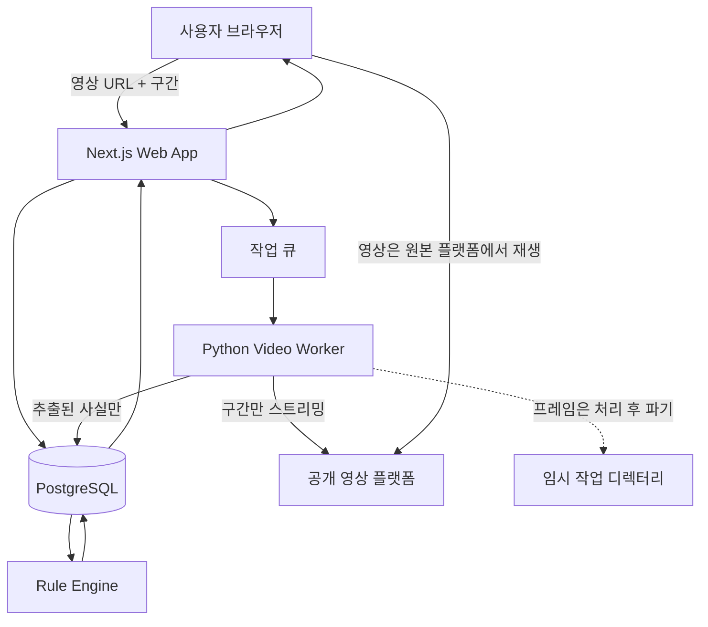

# K리그 규정 기반 영상 판정 분석 시스템

공개된 K리그 하이라이트 영상의 구간을 지정하면 영상에서 확인 가능한 사실을 구조화하고, 해당 시즌의 IFAB 경기규칙과 K리그 대회요강을 근거로 파울·득점·VAR 개입 가능성을 설명하는 판정 보조 시스템입니다.

> 본 프로젝트의 분석 결과는 KFA, 한국프로축구연맹, IFAB 또는 심판위원회의 공식 판정이 아닙니다. 공개된 규정과 제공된 영상에 기반한 기술적 판정 보조 의견입니다.

---

## 1. 프로젝트 목표

이 프로젝트는 영상을 보고 바로 “오심”을 선언하는 자동 심판 시스템을 목표로 하지 않습니다.

**답하려는 질문은 "이 판정이 맞았나"가 아니라 "이 상황에 대해 규정은 무엇을 말하는가"입니다.**

두 질문은 실제로 다른 결과를 냅니다. 앞의 질문은 IFAB와 대회요강이 같은 사안을 다르게 적고 있을 때 어느 한쪽을 골라야 답이 나오고, 고를 근거가 없으면 답을 못 합니다. 뒤의 질문은 두 층을 나란히 놓고 **차이 자체를 보여주면 그것으로 완결됩니다.** 실제로 그런 조항이 있습니다 ([3절](#3-규정-데이터-구성)의 2차 경고 퇴장 범주).

핵심 목표는 다음과 같습니다.

- 영상에서 접촉 시점, 접촉 부위, 팔의 사용, 선수 이동 변화 등 관찰 가능한 사실을 추출
- 경기 날짜와 대회를 기준으로 적용 규정 판본 선택
- **그 상황에 걸리는 조항을 계층별로 제시하고, 계층 간 차이가 있으면 차이 자체를 노출**
- **각 조항이 요구하는 사실값이 영상에서 어디까지 확인됐는지 표시**
- 올바른 판정과 VAR 개입 가능성을 별도로 분석
- 관측 판정이 그 안에서 어디에 놓이는지 비교 — **결론이 아니라 참고 항목**
- 근거 조항, 반대 해석, 영상 한계를 함께 제시
- 사용자가 핵심 프레임과 사실값을 직접 보정할 수 있도록 설계

---

## 2. 핵심 원칙

```text
영상 분석 모듈
→ 장면에서 확인 가능한 사실 추출

규칙 엔진
→ 추출된 사실과 적용 규정 대조

설명 모듈
→ 판정 근거, 다른 해석, 분석 한계 제공
```

영상 모델이 직접 파울 여부를 결정하지 않습니다.

판정은 규칙 엔진이 수행하며, 영상 모델은 아래와 같은 사실 데이터만 생성합니다.

```json
{
  "incident_type": "pushing",
  "fact_schema_version": 2,
  "contact_detected": { "value": true, "observed_at_speed": "NORMAL", "shot_ids": ["s3"] },
  "contact_frame": { "value": 327, "observed_at_speed": "SLOW", "shot_ids": ["s4"] },
  "actor_body_part": { "value": "right_forearm", "observed_at_speed": "SLOW", "shot_ids": ["s4"] },
  "opponent_body_part": { "value": "upper_body", "observed_at_speed": "SLOW", "shot_ids": ["s4"] },
  "arm_extension": { "value": true, "observed_at_speed": "SLOW", "shot_ids": ["s4"] },
  "severity": { "value": "RECKLESS", "observed_at_speed": "NORMAL", "shot_ids": ["s3"] },
  "opponent_displacement": { "value": "clear", "observed_at_speed": "NORMAL", "shot_ids": ["s3"] },
  "before_goal": { "value": true, "observed_at_speed": "NORMAL", "shot_ids": ["s3"] },
  "inside_penalty_area": { "value": false, "observed_at_speed": "SLOW", "shot_ids": ["s5"] },
  "camera_sufficiency": "medium"
}
```

`arm_extension`처럼 규정 요건이 아닌 값도 관찰 사실로는 수집합니다.
다만 이런 값이 판정 조건으로 직접 쓰이지는 않습니다. 판단 요건은 규칙 엔진 쪽에만 존재합니다.

### 사실값에는 관측 조건이 함께 붙습니다

값만으로는 부족합니다. **어느 컷에서 어느 재생속도로 봤는지**가 판정 가능 여부를 바꾸기 때문입니다.

```text
IFAB VAR 프로토콜 (2025/26 · 2026/27 동일 문구)

"The VAR can 'check' the footage in normal speed and/or in slow motion
 but, in general, slow-motion replays should only be used for facts,
 e.g. position of offence/player, point of contact for physical
 offences and handball, ball out of play (including goal/no goal);
 normal speed should be used for the 'intensity' of an offence or to
 decide if it was a handball offence"
```

| 슬로우모션 관측으로 충분 | 정상 속도 관측이 필요 |
|---|---|
| 반칙·선수 위치 | **반칙의 강도 (`severity`)** |
| 접촉 지점 (`contact_frame`, `*_body_part`) | **핸드볼 성립 여부** |
| 볼 아웃, 득점·노득점 | |

하이라이트 리플레이는 대부분 슬로우모션입니다. 그런데 논란이 가장 많이 나는 두 값이 정확히 슬로우모션으로 판단하면 안 되는 값입니다. 그래서 **`severity`와 핸드볼은 정상 속도 관측이 없으면 판정하지 않습니다.** [11절](#11-규칙-엔진-설계)의 속도 게이트를 참고합니다.

원문은 `should`이고 `in general`이라는 단서가 붙습니다. **금지가 아니라 지침입니다.**
그런데 이 시스템의 게이트는 그보다 셉니다 — 정상 속도 관측이 없으면 아예 판정하지 않습니다.

의도적으로 원문보다 엄격하게 잡았습니다.
사람 심판은 지침을 벗어날 때 그 판단에 책임을 지지만, 이 시스템은 책임을 질 수 없습니다.
**책임질 수 없는 쪽이 재량을 덜 갖는 게 맞습니다.**

두 개의 게이트가 있습니다.

- `camera_sufficiency` — **각도**의 게이트
- `observed_at_speed` — **속도**의 게이트

둘 다 표시용 정보가 아니라 **판정을 막는 게이트**입니다. [11절](#11-규칙-엔진-설계) 참고.

### 심판 개인은 이 시스템의 대상이 아닙니다

**심판 개인 식별 정보는 어떤 형태로도 저장하거나 표시하지 않습니다.**
보도에 실명이 나왔더라도 담지 않습니다. 한국은 사실적시 명예훼손도 처벌 대상이고,
무엇보다 이 시스템의 목적은 개인 지목이 아니라 **판정 구조의 검증**입니다.

이 규칙이 적용되는 곳은 다음과 같습니다.

| 대상 | 규칙 |
|---|---|
| `official_verdicts.quote` | 발표문에 이름이 있으면 제거하고 저장합니다 (8절) |
| 현장 설명 인용 | 발화자를 특정하지 않습니다 |
| 라벨 사례 레코드 | 심판·심판진 식별자를 넣지 않습니다 (13절) |
| `fact_signature` | 경기·심판 식별자를 포함하지 않습니다 — `var-20`이 검사합니다 |
| 결과 문구 | 판정 자체만 다루고 개인을 지목하지 않습니다 (16절) |

**선수명은 유지합니다.** 사건을 특정하기 위한 것이고, 선수는 판단의 대상이 아니라
플레이의 당사자이기 때문입니다. 합성 픽스처에는 애초에 사람이 등장하지 않습니다.

---

## 3. 규정 데이터 구성

규정 자료는 `rules/` 아래에 발행 주체별로 보관하며, 항목마다 확보 상태를 함께 표기합니다.

### IFAB 경기규칙

파울, 핸드볼, 득점, 징계, 재개 방식, VAR 개입 범위의 기준입니다.

```text
rules/ifab/
├── 2024-25/   확보 (원문 PDF, 230p)
├── 2025-26/   확보 (원문 PDF, 230p)
└── 2026-27/   확보 (원문 PDF, 260p)
```

**판본 간 차이는 문구 수정에 그치지 않습니다.** 2026/27 개정에서 VAR 검토 범주가 4개에서 5개로 늘었습니다.

```text
2025/26                                      2026/27
a. Goal/no goal                              a. Goal/no goal
b. Penalty kick/no penalty kick              b. Penalty kick/no penalty kick
c. Direct red cards                          c. Red cards          ← 범주명 변경
   (not second yellow card/caution)             └ • clearly incorrect second caution  ← 불릿 신규
d. Mistaken identity                         d. Mistaken identity
                                             e. Clearly incorrectly awarded    ← 범주 신규
                                                corner kick ... (competition option)

개정 표기 원문: "only in relation to four five categories"
                 (four 삭제선, five 삽입)
```

**두 개의 서로 다른 변경이 한 번에 일어났습니다.**

| | 무엇이 | 층위 |
|---|---|---|
| 2차 경고 | `c` 범주 **안의 불릿** 추가 + 범주명에서 제외 문구 삭제 | 범주 내부 |
| 코너킥 | `e` **범주 자체**가 신설 | 범주 목록 |

4→5를 만든 건 코너킥입니다. 2차 경고는 범주 수를 늘리지 않았습니다.
둘을 같은 층위로 취급하면 범주 목록을 한 칸 잘못 세게 됩니다.

그리고 `e`에는 **`competition option`**이 붙어 있습니다.
IFAB이 열어둔 선택지일 뿐이고, 실제 적용 여부는 대회가 정합니다.
따라서 2026/27을 적용하더라도 **K리그가 코너킥 범주를 채택했는지는 대회요강에서 따로 확인해야 합니다.**
바로 아래 3계층 권위 구조가 필요한 이유가 이겁니다 — IFAB이 "할 수 있다"고 한 것을 대회가 "한다"고 해야 성립합니다.

효과는 두 갈래입니다.

- 2025/26까지 **2차 경고 퇴장은 검토 대상이 아니었으나 2026/27부터 검토 대상입니다.**
- 코너킥 오심은 2026/27 + **채택한 대회**에서만 검토 대상입니다.

판본을 하드코딩했다면 이 개정을 놓친 채 "검토 대상 아님"을 계속 출력했을 항목입니다.
규칙을 데이터로 두는 이유가 이 한 건에 다 들어 있습니다.

### KFA 한국어 대조판

IFAB 영문 원문과 공식 한국어 표현을 연결하는 **준거 문서**입니다.

```text
rules/kfa/
└── 2025-26/   미확보
```

용어 번역이 판정 설명 문구의 신뢰도를 좌우하므로 1단계 착수 전에 확보합니다.
확보 전까지는 `plain_korean`만 채우고 `official_korean`은 비워 둔 채 `review_status`로 구분합니다.

참고 자료가 아니라 준거 문서로 두는 이유는, 대회요강이 IFAB 원문을 한국어로 옮기면서
**범위가 달라진 표현**을 쓰기 때문입니다. 아래 대회요강 항목과 규정 판본 매핑을 참고합니다.

### K리그 대회요강

K리그에서 적용되는 운영 절차와 VAR 운영 규정을 확인하는 자료입니다.

```text
rules/kleague/
├── 2025/
│   ├── kleague1/   확보 (HTML + PDF)
│   └── kleague2/   확보 (HTML + PDF)
└── 2026/
    ├── kleague1/   확보 (HTML + PDF)
    └── kleague2/   확보 (HTML + PDF)
```

각 폴더에는 HTML과 PDF 스냅샷을 함께 보관하고, 출처와 취득 시점을 `metadata.json`에 기록합니다.

```text
competition-regulations.html   확보 (보존용, 파싱 소스 아님)
competition-regulations.pdf    확보 (파싱 소스)
metadata.json                  미작성
```

**파싱 소스는 PDF입니다.** HTML은 보존용으로만 둡니다. 원문 확인 결과:

- HTML 파일에 서로 다른 대회요강 2~3개가 한 페이지에 병합되어 있고, 그 결과 **`제24조`가 파일 안에 여러 번 등장**합니다. 조 번호로 조회하면 어느 대회의 조항인지 특정할 수 없습니다
- `kleague1`과 `kleague2`의 HTML이 **바이트 단위로 동일**합니다. 리그별로 분리되어 있지 않습니다
- 같은 연도의 PDF는 리그별로 정상 분리되어 있고 조 번호도 유일합니다

### 계층 간 표현 차이

동일 사안을 IFAB 원문과 대회요강이 다르게 적고 있습니다. 번역 뉘앙스가 아니라 **적용 범위가 달라지는 차이**입니다.

| 항목 | IFAB 2025/26 | K리그 대회요강 제25조 |
|---|---|---|
| 범주 수 | 4개 (2026/27부터 5개) | "4가지 상황" |
| 퇴장 | `Direct red cards (not second yellow card/caution)` | "퇴장 상황" — **2차 경고 제외 단서 없음** |
| 선수 확인 오류 | `Mistaken identity` | "징계조치 오류" — 더 넓게 읽힐 수 있음 |

어느 쪽을 적용할지는 판정마다 달라지므로 **`rules` 테이블에 `authority`를 두고 계층별로 따로 저장합니다.**
차이가 있는 조항은 양쪽을 모두 인용하고, 충돌 사실 자체를 결과 화면에 노출합니다.

### 규정 판본 매핑

**조회 키는 `(competition, match_date)`이며, 현재 확인된 값은 시즌당 단일 판본입니다.**

IFAB 경기규칙은 매년 7월 1일에 발효하고 K리그 시즌은 2~3월에 개막합니다. IFAB은 발효일에 이미 진행 중인 대회가 다음 시즌까지 적용을 미룰 수 있도록 허용하며, **대회요강 확인 결과 K리그는 시즌 개막 시점 판본을 그 시즌 내내 쓰는 것으로 읽힙니다.**

```text
competition  season  effective_from  effective_to  ifab_edition  verification
kleague1     2025    2025 개막        2025 종료      2024-25       INFERRED
kleague2     2025    2025 개막        2025 종료      2024-25       INFERRED
kleague1     2026    2026 개막        2026 종료      2025-26       INFERRED
kleague2     2026    2026 개막        2026 종료      2025-26       INFERRED
```

`verification`을 `CONFIRMED`가 아니라 `INFERRED`로 두는 이유는 근거가 간접적이기 때문입니다.

**직접 근거 — 다만 조 한정 적용**

```text
2025 대회요강 제35조(뇌진탕 교체) 9항
  "본조에 명시되지 않은 사항은 '2024/25 IFAB 경기규칙서'의 내용에 따른다"

2026 대회요강 제36조(뇌진탕 교체) 7항
  "본조에 명시되지 않은 사항은 '2025/26 IFAB 경기규칙서'의 내용에 따른다"
```

판본을 명시한 유일한 조항인데 **`본조`, 즉 뇌진탕 교체 조에 한정**되어 있습니다. 대회요강 전체의 판본 지정이 아닙니다.

**전체 준거 조항은 판본을 특정하지 않습니다**

```text
제24조 (경기규칙)
  2025 "본 대회의 경기는 FIFA 및 KFA의 경기규칙에 따라 실시되며..."
  2026 "본 대회의 경기는 FIFA의 경기규칙에 따라 실시되며..."
```

2026년에 `및 KFA`가 빠졌습니다. 부칙의 준용 순서도 리그별로 다릅니다 — 2026 K리그1은 `K리그 규정 · KFA규정 · FIFA규정`, K리그2는 `K리그 규정 · FIFA 규정`으로 **KFA가 빠져 있습니다.** 계층 구조가 연도와 리그에 따라 움직입니다.

**보강 근거**

2026 대회요강 제25조는 VAR을 "**4가지 상황**"으로 적습니다. IFAB 2026/27은 5개입니다. 개수가 2025/26과 일치하므로 2026 시즌이 2025/26 판본 위에 있다는 쪽을 뒷받침합니다.

**그래서 이렇게 다룹니다**

- 조회 키는 `match_date`로 유지합니다. 시즌 중 전환이 확인되면 데이터 행만 추가하면 되고 스키마를 바꾸지 않습니다
- 현재 데이터는 시즌당 1행입니다. 근거가 간접적이라는 사실을 `verification_status`에 남깁니다
- 7월 1일 이후 경기를 판정할 때 **적용 판본과 그 근거를 결과 화면에 함께 표시**합니다. 조용히 고르지 않습니다

### 원문 파일 관리

원문은 PDF만 74MB이고, 여기에 대회요강 HTML이 더 붙습니다.
**저장소에 커밋하지 않습니다.** 용량보다 저작권이 앞선 이유입니다 —
IFAB 경기규칙과 K리그 대회요강은 각 발행 주체의 저작물이고, 원문 전문을 재배포하지 않습니다.

- `rules/` 아래 `*.pdf`와 `*.html`은 `.gitignore`가 막습니다. 같은 디렉터리의 파싱 결과와 `metadata.json`은 확장자가 달라 그대로 커밋됩니다
- 저장소에 들어가는 것은 **파싱 결과(조항 단위 구조화 데이터)와 원문 체크섬**뿐입니다
- 원문이 필요한 사람은 각 발행처에서 직접 내려받아 같은 경로에 둡니다. 체크섬으로 같은 판본인지 확인합니다
- 규정 검색 API도 같은 원칙입니다. 조항 단위 인용과 출처 링크만 반환하고 전문을 서빙하지 않습니다

Git LFS는 쓰지 않습니다. LFS는 용량 문제만 해결하고 재배포 문제는 그대로 남기기 때문입니다.

---

## 4. 시스템 아키텍처

Vercel 배포 편의성을 유지하면서 무거운 영상 처리는 별도 Python Worker로 분리합니다.



**영상 픽셀은 저장하지 않습니다.** Worker가 지정 구간만 내려받아 사실을 추출하고, 작업이 끝나면 프레임을 파기합니다. 저장하는 것은 `source_url + 구간 + 추출된 사실`이며, 사용자는 원본 플랫폼 링크로 해당 시점을 직접 확인합니다.

이 결정 하나로 Blob Storage, 보존 기한 관리, TTL 삭제 배치, 업로드 권리 확인 절차가 함께 사라집니다. 16절 참고.

### Next.js / Vercel

담당 기능:

- 사용자 인터페이스
- 인증
- 경기 및 분석 요청 관리
- 규정 검색
- Rule Engine 실행
- 분석 상태 조회
- 결과 화면
- 관리자 검수 화면

### Python Video Worker

담당 기능:

- 지정 구간 스트리밍 및 FFmpeg 전처리
- **샷 경계 검출** (하이라이트는 하드컷으로 나뉜다)
- **리플레이·재생속도 판별** (optical flow 크기, 방송사 트랜지션)
- **사건 단위 묶기** (라이브 컷 1 + 리플레이 컷 N = 사건 1개)
- OpenCV 프레임 처리
- 선수와 공 탐지
- 선수 추적
- 자세 추정
- 접촉 후보 탐지
- 핵심 프레임 추출
- 관찰 사실 JSON 생성 (컷 id와 재생속도 포함)
- 프레임 파기

하이라이트 영상을 입력으로 삼으면 **90분에서 논란 장면을 찾는 문제가 사라집니다.** 편집자가 이미 장면을 골랐고, 여러 앵글을 모았고, 느린 화면을 붙였습니다. `camera_sufficiency`를 판단할 재료가 처음부터 주어진 상태로 들어옵니다.

대신 하이라이트에는 구조적 한계가 있습니다. 6절과 16절에 적어둡니다.

### PostgreSQL

저장 대상:

- 경기 정보
- 분석 요청 (영상 URL과 구간)
- 관찰 사실
- 샷 분할 결과와 재생속도 판별 결과
- 규정 메타데이터
- 규정 판본 매핑
- 판정 결과
- 공식 유사 사례
- 모델 및 규칙 엔진 버전

### 저장하지 않는 것

- 원본 영상
- 분석용 클립
- 추출 프레임
- 오버레이 영상

프레임은 Worker의 임시 디렉터리에서만 존재하고 작업 종료 시 파기합니다.
결과 화면에서 장면을 보여줘야 할 때는 이미지를 서빙하지 않고 **원본 플랫폼의 해당 시각 링크**를 겁니다.

---

## 5. 권장 기술 스택

```text
Frontend / Web API
- Next.js
- TypeScript
- Tailwind CSS

Database
- PostgreSQL
- Prisma 또는 Drizzle ORM

Video Access
- 공개 영상 URL에서 지정 구간만 취득
- 영구 저장소 없음 (임시 작업 디렉터리만 사용)

Queue
- MVP: PostgreSQL 상태 폴링 (status = QUEUED)
- 확장 시: Redis + BullMQ

Video Worker
- Python
- FastAPI
- FFmpeg
- OpenCV
- PyTorch

Deployment
- Web: Vercel
- Worker: Railway, Render, Fly.io, RunPod 또는 별도 서버
```

초기 버전에서는 GPU 없이 CPU 기반 프레임 추출과 수동 보정 기능부터 시작합니다.
분석 상태 enum이 이미 큐 역할을 하므로 MVP 규모에서는 Redis를 도입하지 않습니다. 부품을 하나 줄이고 시작합니다.

---

## 6. MVP 범위

### 포함

- 경기, 시즌, 대회 선택
- 하이라이트 영상 URL과 구간(10~30초) 지정
- 원심 선택
- 분석 유형 선택 (1차는 밀기 1개 유형)
- 핵심 프레임 지정
- 접촉 사실 입력 및 수정 (관측 재생속도 함께 기록)
- 규정 검색 (조항 단위 인용)
- 파울, 반칙 강도, 득점, 재개 방식 분석
- VAR 검토 대상 여부 분석
- 근거 부족 시 판정 보류와 사유 출력
- 근거 조항과 분석 한계 출력

### 후순위

- 완전 자동 접촉 판정
- 샷 경계 자동 검출과 재생속도 자동 판별
- 재개 방식 자동 인식 (관측 판정 자동 복원)
- 오프사이드 자동 분석
- 경기장 좌표 자동 보정
- 선수 자동 식별
- 실시간 중계 분석
- 공식 엠블럼 표시

### 하이라이트 입력의 구조적 한계

MVP 단계에서 해결하지 않되 결과 화면에 명시합니다.

- **표본이 편향되어 있습니다.** 하이라이트에는 득점과 논란만 들어가고, 그냥 넘어간 유사 접촉은 들어가지 않습니다. 누적된 판정 기록은 "판정 분포"가 아니라 "논란 분포"입니다
- **미개입 사례가 구조적으로 누락됩니다.** 아무 조치 없이 지나간 장면은 애초에 편집에서 빠지기 쉽습니다. 이 프로젝트가 잡으려는 유형이 하필 그쪽입니다
- **결정적 앵글이 편집에서 빠지면 복구할 수 없습니다.** `camera_sufficiency`가 여기서 핵심 게이트가 됩니다

---

## 7. 사용자 흐름

```text
1. 경기와 시즌 선택
2. 하이라이트 영상 URL과 구간 지정
3. 주심 원심 입력 (재개 방식으로 확인)
4. 분석 유형 선택
5. 핵심 프레임 확인
6. 관찰 사실 검토 및 수정 (관측 재생속도 포함)
7. 규칙 엔진 실행
8. 관측 판정과 추천 판정 비교, 근거 확인
```

### 결과 화면

**순서가 곧 이 시스템의 주장입니다.** 규정이 먼저 오고, 관측 판정은 그 안에 놓입니다.

```text
1. 이 상황에 걸리는 조항                    ← 산출물의 본체
   - 적용 판본과 그 판본을 고른 근거
   - IFAB 경기규칙이 요구하는 것
   - K리그 대회요강이 요구하는 것
   - 두 층이 다르면 차이 자체를 표시 (3절)

2. 각 조항이 요구하는 사실값
   - 영상에서 확인된 값과 관측 조건
   - 확인되지 않은 값과 그 이유 (각도 / 속도 / 편집에서 빠짐)
   - 그래서 조항을 어디까지 좁혔는지

3. VAR 판단 — 네 게이트를 각각
   - 검토 가능 범주에 해당하는지        (범주)
   - 재개 전이었는지                    (시한)
   - 명백하고 분명한 오류였는지          (문턱)
   - 개입했다면 어느 절차였는지          (절차: OFR / VAR-only)

4. 관측 판정은 그 안에서 어디에 놓이는가     ← 참고
   - 재개 방식으로 역산한 원심
   - 규정을 적용하면 나오는 판정
   - 두 값의 관계 (MATCH / MISMATCH / UNDETERMINED)

5. 이 분석의 한계
   - 다른 해석 가능성
   - 영상의 한계
```

`decision_match`가 1번이 아니라 **4번에 있는 것**이 핵심입니다. 왜 그래야 하는지는 실제 사례가 보여줍니다.

#### 예시 — 득점 취소, VAR 미개입 (2026-08-01 K리그2 20R)

후반 추가시간 헤더 득점이 공격 측 밀기로 취소됐고, VAR 교신 없이 종료 휘슬이 울렸습니다.
현장 설명은 **"원심을 파울로 선언해서 VAR 판정이 불가하다"**였습니다.

**"이 판정이 맞았나"로 물으면** 강도를 정상 속도로 관측하지 못해 반칙 성립을 확정할 수 없고, 답이 `UNDETERMINED`에서 멈춥니다. 화면에 빈칸이 남습니다.

**"규정은 뭐라고 하나"로 물으면** 아래가 전부 답입니다.

| 층 | 이 상황에 대해 무엇을 말하는가 | 영상에서 |
|---|---|---|
| IFAB 12조 | 밀기는 반칙. 강도를 부주의 / 무모 / 과도한 힘으로 나누고 그에 따라 징계가 갈림 | 접촉 ✅ · **강도 ❌ 슬로우 관측만** |
| IFAB VAR 범주 | 득점 상황(goal / no goal)은 검토 가능 범주 | ✅ 해당 |
| IFAB VAR 시한 | 검토 창을 닫는 것은 **재개(restart)** | ✅ 재개 없이 종료 — 창 열려 있었음 |
| IFAB VAR 전제 | 주심의 판정은 VAR의 **전제 조건**이지 차단 조건이 아님<br>*"the VAR is only used after the referee has made a (first/original) decision"* | — |
| IFAB VAR 문턱 | "명백하고 분명한 오류"일 때만 개입 | ❌ 강도 미확정이라 문턱 판단 불가 |
| K리그 대회요강 25조 | 4가지 상황 — 득점 상황 포함 | ✅ IFAB와 일치 |

여기서 나오는 문장은 심판에 대한 평가가 아니라 **규정 대조 결과**입니다.

> 현장 설명 "원심을 선언해서 VAR 판정이 불가하다"는 IFAB VAR 프로토콜과 어긋납니다. 프로토콜은 주심의 판정을 VAR의 전제 조건으로 두고, 검토 창을 닫는 조건은 재개입니다. 이 장면은 재개 없이 종료됐으므로 창은 열려 있었습니다.
>
> 다만 **검토 창이 열려 있었다는 것과 개입했어야 한다는 것은 다릅니다.** 개입하려면 "명백하고 분명한 오류"라는 문턱을 넘어야 하는데, 강도가 슬로우모션에서만 관측돼 이 영상으로는 문턱 판단이 성립하지 않습니다.

KFA 심판평가협의체는 이 건을 **정심**으로 발표했습니다 — *"주심의 현장 판정이 명백한 오류에 해당하지 않아"*. **문턱 게이트에 대한 판단입니다.** 현장 설명이 프로토콜과 어긋났는지는 다른 질문이고, 발표는 그것을 다루지 않았습니다. 규정 중심으로 답하면 이 둘이 자동으로 갈립니다.

`MATCH` / `MISMATCH` 하나로 답했다면 이 구분이 통째로 사라집니다.

#### 게이트는 판정이 아니라 조항을 막습니다

같은 이유로, 사실이 확인되지 않았을 때의 출력도 달라집니다.

```text
이전:  카메라 각도 부족 → "판정하지 않습니다"
지금:  카메라 각도 부족 → "12조 반칙까지는 좁혀지고, 페널티 지역 안이었는지가
                        확인되지 않아 페널티킥 조항까지는 내려가지 못합니다"
```

게이트의 출력은 **조항을 어디까지 좁혔는가**입니다. 빈칸이 아니라 도달 지점입니다.

#### VAR 판단은 여전히 독립입니다

VAR 판단은 추천 판정과 독립적으로 계산합니다.
파울이라고 판단해도 검토 범주 밖이면 개입 대상이 아니며, 이 둘이 화면에서 섞이지 않도록 분리해 표시합니다.

**개입하지 않았다는 결론은 반드시 이유까지 함께 표시합니다.**

```text
"검토 대상 아님"      ← 범주 게이트에서 걸림
"검토 대상이나 문턱 미달" ← 문턱 게이트에서 걸림
```

같은 "개입 없음"이지만 듣는 사람에게는 전혀 다른 말입니다. 앞은 문을 닫고 뒤는 근거를 줍니다.

---

## 8. 데이터 모델 초안

### matches

```text
id
competition
season
match_date
home_club_id
away_club_id
score_home
score_away
```

### analyses

```text
id
match_id
original_decision
incident_type
status
source_url
source_platform
clip_start_ms
clip_end_ms
source_fingerprint
facts                     JSONB
fact_schema_version
applied_rule_version_id
created_at
completed_at
```

`incident_type`은 **무엇이 일어났는가**이며 VAR 범주 게이트의 입력입니다. 범주 자체는 아닙니다.

```text
GOAL_DISALLOWED          득점이 취소됨
GOAL_AWARDED             득점이 인정됨
PENALTY_NOT_GIVEN        PK가 선언되지 않음
PENALTY_GIVEN            PK가 선언됨
SENDING_OFF_NOT_GIVEN    퇴장이 주어지지 않음
CARD_SHOWN               카드가 제시됨
SECOND_CAUTION           2차 경고로 인한 퇴장
CORNER_KICK_AWARDED      코너킥이 선언됨
OTHER                    위 어디에도 들어가지 않음
```

`OTHER`는 버리는 값이 아닙니다. 규정이 다루지 않는 사건(예: 추가시간 길이 논란)도 분석 요청으로는 들어오며, 이때 엔진은 `OUT_OF_SCOPE`를 반환합니다. **요청을 거부하는 것과 규정에 없다고 답하는 것은 다릅니다.**

`incident_type`에서 `var_category`로 가는 매핑은 판본 데이터에 있습니다. `SECOND_CAUTION`이 2025/26에서는 어느 범주에도 닿지 않고 2026/27에서는 `RED_CARD`에 닿는 것이 그 매핑의 전부입니다. 코드에 두면 판본 교체가 코드 수정이 됩니다.

`facts`에는 범주·문턱·절차 게이트가 읽는 값이 함께 들어갑니다.

```text
disallow_reason        ATTACKING_TEAM_FOUL | OFFSIDE | BALL_OUT_OF_PLAY | OTHER
referee_decision_type  NO_FOUL | FOUL_AGAINST_ATTACKER | FOUL_AGAINST_DEFENDER
                       | PLAY_ON | UNKNOWN
decision_nature        FACTUAL | SUBJECTIVE       ← 절차 게이트만 읽는다
error_magnitude        CLEAR_AND_OBVIOUS | NOT_CLEAR_AND_OBVIOUS | UNDETERMINED
```

`referee_decision_type`은 **주심이 무엇을 판정했는가**이고, 이 값이 `UNKNOWN`이 아니라는 사실 자체가 VAR 검토의 전제입니다. 어떤 값이 들어와도 `var_reviewable`을 `false`로 만들지 않습니다.

`decision_nature`는 `error_magnitude`에 영향을 주지 않습니다. 두 값이 서로를 읽으면 11절의 게이트 분리가 무너집니다.

`source_url + clip_start_ms + clip_end_ms`가 분석 대상을 가리키는 유일한 좌표입니다. 영상 자체는 저장하지 않습니다.
`source_fingerprint`는 구간 프레임에서 계산한 지각 해시로, **원본이 재업로드되거나 URL이 바뀌어도 같은 장면임을 식별**하고 결과를 재현하는 데 사용합니다.
`applied_rule_version_id`는 `match_date` 기준으로 결정하며 **분석 시점에 확정해 저장합니다.** 규정이 개정되어도 과거 판정을 그대로 재현할 수 있어야 합니다.

원본이 삭제되거나 비공개로 바뀌면 영상은 다시 볼 수 없지만 **추출된 사실과 판정 근거는 남습니다.** 그 경우 결과 화면에 원본 접근 불가 상태를 표시합니다.

### shots

샷 분할 결과입니다. 사실값의 `shot_ids`가 이 테이블을 가리킵니다.

```text
id
analysis_id
shot_index
start_ms
end_ms
playback_speed        NORMAL | SLOW | UNKNOWN
is_replay
camera_angle_label
```

`playback_speed`가 `observed_at_speed`의 근거이며, 속도 게이트는 이 값을 읽습니다.

`facts`는 `incident_type`별 스키마를 가진 타입드 JSONB입니다. 규칙 엔진의 입력 계약이 명시적으로 드러나야 하므로 키-값 나열로 두지 않습니다. 스키마가 바뀌면 `fact_schema_version`을 올립니다.

### analysis_facts

관찰 사실의 **현재 값**은 `analyses.facts`에 있고, 이 테이블은 그 값이 어떻게 바뀌었는지에 대한 **변경 이력**을 남깁니다.
모델이 채운 값을 사용자가 어떻게 보정했는지가 3단계 자동화의 학습 신호가 됩니다.

```text
id
analysis_id
fact_key
old_value
new_value
source
confidence
created_at
```

`source` 값 예시:

```text
MODEL
USER
ADMIN
```

`confidence`는 사실값에 대한 **추출 신뢰도**이며, 판정 결과의 `confidence_level`과는 다른 개념입니다.

### rules

```text
id
authority
edition
law
section
concept
original_text
official_korean
plain_korean
source_page
review_status
```

### competition_rule_versions

```text
id
competition
season
effective_from
effective_to
ifab_edition
source_document
verification_status
```

### decision_results

```text
id
analysis_id

-- 관측 판정: 영상에서 실제로 무슨 판정이 내려졌는가
observed_restart_type    DIRECT_FREE_KICK | INDIRECT_FREE_KICK | FREE_KICK_UNSPECIFIED
                         | PENALTY_KICK | DROP_BALL | THROW_IN | GOAL_KICK
                         | CORNER_KICK | KICK_OFF | PLAY_CONTINUED | UNKNOWN
observed_restart_beneficiary  ATTACKING_TEAM | DEFENDING_TEAM | NONE | UNKNOWN
observed_card
observed_goal_decision   GOAL | NO_GOAL | NOT_APPLICABLE | UNKNOWN
observed_source          RESTART_INFERRED | REFEREE_SIGNAL | VAR_OFR
                         | USER_INPUT | MATCH_REPORT

-- 추천 판정: 규정을 적용하면 무엇이 나오는가
foul_decision
severity
goal_decision
restart_type
disciplinary_action

-- 비교 결과
decision_match           MATCH | MISMATCH | UNDETERMINED

-- VAR 판단
var_reviewable
var_category                 GOAL_NO_GOAL | PENALTY_NO_PENALTY | RED_CARD
                             | MISTAKEN_IDENTITY | CORNER_KICK | NONE
var_within_time_window
var_threshold_met            MET | NOT_MET | UNDETERMINED
var_intervention             NO_INTERVENTION | OVERTURNED | CONFIRMED
var_no_intervention_reason   NOT_REVIEWABLE | TOO_LATE | THRESHOLD_NOT_MET
var_not_reviewable_reason    OUTSIDE_REVIEWABLE_CATEGORIES
                             | COMPETITION_OPTION_NOT_ADOPTED
var_window_closed_reason     PLAY_RESTARTED
var_window_exception         MISTAKEN_IDENTITY | VIOLENT_CONDUCT | NONE
var_review_procedure         OFR | VAR_ONLY | NONE

confidence_level
inconclusive_reason
fact_signature
rule_engine_version

-- 근거와 시각
citations                JSONB   -- RuleCitation[] (11절), 최소 1개
created_at
```

**이 표의 행은 한 번 쓰면 고치지 않습니다.** 사실값이 바뀌면 새 `analyses`를 만들고 그 아래 새 행을 답니다.
같은 행을 덮어쓰면 `applied_rule_version_id`와 `rule_engine_version`이 이미 사라진 입력을 가리키게 되고,
그 순간 판본 도장은 거짓말이 됩니다. 그래서 `created_at`이 필요하고, 갱신 시각은 필요하지 않습니다.

불변이기 때문에 `(fact_signature, applied_rule_version_id, rule_engine_version)`이
안전한 캐시 키가 됩니다. 세 값이 같으면 결과가 같다는 것이 보장되기 때문입니다.

`severity`는 Law 12의 `CARELESS / RECKLESS / EXCESSIVE_FORCE`이며 `disciplinary_action`을 결정합니다.

`observed_*`는 **재개 방식에서 역산한 실제 판정**입니다. 경기가 어떻게 재개됐는지가 무슨 판정이 내려졌는지의 물리적 흔적입니다.

```text
프리킥 재개        → 반칙 선언됨 (방향이 곧 누구의 반칙인지)
페널티킥           → 페널티지역 내 반칙 선언됨
드롭볼             → 반칙 아님으로 처리됨
골 인정 후 취소     → 득점 과정 공격 측 반칙 선언됨
카드 제시          → 징계 등급까지 확정
스로인 / 골킥      → 아웃 판정
재개 없이 속행      → 반칙 없음으로 처리됨 (PLAY_CONTINUED)
```

`FREE_KICK_UNSPECIFIED`는 프리킥인 건 확인됐지만 **직접·간접 구분이 확인되지 않은** 상태입니다.
중계 화면과 보도에 이 구분이 남지 않는 경우가 흔합니다.
**임의로 한쪽으로 채우지 않습니다.** 채워 넣으면 이후 비교가 관측이 아니라 제 추측을 대상으로 하게 됩니다.

`var_threshold_met`이 불리언이 아닌 이유도 같습니다.
문턱 판단은 강도에 의존하고, 강도가 속도 게이트에 걸리면 `UNDETERMINED`가 정직한 값입니다.

`decision_match`가 `MISMATCH`인 건이 곧 "판정에 문제가 있었던 지점"입니다. 이 값이 이 시스템의 산출물입니다.

`var_no_intervention_reason`은 **개입하지 않은 이유를 게이트별로 구분**합니다. `NOT_REVIEWABLE`과 `THRESHOLD_NOT_MET`은 결과가 같아도 의미가 전혀 다르므로 하나의 값으로 합치지 않습니다.

그 아래 한 단계가 더 있습니다. **어느 게이트가 막았는지**와 **그 게이트가 왜 막았는지**는 다른 질문입니다.

```text
NOT_REVIEWABLE  ├ OUTSIDE_REVIEWABLE_CATEGORIES    판본에 그 범주가 없음
                └ COMPETITION_OPTION_NOT_ADOPTED   판본엔 있으나 대회가 채택 안 함
TOO_LATE        └ PLAY_RESTARTED                   재개로 창이 닫힘
```

`COMPETITION_OPTION_NOT_ADOPTED`는 2026/27 코너킥 범주 때문에 필요합니다. IFAB가 연 것과 대회가 채택한 것은 다르고, **"규정에 없다"와 "우리 대회는 안 쓴다"를 같은 문장으로 답하면 3절의 3계층 구조가 화면에서 사라집니다.**

`var_window_exception`은 재개 후에도 창이 열려 있는 경우를 기록합니다. 값이 `NONE`이 아니면 `var_within_time_window`는 재개 여부와 무관하게 참입니다.

`var_review_procedure`는 사실적·주관적 구분에서 나오며 **문턱과 무관합니다.** 개입이 필요할 때 어느 절차를 밟는지만 정합니다.

`inconclusive_reason` 값 예시:

```text
CAMERA_INSUFFICIENT        각도 부족
SEVERITY_UNDETERMINED      강도 특정 불가
SLOW_MOTION_ONLY           정상 속도 관측 없음 (속도 게이트)
OUT_OF_SCOPE               경기규칙에 해당 조문 없음
```

`OUT_OF_SCOPE`는 `CAMERA_INSUFFICIENT`와 다릅니다. 영상이 부족한 게 아니라 **규정이 그 상황을 다루지 않는** 경우입니다. 이때는 판정을 시도하지 않고 그 사실만 출력합니다. 규정에 없는 것을 있는 것처럼 답하지 않습니다.

`fact_signature`는 판정에 실제로 사용된 사실값들의 정규화 해시입니다. 지금은 재현 검증에만 쓰지만, **같은 사실 조합에 대한 과거 판정 분포를 조회**하는 기능의 기반이 됩니다.

```text
"얼굴 부위 · 팔 접촉 · 볼 경합 중 · 페널티지역 밖"
→ 동일 서명 과거 12건: 퇴장 9 / 경고 3
```

조항 인용은 "규정상 이렇다"고 말하고, 이 조회는 "그동안 이렇게 해왔다"고 말합니다. 일관성은 사람의 기억력이 아니라 기록의 문제입니다. **기능 자체는 4단계이지만 서명 컬럼은 지금 넣습니다.** 나중에 스키마를 뒤집는 비용이 훨씬 큽니다.

다만 6절의 표본 편향을 함께 표시해야 합니다. 하이라이트에서 수집한 기록은 판정 분포가 아니라 논란 분포입니다.

### 인용은 별도 테이블이 아니라 `decision_results.citations`입니다

**모든 `decision_results` 행은 최소 1개의 인용을 가집니다.** 조항 없는 결론은 저장하지 않습니다.

```sql
citations JSONB NOT NULL CHECK (jsonb_array_length(citations) >= 1)
```

원소는 11절의 `RuleCitation`이고, `COUNTER_READING`은 결과 화면의 "다른 해석 가능성" 항목에 씁니다.

연결 테이블을 두지 않는 이유는 셋입니다.

**첫째, `rule_id` 외래키는 스냅샷이 아닙니다.** 조항 텍스트를 나중에 고치면 예전 결과가 조용히
새 텍스트를 가리키게 됩니다. 그 결과는 그때 그 문장을 근거로 나온 것인데 근거가 뒤에서 바뀝니다.
인용은 **그 시점의 사본**이어야 하고, 사본에는 참조가 아니라 값이 들어갑니다.

**둘째, "최소 1개"가 선언으로 강제됩니다.** 별도 테이블이면 이 불변식이 두 테이블에 걸쳐 있어
트랜잭션과 애플리케이션 코드로만 지킬 수 있습니다. 한 행 안에 있으면 `CHECK`이 지킵니다.
**규칙을 문서가 아니라 스키마가 지키게 하는 것이 이 프로젝트에서 계속 쓰는 방식입니다.**

**셋째, 산출물이 이미 트리입니다.** `accounts[].citations`는 계층마다 인용을 답니다(11절).
평평한 테이블로 펴 두고 매번 다시 조립하는 것은 저장 형태를 API 형태와 어긋나게 만들 뿐입니다.

> 이건 앞서 낸 권고를 뒤집은 것입니다. 불변을 정하기 전에는 별도 테이블이 맞았습니다.
> 행을 고칠 수 있다면 정규화가 맞고, 고치지 않기로 하면 스냅샷이 맞습니다.

조항을 축으로 조회할 일(예: "Law 12를 인용한 결과 전부")은 생성 열로 해결합니다.
JSONB에서 뽑아낸 값이므로 사본이 하나 더 생기지 않습니다.

```sql
cited_laws TEXT[] GENERATED ALWAYS AS (...) STORED
```

### official_verdicts

외부 기관이 그 사건을 어떻게 판단했는지입니다. `analyses`에 연결됩니다.

```text
id
analysis_id
announced_by           KFA_REFEREE_COMMITTEE | COMPETITION_ORGANISER | OTHER
announced_by_name
announced_on
verdict                CORRECT | INCORRECT | NO_COMMENT
quote
source_url
status                 EXTERNAL_OPINION
```

이 컬럼이 `authority`가 아닌 이유가 있습니다. `rules.authority`는 **규정을 쓴 주체**(IFAB·KFA·K리그)이고
여기 있는 것은 **그 사건을 판단해 발표한 주체**입니다. 두 개념이 한 이름을 쓰면
"authority가 무엇인가"에 답이 두 개가 되고, 그 순간 어느 쪽도 단일 정의를 갖지 못합니다.

`announced_by`는 분류이고 `announced_by_name`은 발표문에 적힌 기관명 그대로입니다.
`심판평가협의체`와 `심판위원회`는 둘 다 `KFA_REFEREE_COMMITTEE`로 분류되지만 같은 기구가 아니므로,
분류로 접으면서 원래 표기를 버리지 않습니다. **인용은 스냅샷이라는 원칙이 여기에도 적용됩니다.**

**`status`가 항상 `EXTERNAL_OPINION`인 것이 이 테이블의 요점입니다.**
공식 발표는 정답 라벨이 아니라 또 하나의 의견이며, 엔진 결과와 어긋나도 엔진이 틀렸다고 자동으로 결론 내지 않습니다. 어긋남 자체를 기록하고 어느 쪽이 왜 그렇게 봤는지를 따로 조사합니다.

이 테이블이 있어서 `datasets/labeled-cases/`의 사례가 **특별한 저장소가 아니라 평범한 DB 행**이 됩니다. 과거 사건과 앞으로 들어올 경기가 같은 테이블, 같은 경로를 씁니다. 대부분의 사건에는 이 행이 아예 없고, 그때는 판정의 정오가 아니라 처리 경로만 비교합니다.

**심판 개인 식별 정보는 `quote`에도 넣지 않습니다.** 발표문에 이름이 있으면 제거하고 저장합니다.

### 값의 정의는 어디에 있는가

지금 열거형 8개가 이 절과 11절 **두 곳에 같은 값으로** 적혀 있습니다
(`var_category` · `var_threshold_met` · `var_intervention` · `var_no_intervention_reason` ·
`var_review_procedure` · `decision_match` · `relevance` · `authority`).
어느 쪽이 정답인지 정해 두지 않으면 한쪽만 고치는 날이 오고, 그날 두 정의가 다 살아 있게 됩니다.

#### DB 컬럼은 SSOT가 될 수 없습니다

**첫째, 값 집합이 판본에 따라 다릅니다.** 픽스처가 이미 그렇게 고정하고 있습니다.

```text
var-12 / var-13   같은 사실, rule_version만 2025-26 / 2026-27
                  → 전자는 OUTSIDE_REVIEWABLE_CATEGORIES, 후자는 RED_CARD
var-14 / var-15   같은 판본, 대회 채택만 다름
                  → 전자는 COMPETITION_OPTION_NOT_ADOPTED, 후자는 CORNER_KICK
```

`var_category`에 `CHECK`를 걸면 판본이 하나 늘 때마다 마이그레이션이 됩니다.
**판본 추가는 데이터 작업이어야 하고 스키마 작업이면 안 됩니다.**

여기서 결정적인 것은 `var-14`입니다. 이 케이스는 `CORNER_KICK`을 **채택하지 않았다고 말하기 위해**
그 이름을 알아야 합니다. 유효한 값의 목록과 지금 열려 있는 값의 목록은 같은 것이 아닙니다.

**둘째, 결과가 JSONB 안에 있습니다.** `citations[].relevance`는 컬럼이 아니므로 컬럼 제약이 닿지 않습니다.

**셋째, 픽스처는 DB 없이 돌아갑니다.** `check/enums.mjs`는 엔진도 DB도 없는 지금 실행됩니다.
정의가 DB에 있으면 이 검사가 DB를 띄워야 하고, 그러면 첫날부터 CI에 걸 수 없습니다.

#### 그래서 셋으로 나눕니다 — 어휘 · 활성 집합 · 구조

| 무엇 | 예 | 판본에 따라 변하나 | SSOT |
|---|---|---|---|
| **어휘** — 엔진이 쓸 수 있는 낱말의 닫힌 집합 | `decision_match` · `relevance` · `var_threshold_met` · `var_intervention` · `var_review_procedure` · `verdict` | 아니오 | `packages/shared-types` |
| **활성 집합** — 그 판본·대회에서 실제로 열려 있는 부분집합 | 2026-27의 재심의 대상 범주, `corner_kick_review` 채택 여부 | 예 | `packages/rule-data` |
| **구조 불변식** — 행이 성립하려면 반드시 참이어야 하는 것 | 인용 최소 1개, 외래키, `NOT NULL` | 아니오 | DB `CHECK`·제약 |

`var_category`의 유니온은 **어휘**이므로 어느 판본에서든 나올 수 있는 값을 전부 담은 상위집합이고,
그중 무엇이 열려 있는지는 **활성 집합**이 정합니다. 이 분리가 FR-21(범주 4→5를 코드 수정 없이)을 성립시킵니다.
낱말을 새로 만드는 것은 코드 변경이 맞습니다 — 엔진이 그 값을 어떻게 다뤄야 하는지 알아야 하기 때문입니다.

**DB 컬럼은 어휘의 사본이지 정의가 아닙니다.** 그래서 값 열거형 컬럼에는 `CHECK`를 손으로 쓰지 않습니다.
손으로 쓴 `CHECK`은 두 번째 손질 대상이고, 그게 정확히 피하려는 것입니다.
DB가 지키는 것은 **구조**이고, 타입이 지키는 것은 **어휘**이고, 규정 데이터가 지키는 것은 **활성 집합**입니다.

#### 지금은 이 문서가 SSOT이고, 그 시점은 정해져 있습니다

`packages/shared-types`는 아직 비어 있습니다. 그때까지는 이 문서가 어휘의 정의이고,
`check/enums.mjs`가 픽스처를 이 문서에 맞춥니다.
**`shared-types`에 첫 파일이 들어가는 커밋에서 방향이 뒤집힙니다.** 그 커밋에서 타입 파일이 정의가 되고,
검사기는 이 문서를 타입 파일에 맞춰 검사하는 쪽으로 바뀝니다.
두 소유자가 겹치는 기간을 두지 않는 것이 요점입니다.

그 전까지 이 문서 안의 중복은 `check/readme.mjs`가 막습니다.
8절과 11절에 같은 이름으로 적힌 열거형은 값이 정확히 같아야 합니다.

---

## 9. API 초안

```http
POST /api/analyses
```

분석 요청 생성

```http
GET /api/analyses/{id}
```

분석 상태와 결과 조회

```http
PATCH /api/analyses/{id}/facts
```

관찰 사실 수정

```http
POST /api/analyses/{id}/evaluate
```

Rule Engine 실행. `EvaluationResult`를 반환하며, 응답의 첫 필드는 판정이 아니라 **이 상황에 걸리는 조항(`accounts`)과 계층 간 차이(`conflicts`)**입니다 (11절). 조항 없이 결론만 담긴 응답은 만들지 않습니다.

```http
GET /api/rules/search
```

규정 조항 검색. 조항 단위 인용과 출처만 반환하며 원문 전문은 서빙하지 않습니다.

```http
POST /api/admin/rules/import
```

규정 데이터 등록

```http
POST /api/admin/precedents/import
```

공식 사례 등록

---

## 10. 분석 상태

```text
REQUESTED          영상 URL과 구간이 접수됨
QUEUED             작업 큐 등록
FETCHING           공개 플랫폼에서 지정 구간만 취득
SEGMENTING         샷 경계 검출, 리플레이·재생속도 판별
DETECTING          선수·공·접촉 검출
EXTRACTING_FACTS   사실값 추출 (관측 속도·샷 기록 포함)
WAITING_FOR_REVIEW 사람 확인 대기
APPLYING_RULES     규칙 엔진 적용
COMPLETED
FAILED
```

`UPLOADED`가 없습니다. 파일을 받지 않기 때문입니다.
대신 `FETCHING`이 있고, 이 단계가 끝나면 원본 프레임은 파기됩니다.

`SEGMENTING`이 `DETECTING`보다 먼저인 이유는 [2절](#2-핵심-원칙)의 속도 게이트 때문입니다.
어떤 프레임이 슬로우모션인지 모르면 그 프레임에서 뽑은 `severity`를 쓸 수 있는지 판단할 수 없습니다.
샷 분할이 검출의 전제 조건입니다.

영상 분석 요청은 HTTP 연결을 유지한 채 처리하지 않습니다.

```text
분석 요청 생성 (URL + 시작/종료 밀리초)
→ analysis_id 즉시 반환
→ 작업 큐 등록
→ Worker 비동기 처리
→ DB 상태 갱신
→ 프론트에서 상태 조회
```

---

## 11. 규칙 엔진 설계

Rule Engine은 LLM이 아니라 명시적 조건식으로 구성합니다.

### 규칙은 코드가 아니라 데이터로

조건식을 TypeScript에 하드코딩하면 판본이 바뀔 때마다 `if (edition === "2025-26")` 분기가 번식하고, 규정 개정이 코드 배포와 묶입니다.

- 판본별 규칙 정의는 데이터로 보관 (DB 또는 버전 관리되는 JSON)
- 엔진은 그 정의를 해석하는 결정론적 인터프리터
- LLM은 여전히 판정에 관여하지 않음

아래 코드는 인터프리터가 다뤄야 할 판단 구조를 보여주는 예시입니다.

### 판정 결과는 구조체로 반환

모든 판정은 근거 조항과 함께 반환합니다. 조항 없이 결론만 반환하는 경로를 만들지 않습니다.

```ts
type Decision =
  | "FOUL"
  | "NO_FOUL"
  | "NORMAL_CONTACT"
  | "INCONCLUSIVE"   // 영상 근거 부족 — 더 나은 영상이 있으면 답이 나온다
  | "OUT_OF_SCOPE";  // 규정에 조문 없음 — 영상을 아무리 봐도 답이 없다

type Severity = "CARELESS" | "RECKLESS" | "EXCESSIVE_FORCE";

// 사실값은 값과 관측 조건을 함께 가진다
type Observed<T> = {
  value: T;
  observedAtSpeed: "NORMAL" | "SLOW" | "UNKNOWN";
  shotIds: string[];
};

// ── 산출물의 본체: 각 계층이 이 상황에 대해 무엇을 말하는가 ──

// `rules` 행(authority·edition·law·section)에 relevance를 더한 것이며,
// `decision_results.citations`에 그대로 저장됩니다 (8절).
// 어디에 실리든 같은 형태입니다. 상위 객체가 authority를 이미 갖고 있어도
// 생략하지 않습니다 — 인용 하나를 떼어내 옮겨도 출처가 남아야 하기 때문입니다.
type RuleCitation = {
  authority: "IFAB" | "KFA" | "KLEAGUE";
  edition: string;
  law: string;                      // "12" | "VAR"
  section: string;
  relevance: "PRIMARY" | "SUPPORTING" | "COUNTER_READING";
};

type AuthorityAccount = {
  authority: "IFAB" | "KFA" | "KLEAGUE";
  edition: string;                  // "2025-26" | "kleague2-2026"
  citations: RuleCitation[];        // 이 상황에 걸리는 조항
  requires: FactRequirement[];      // 그 조항이 요구하는 사실값
};

type FactRequirement = {
  fact: string;                     // "severity"
  status: "ESTABLISHED" | "UNMET";
  blockedBy: "CAMERA" | "SPEED" | "NOT_IN_FOOTAGE" | null;
  narrowsTo: RuleCitation | null;   // 이 값이 정해지면 내려갈 조항
};

// 계층이 서로 다르게 적고 있을 때 — 해소하지 않고 노출한다
type LayerConflict = {
  topic: string;                    // "퇴장 범주에 2차 경고가 포함되는가"
  readings: { authority: string; text: string }[];
};

// 네 게이트를 각각 별도 필드로 (아래 "VAR 판단은 별도 경로" 참고)
type VarAssessment = {
  reviewable: boolean;
  category: "GOAL_NO_GOAL" | "PENALTY_NO_PENALTY" | "RED_CARD"
          | "MISTAKEN_IDENTITY" | "CORNER_KICK" | "NONE";
  withinTimeWindow: boolean;
  thresholdMet: "MET" | "NOT_MET" | "UNDETERMINED";
  intervention: "NO_INTERVENTION" | "OVERTURNED" | "CONFIRMED";
  noInterventionReason: "NOT_REVIEWABLE" | "TOO_LATE" | "THRESHOLD_NOT_MET" | null;
  reviewProcedure: "OFR" | "VAR_ONLY" | "NONE";
  explanation: string;
};

type EvaluationResult = {
  // 1. 규정이 이 상황에 대해 말하는 것
  accounts: AuthorityAccount[];
  conflicts: LayerConflict[];

  // 2. 조항 트리에서 도달한 깊이
  narrowedTo: RuleCitation[];
  blockedFrom: FactRequirement[];

  // 3. VAR 네 게이트 (별도 필드 — var-19가 검사한다)
  varAssessment: VarAssessment;

  // 4. 참고 — 규정을 적용하면 나오는 판정과 관측 판정의 관계
  decision: Decision;
  severity: Severity | null;
  restart: "DIRECT_FREE_KICK" | "PENALTY_KICK" | "DROP_BALL" | "NONE" | null;
  disciplinary: "NONE" | "CAUTION" | "SEND_OFF" | null;
  decisionMatch: "MATCH" | "MISMATCH" | "UNDETERMINED";

  // 5. 한계
  confidence: "LOW" | "MEDIUM" | "HIGH";
  inconclusiveReason: string | null;
  citations: RuleCitation[]; // 비어 있을 수 없음
};
```

**`accounts`가 앞에 있고 `decision`이 뒤에 있는 순서가 의도입니다.** 엔진이 먼저 하는 일은 판정이 아니라 **이 상황에 걸리는 조항을 계층별로 고르는 것**이고, `decision`은 그 조항들을 적용한 결과입니다. 순서를 뒤집으면 결론을 먼저 내고 근거를 나중에 붙이는 구조가 됩니다.

`blockedFrom`이 비어 있지 않다는 것은 실패가 아니라 **조항 트리의 어느 지점에서 멈췄는지**를 뜻합니다. 7절 결과 화면 2번이 이 값을 그대로 보여줍니다.

`conflicts`는 시스템이 해소하지 않습니다. 어느 층이 이기는지 정할 근거가 없을 때 하나를 고르면, 확인하지 않은 것을 확인한 것처럼 답하게 됩니다.

`INCONCLUSIVE`와 `OUT_OF_SCOPE`를 나눈 이유는 사용자가 다음에 할 일이 다르기 때문입니다. 앞은 더 좋은 앵글을 찾으면 풀리고, 뒤는 영상을 더 봐도 풀리지 않습니다.

`OUT_OF_SCOPE`가 필요한 실제 유형은 예를 들어 주심과 선수의 충돌입니다. 경기규칙에 해당 조문이 없고 주심 재량 영역으로 처리되는 사안이라, 규정을 근거로 옳고 그름을 말할 수 없습니다. 이때 엔진이 억지로 판정하면 근거 없는 결론을 만들어냅니다.

### 밀기 판단 예시

Law 12는 밀기를 팔 사용 여부가 아니라 **부주의(careless) / 무모(reckless) / 과도한 힘(excessive force)** 으로 구분합니다.
팔 뻗음은 참고 사실일 뿐 요건이 아니며, 몸이나 어깨로도 반칙이 성립합니다.

```ts
type PushFacts = {
  contactDetected: Observed<boolean>;
  severity: Observed<Severity | "uncertain">;
  opponentDisplacement: Observed<"none" | "possible" | "clear" | "uncertain">;
  insidePenaltyArea: Observed<boolean>;
  cameraSufficiency: "low" | "medium" | "high";
};

// 한 판본의 규정 데이터를 담은 핸들입니다. 내부 형태는 1단계에서
// 규정 적재(계획 문서 FR-05·FR-06)와 함께 정합니다. 여기서 확정된 것은
// 엔진이 조항을 **주입받는다**는 사실뿐입니다 — 판본 문자열이 코드에 들어오지 않습니다.
type RuleSet = {
  cite(conceptKey: string): RuleCitation[];
};

export function evaluatePush(facts: PushFacts, rules: RuleSet): EvaluationResult {
  // 각도 게이트: 근거가 부족하면 판정하지 않는다
  if (facts.cameraSufficiency === "low") {
    return inconclusive(rules, "CAMERA_INSUFFICIENT");
  }

  if (!facts.contactDetected.value) {
    return decide("NO_FOUL", { restart: "NONE" }, rules.cite("LAW_12"));
  }

  // 속도 게이트: 강도는 정상 속도 관측이 없으면 판정하지 않는다
  // 근거: VAR 프로토콜 — normal speed should be used for the 'intensity' of an offence
  if (facts.severity.observedAtSpeed !== "NORMAL") {
    return inconclusive(rules, "SLOW_MOTION_ONLY", rules.cite("VAR_PROTOCOL_REVIEW_PROCESS"));
  }

  if (
    facts.severity.value === "uncertain" ||
    facts.opponentDisplacement.value === "uncertain" ||
    facts.opponentDisplacement.value === "possible"
  ) {
    return inconclusive(rules, "SEVERITY_UNDETERMINED");
  }

  if (facts.opponentDisplacement.value === "none" && facts.severity.value === "CARELESS") {
    return decide("NORMAL_CONTACT", { restart: "NONE" }, rules.cite("LAW_12"));
  }

  return decide(
    "FOUL",
    {
      severity: facts.severity.value,
      restart: facts.insidePenaltyArea.value ? "PENALTY_KICK" : "DIRECT_FREE_KICK",
      // CARELESS → 반칙만, RECKLESS → 경고, EXCESSIVE_FORCE → 퇴장
      disciplinary: disciplinaryFor(facts.severity.value),
    },
    rules.cite("LAW_12")
  );
}
```

세 가지를 강제합니다.

- `camera_sufficiency`가 `low`면 어떤 사실값이 들어오든 결과를 `INCONCLUSIVE`로 고정합니다
- **`severity`가 슬로우모션에서만 관측됐으면 판정하지 않습니다.** 규정은 강도 판단에 정상 속도를 쓰라고 지침(`should`)을 두고, 이 게이트는 그 지침을 하드 블록으로 올린 것입니다 ([2절](#2-핵심-원칙)에 이유를 적어뒀습니다)
- 강도를 특정할 수 없으면 파울로 단정하지 않습니다. `possible`은 파울이 아니라 보류입니다

속도 게이트는 하이라이트를 입력으로 쓸 때 특히 자주 걸립니다. 리플레이만 있고 라이브 컷이 없는 장면이 실제로 있기 때문입니다. **자주 걸리는 게 결함이 아니라 의도한 동작입니다.**

### VAR 판단은 별도 경로

VAR 판단은 추천 판정과 독립적으로 계산하며, **검토 가능 범주 확인이 첫 번째 분기**입니다.

```text
1. 검토 가능 범주에 해당하는가          ← 범주 게이트
   판본에서 읽어온다. 하드코딩하지 않는다.
   2025/26  4개 : 득점 / PK / 직접 퇴장(2차 경고 제외) / 선수 확인 오류
   2026/27  5개 : 득점 / PK / 퇴장(2차 경고 오류 포함) / 선수 확인 오류
                 / 명백히 잘못 준 코너킥 ← 대회 채택 옵션
   → 해당하지 않으면 오심의 정도와 무관하게 NOT_REVIEWABLE
   → 코너킥 범주는 판본이 열어둔 것일 뿐이므로 대회 채택 여부를 함께 확인한다.
     판본만 보고 켜면 채택하지 않은 대회에서 없는 권한을 만들어낸다.

2. 재개(restart)가 이미 이루어졌는가     ← 시한 게이트
   경기가 재개되면 검토 창이 닫힌다.
   예외: 선수 확인 오류, 폭력 행위·침뱉기·물기·심한 모욕 관련 퇴장 사안
   → 재개 후면 TOO_LATE

3. 명백하고 분명한 오류 또는 심각한 미인지 사건인가   ← 문턱 게이트
   4개(5개) 범주 전부에 이 문턱이 적용된다.
   → 문턱 미달이면 NO_INTERVENTION (범주 밖이라는 뜻이 아니다)

4. 검토 절차는 무엇인가                  ← 문턱과 무관, 절차 선택
   주관적 판정 (반칙 여부, 반칙의 강도)  → 온필드 리뷰(OFR)
   사실적 판정 (오프사이드 위치, 볼 아웃) → VAR-only 리뷰

5. 득점 관련 검토는 공격 진행 국면(APP) 시작까지 거슬러 올라간다
   → before_goal 사실값의 판단 범위가 여기서 정해진다
```

**사실적 판정과 주관적 판정의 구분은 문턱을 가르지 않고 검토 절차만 가릅니다.** 원문은 4개 범주 전부에 `clear and obvious error` / `serious missed incident`를 요구합니다.

**주심이 이미 판정을 내렸다는 사실은 VAR의 차단 조건이 아니라 전제 조건입니다.**

```text
"the VAR is only used after the referee has made a (first/original)
 decision (including allowing play to continue), or if a serious
 incident is missed/not seen by the match officials"

"a decision to allow play to continue after an alleged offence
 can be reviewed"
```

검토 창을 닫는 유일한 조건은 **재개**입니다. "원심을 선언했으니 VAR 검토가 불가하다"는 규정을 뒤집은 진술이며, 엔진은 이 형태의 결론을 낼 수 없어야 합니다.

이 순서를 지키지 않으면 두 가지 잘못된 출력이 나옵니다.

- 범주 게이트를 건너뛰면 → "명백한 오심인데 VAR가 왜 개입 안 했나"
- 범주 게이트와 문턱 게이트를 합치면 → **정답을 내면서 이유를 틀립니다.** 개입하지 않은 이유가 "검토 대상이 아님"인지 "문턱 미달"인지가 화면에서 반드시 구분되어야 합니다

```json
{
  "applied_rule_version": {
    "ifab_edition": "2025-26",
    "basis": "2026 대회요강 제36조 7항 (뇌진탕 교체 조 한정 지정)",
    "verification": "INFERRED"
  },

  "accounts": [
    {
      "authority": "IFAB",
      "edition": "2025-26",
      "citations": [
        { "authority": "IFAB", "edition": "2025-26", "law": "12", "section": "1", "relevance": "PRIMARY" },
        { "authority": "IFAB", "edition": "2025-26", "law": "VAR", "section": "2", "relevance": "PRIMARY" }
      ],
      "requires": [
        { "fact": "contact_confirmed", "status": "ESTABLISHED", "blocked_by": null },
        { "fact": "severity", "status": "ESTABLISHED", "blocked_by": null },
        { "fact": "in_penalty_area", "status": "ESTABLISHED", "blocked_by": null }
      ]
    },
    {
      "authority": "KLEAGUE",
      "edition": "2026",
      "citations": [
        { "authority": "KLEAGUE", "edition": "2026", "law": "25", "section": "1", "relevance": "SUPPORTING" }
      ],
      "requires": []
    }
  ],
  "conflicts": [],

  "narrowed_to": [
    { "authority": "IFAB", "edition": "2025-26", "law": "12", "section": "1", "relevance": "PRIMARY" },
    { "authority": "IFAB", "edition": "2025-26", "law": "VAR", "section": "2", "relevance": "PRIMARY" }
  ],
  "blocked_from": [],

  "var_assessment": {
    "reviewable": true,
    "category": "GOAL_NO_GOAL",
    "within_time_window": true,
    "threshold_met": "NOT_MET",
    "intervention": "NO_INTERVENTION",
    "no_intervention_reason": "THRESHOLD_NOT_MET",
    "review_procedure": "OFR",
    "explanation": "검토 대상에는 해당하나 명백하고 분명한 오류로 보기 어려움"
  },

  "observed_decision": {
    "restart_type": "DIRECT_FREE_KICK",
    "restart_beneficiary": "DEFENDING_TEAM",
    "goal_decision": "NO_GOAL",
    "card": "NONE",
    "source": "RESTART_INFERRED"
  },
  "recommended_decision": {
    "foul_decision": "FOUL",
    "severity": "CARELESS",
    "goal_decision": "NO_GOAL",
    "restart_type": "DIRECT_FREE_KICK",
    "disciplinary_action": "NONE"
  },
  "decision_match": "MATCH",

  "citations": [
    { "authority": "IFAB", "edition": "2025-26", "law": "12", "section": "1", "relevance": "PRIMARY" },
    { "authority": "IFAB", "edition": "2025-26", "law": "VAR", "section": "2", "relevance": "PRIMARY" },
    { "authority": "KLEAGUE", "edition": "2026", "law": "25", "section": "1", "relevance": "SUPPORTING" }
  ]
}
```

이 예시는 **필요한 사실값이 전부 확인된 경우**입니다. 그래서 `blocked_from`이 비어 있고 `narrowed_to`가 12조 1항까지 내려갔습니다.

사실값이 확인되지 않으면 `severity`의 `status`가 `UNMET` / `blocked_by: "SPEED"`가 되고, `blocked_from`에 그 항목이 들어가며, `narrowed_to`는 징계 단계 조항까지 내려가지 못합니다. 그때 `decision_match`는 `UNDETERMINED`이지만 **`accounts`는 그대로 채워집니다** — 규정이 무엇을 요구하는지는 영상과 무관하게 말할 수 있기 때문입니다. 7절의 예시가 그 경우입니다.

`reviewable`이 `true`인데 `intervention`이 `NO_INTERVENTION`인 것이 이 구조의 핵심입니다.
**개입하지 않은 것이 맞으면서 동시에 검토 대상이기는 한** 상태를 표현할 수 있어야 합니다. 두 값을 하나로 합치면 이 상태가 사라집니다.

---

## 12. 구단 데이터와 엠블럼

구단명과 시즌별 리그 소속은 데이터로 관리합니다.

```text
clubs
club_identities
club_season_memberships
club_assets
```

공식 엠블럼은 권리 상태가 확인된 경우에만 표시합니다.

```text
PLACEHOLDER
INTERNAL_REFERENCE
PERMISSION_PENDING
LICENSED
EXPIRED
```

MVP에서는 공식 엠블럼 대신 약칭 배지를 사용합니다.

```text
수원 삼성 블루윙즈 → SUW
FC 안양 → ANY
충북청주FC → CCH
```

---

## 13. 프로젝트 구조

### 문서는 이 파일 하나입니다

프로젝트 설명 문서를 디렉터리마다 두지 않습니다. 픽스처 작성 규칙도, 라벨 사례 스키마도
이 문서 안에 있습니다. 같은 규칙이 세 군데에 적히면 세 군데가 서로 다른 속도로 낡고,
그때부터는 어느 것이 맞는지 확인하는 비용이 문서를 읽는 비용보다 커집니다.

단계별 계획은 `docs/01-plan/`에 따로 둡니다. 그것은 이 문서의 설명이 아니라 **작업 기록**이고,
완료되면 아카이브되어 사라지는 수명이 다른 문서이기 때문입니다.

### 디렉터리

`✅`는 지금 저장소에 있는 것이고, 나머지는 아직 없습니다.

```text
Replay_Lab/
├── README.md                     ✅ 이 문서
├── .gitignore                    ✅ 규정 원문과 영상을 저장소 밖으로 막습니다
│
├── docs/
│   └── 01-plan/features/         ✅ 단계별 계획 (PDCA)
│
├── rules/                        ✅ 규정 원문 — 커밋하지 않습니다 (3절)
│   ├── ifab/                     ✅ 2024-25 · 2025-26 · 2026-27
│   ├── kleague/                  ✅ 2025 · 2026 × kleague1 · kleague2
│   └── kfa/                         한국어 대조판 (미확보)
│
├── packages/
│   ├── rule-engine/
│   │   ├── fixtures/             ✅ 케이스 27 + 불변식 4 — 규칙 적용의 정확성, PASS/FAIL
│   │   └── src/                     규칙 엔진 구현
│   ├── rule-data/                   파싱된 조항 데이터 — 판본별 활성 집합의 SSOT
│   ├── shared-types/                어휘(판본 무관 열거형)의 SSOT — 비어 있는 동안은 이 문서
│   └── database/
│
├── datasets/
│   └── labeled-cases/            ✅ 실제 경기 사례 3건 — 현실 정합성, 점수
│
├── scripts/
│   ├── check/                       ✅ 엔진 없이 지금 도는 검사 넷
│   │   ├── enums.mjs                   픽스처 열거형이 이 문서에 정의돼 있는지
│   │   ├── links.mjs                   픽스처↔사례 상호 참조가 살아 있는지
│   │   ├── readme.mjs                  이 문서의 절·타입·인용 참조가 깨지지 않았는지
│   │   └── json.mjs                    우리가 쓴 JSON이 여섯 기준을 지키는지
│   ├── parse-ifab/                  IFAB PDF
│   ├── parse-kfa/                   KFA PDF
│   └── parse-kleague/               대회요강 PDF (HTML 아님, 3절 참고)
│
├── apps/web/                        Next.js
└── workers/video/                   fetch · shots · detection · tracking · pose · facts
```

네 검사 스크립트는 **엔진 구현 없이 지금 실행됩니다.** JSON과 문서만 읽기 때문입니다.
그래서 `src/`가 비어 있는 상태에서도 CI에 걸어 둘 수 있습니다.

```bash
node scripts/check/enums.mjs    # 픽스처가 스키마보다 앞서 나가지 않았는지
node scripts/check/links.mjs    # 갈라놓은 두 디렉터리의 링크가 끊기지 않았는지
node scripts/check/readme.mjs   # 문서가 하나뿐이므로 자기 참조는 자동으로 검사한다
node scripts/check/json.mjs     # 키·타입·깊이·배열·날짜·래핑
```

---

### 테스트 데이터가 두 군데인 이유

`fixtures/`가 `src/`와 나란히 있는 것은 **규칙을 고칠 때마다 같이 깨져야 하기 때문**입니다.
합성 데이터이고, 입력이 손으로 고정되어 있고, 실패하면 CI가 멈춥니다.

`datasets/labeled-cases/`가 패키지 밖에 있는 것은 다음이 전부 다르기 때문입니다.

| | `packages/rule-engine/fixtures/` | `datasets/labeled-cases/` |
|---|---|---|
| 재는 것 | 규칙 적용의 정확성 | 현실에서의 정합성 |
| 입력 | 손으로 고정 | 영상 파이프라인이 생성 |
| 증가 | 판본이 바뀔 때 | 라운드마다 |
| 결과 | PASS / FAIL | 점수와 어긋남 목록 |
| 실패하면 | CI 정지 | 조사 항목 등록 |

**입력이 고정되지 않는 것이 결정적입니다.** 회귀 테스트의 전제는 입력이 그대로라는 것인데, 실제 사례의 사실값은 3단계부터 파이프라인이 뽑아냅니다. 추출을 개선하면 같은 경기에서 다른 값이 나오고, 그때 빨간불이 켜진다면 **엔진이 망가진 게 아니라 추출이 좋아진 것**입니다. 개선을 실패로 신고하는 테스트는 곧 아무도 보지 않게 됩니다.

이 시스템은 과거에 일어난 일과 앞으로 일어날 일을 같은 경로로 처리합니다. 특정 경기를 엔진 패키지 안에 박아 넣으면 그 전제가 무너집니다.

**실제 사건은 픽스처를 낳지만 픽스처가 되지는 않습니다.**
어떤 사건이 알려준 것이 "득점이 공격 측 반칙으로 취소됐고 재개가 없으면 `reviewable=true`"라는 규칙이라면, 그 규칙은 팀명 없이 세 줄로 씁니다. 경기는 픽스처를 쓰게 만든 **동기**이지 테스트의 **입력**이 아닙니다. 그 연결은 양쪽의 `derived_from` / `derived_fixtures` 필드로 남기고, `check/links.mjs`가 끊어지지 않았는지 검사합니다.

---

### 합성 픽스처 — `packages/rule-engine/fixtures/`

엔진이 **규정을 옳게 적용하는지**를 고정하는 합성 데이터입니다.
실제 경기와 무관합니다. 팀명도 선수명도 날짜도 없습니다.

| 파일 | 케이스 | 불변식 | 고정하는 것 |
|---|---|---|---|
| `push-decision.fixtures.json` | 8 | 2 | 밀기 판정과 세 게이트(각도·속도·강도) |
| `var-assessment.fixtures.json` | 19 | 2 | VAR 네 게이트(범주·시한·문턱·절차)의 독립성 |

**케이스와 불변식은 별도 배열입니다.** `cases[]`는 입력 하나를 넣어 결과 하나를 보는 실행이고,
`invariants[]`는 그 스위트의 모든 결과를 모아 놓고 보는 사후 검사입니다.
둘을 같은 배열에 두면 `given.facts`가 없는 원소가 섞여서 러너가 원소마다 형태를 되물어야 합니다.
**배열 하나에는 같은 것만 들어갑니다.**

#### 케이스 작성 규칙

**입력은 최소한만 씁니다.** 판단에 필요 없는 필드는 넣지 않습니다. 케이스에 있는 값은 전부 결과에 영향을 줍니다. 그래야 케이스가 깨졌을 때 어느 값이 원인인지가 바로 보입니다.

**한 케이스는 한 가지만 주장합니다.** `concern` 또는 `gate` 필드가 그 하나를 적어 둡니다.

**쌍으로 만듭니다.** 값 하나만 뒤집은 두 케이스가 반대 결과를 내야 그 값이 실제로 읽히고 있다는 증거가 됩니다.

```text
var-03 / var-04   restartOccurred=true 동일, sendOffCategory만 다름 → 창이 닫힘 / 열림
var-10 / var-11   decisionNature 동일, errorMagnitude만 다름       → 절차 동일, 문턱만 뒤집힘
var-12 / var-13   입력 동일, rule_version만 다름                    → 판본이 결과를 바꿈
var-14 / var-15   판본 동일, 대회 채택 옵션만 다름                   → 옵션이 별개 축임
var-14 / var-21   미채택 vs 값 없음                                → 모르는 것을 미채택으로 접지 않음
push-03 / push-04 결과 동일, 사유가 달라야 함                        → 보류 사유를 뭉개지 않음
```

**`note`에는 무엇이 깨지면 안 되는지를 씁니다.** 케이스가 무엇을 하는지는 입력을 보면 압니다. 적어야 하는 것은 **왜 이게 있어야 하는지**입니다.

#### 전체 결과에 대한 사후 검사 네 건

`invariants[]`의 원소는 개별 실행이 아닙니다. 러너는 그 스위트의 케이스를 전부 돌린 뒤,
모인 결과를 대상으로 이 검사를 겁니다. `applies_to`가 그 범위를 적어 둡니다.

- `push-09` — 모든 결과에 조항 인용이 최소 1개 붙는가
- `push-10` — 사실값이 막혀도 `accounts`가 비지 않고 막힌 사실이 보고되는가
- `var-19` — 네 게이트가 항상 별도 필드(`category` / `within_time_window` / `threshold_met` / `review_procedure`)로 나오는가
- `var-20` — `fact_signature`가 결정적이고 경기·심판 식별자를 포함하지 않는가

**`var-19`가 이 스위트 전체의 이유입니다.** 네 값이 하나로 접힌 결론만 돌아오면 케이스 27개가 다 통과해도 이 검사가 막습니다.

#### 열거형은 이 문서와 맞아야 합니다

픽스처에 쓰인 모든 대문자 값은 이 문서의 8절 또는 [계획 문서](docs/01-plan/features/규정-데이터-룰엔진.plan.md)에 정의되어 있어야 하고, `check/enums.mjs`가 이를 검사합니다. **픽스처가 스키마보다 앞서 나가지 않게 하기 위한 것**입니다.

#### 판본과 대회 옵션은 다른 축입니다

`rule_version`은 IFAB 판본이고, `competition_options`는 대회가 무엇을 채택했는지입니다.
2026/27에 신설된 코너킥 범주에는 `competition option`이 붙어 있습니다. IFAB가 열어둔 것과 K리그가 채택한 것은 다르고, 픽스처는 세 상태를 각각 고정합니다.

| 케이스 | `competition_options` | 결과 |
|---|---|---|
| `var-14` | `{corner_kick_review: false}` | `reviewable: false`, `COMPETITION_OPTION_NOT_ADOPTED` |
| `var-15` | `{corner_kick_review: true}` | `reviewable: true`, `CORNER_KICK` |
| `var-21` | `{}` | `error: UNKNOWN_COMPETITION_OPTION` |

**K리그의 실제 채택 여부는 아직 확인되지 않았습니다.** 확인 전까지 픽스처는 어느 쪽도 사실로 주장하지 않고, 각 경우의 동작만 고정합니다. 값이 아예 없을 때 미채택으로 떨어지지 않는 것(`var-21`)이 그 원칙의 실행입니다 — **기본값을 정하는 순간 확인하지 않은 것을 확인한 것처럼 답하게 됩니다.** 매핑에 없는 날짜에 `UNKNOWN_RULE_VERSION`을 반환하는 것과 같은 이유입니다 (계획 문서 FR-12).

---

### 라벨 사례 — `datasets/labeled-cases/`

실제 K리그 경기에서 나온 판정 사건입니다.
엔진이 규정을 옳게 적용하는지가 아니라, **시스템 전체가 현실에서 얼마나 맞는지**를 재는 곳입니다.

#### 이 데이터가 하는 일

**1. 정답 라벨이 있는 몇 안 되는 사건을 붙잡아 둡니다.** 대부분의 판정 논란은 결론 없이 흩어집니다. 공식 기관이 옳고 그름을 명시하는 경우는 드물고, 그 드문 경우를 놓치면 다시 만들 수 없습니다.

**2. 3단계 파이프라인의 채점 기준이 됩니다.** `reconstructed_facts`는 엔진에 먹이는 입력이 아니라 **추출이 도달해야 할 목표**입니다. 파이프라인이 다른 값을 뽑으면 그 차이가 결과이며, 여기 적힌 값을 강제로 밀어 넣지 않습니다.

**3. 새 픽스처를 낳습니다.** 어긋남을 조사해서 규칙 오류로 확인되면, 그 규칙을 경기 이름 없이 합성 픽스처로 옮깁니다. `derived_fixtures` 필드가 그 이동을 기록합니다.

**4. DB의 시드가 됩니다.** 각 레코드는 `analyses` + `decision_results` + `official_verdicts` 행으로 그대로 들어갑니다. 앞으로 들어올 경기와 같은 테이블, 같은 경로입니다. 과거 사건에만 쓰는 별도 저장소가 아닙니다.

#### 현재 레코드

| 파일 | 사건 | 공식 라벨 |
|---|---|---|
| `2026-08-01-kleague2-r20-penalty-not-given` | PK 미선언 | KFA: 명백한 오심 |
| `2026-08-01-kleague2-r20-goal-disallowed-push` | 골 취소, VAR 미개입 | KFA: 정심 |
| `2026-07-26-kleague1-r20-goal-disallowed-charge` | 골 취소, VAR 개입 + OFR | 없음 |

**정심 사례가 오심 사례보다 중요합니다.** 오심만 모으면 무조건 "오심"이라 답하는 엔진도 만점을 받습니다. 앞의 두 건은 같은 경기 같은 90분 안에서 나왔습니다. 같은 심판진, 같은 판본, 같은 상황에서 하나는 오심이고 하나는 정심입니다. 이보다 나은 대조군은 만들 수 없습니다.

세 번째는 다른 축을 겁니다. 6일 간격으로 **같은 범주가 정반대로 처리**됐습니다. 한쪽은 VAR이 개입해 OFR까지 갔고, 한쪽은 교신이 없었습니다.

#### 레코드 구조

```text
case_id / title / status
match / applied_rule_version / incident   사건 기록
observed_decision                          실제로 무슨 판정이 내려졌는가
reconstructed_facts                        파이프라인이 뽑아야 할 목표값
expected                                   비교 기준
not_scored                                 기록하되 점수를 매기지 않는 부분
official_label                             외부 기관의 판단 (정답이 아니라 또 하나의 의견)
scoring                                    어긋났을 때 무엇을 하는가
derived_fixtures                           이 사건이 낳은 합성 픽스처
```

**`status`**

| 값 | 뜻 |
|---|---|
| `AWAITING_PIPELINE` | 영상 추출이 아직 없어 손으로 재구성한 값만 있음 |
| `PIPELINE_SCORED` | 파이프라인이 실제로 사실값을 뽑아 채점된 상태 |

세 레코드 모두 지금은 `AWAITING_PIPELINE`입니다.
**손으로 적은 값으로 채점하면 엔진이 아니라 그 재구성을 평가하게 됩니다.**

**`provenance`**

| 값 | 뜻 |
|---|---|
| `PUBLIC_RECORD` | 공식 발표 또는 복수 언론 보도로 확인됨 |
| `RULE_TEXT` | IFAB·대회요강 원문에서 직접 도출됨 |
| `ASSUMED_FOR_TEST` | 레코드를 실행 가능하게 만들려고 채워 넣은 값 |

`ASSUMED_FOR_TEST`에서 나온 결과는 `not_scored`로 갑니다.
이 구분이 없으면 데이터셋이 조용히 "상상한 경기"를 채점하게 됩니다.

**`official_label`**

**공식 라벨은 정답이 아니라 또 하나의 의견입니다.** `status: EXTERNAL_OPINION`이 그 뜻입니다.
엔진과 어긋나면 엔진이 틀렸다고 결론 내지 않고, 어느 쪽이 왜 그렇게 봤는지를 조사 항목으로 남깁니다.
`official_label: null`인 레코드가 앞으로 대부분일 것이고, 그때는 정오가 아니라 처리 경로만 비교합니다.

#### 표본 편향

이 레코드들은 하이라이트와 보도에서 왔습니다.
**논란이 된 장면만 모인 표본이므로 판정 분포가 아니라 논란 분포입니다.**
여기서 나온 점수는 "K리그 판정의 몇 %가 오심이다" 같은 문장으로 옮길 수 없습니다.
`fact_signature` 선례 조회에도 같은 경고가 함께 표시되어야 합니다 (6절, 16절).

---

## 14. 개발 순서

### 1단계: 규정 데이터와 Rule Engine

전체 규정 파싱을 먼저 하지 않습니다. **밀기 1개 유형 × 1개 판본**으로 수직 관통을 먼저 뚫습니다.

- 규정 폴더 구조 정리, metadata.json 작성
- KFA 한국어 대조판 확보
- 대회요강의 판본 지정 범위 재확인 ([3절](#3-규정-데이터-구성)의 `INFERRED`를 `CONFIRMED`로 올릴 수 있는지)
- `competition_rule_versions` 초기 데이터 확정
- Law 12와 VAR 프로토콜만 **수동 발췌**해 구조화 (2025/26과 2026/27 양쪽)
- 밀기 규칙 정의 작성 및 Rule Engine 인터프리터 구현
- 판정 결과에서 근거 조항까지 이어지는 경로 완성
- **합성 픽스처 작성 및 통과** — 아래 참고

파서 작성은 이 관통이 끝난 뒤입니다.
IFAB 원문은 다단 레이아웃이라 파싱 비용이 크고, 먼저 손대면 판정 로직 검증이 계속 밀립니다.

#### 1단계의 완료 기준은 합성 픽스처입니다

1단계가 끝났다는 걸 무엇으로 판단할지가 없으면 "돌아가긴 한다"에서 멈춥니다.
그 기준을 실제 경기로 잡을 수는 없습니다. 1단계에는 영상 파이프라인이 없어서
사실값을 손으로 넣어야 하고, **손으로 넣은 값으로 채점하면 엔진이 아니라 제 재구성을 평가하게 됩니다.**

그래서 완료 기준은 합성 픽스처입니다. 케이스 27개가 규칙만으로 결정되고, 불변식 4개와 함께 전부 통과해야 합니다.
값 하나만 뒤집은 쌍(`var-10`/`var-11`, `var-12`/`var-13`, `var-14`/`var-15`)이 반대 결과를 내는지가
그 값이 실제로 읽히고 있다는 증거입니다.

**`var-19`가 1단계 전체의 기준입니다.**
네 게이트가 별도 필드로 나오지 않으면 케이스 27개가 통과해도 여기서 막힙니다.
정답을 내면서 이유를 틀리는 것이 이 시스템에서 가장 나쁜 실패입니다.

라벨 사례는 이때 채점하지 않고 **기록만 합니다.** 파이프라인이 붙는 3단계부터 점수가 의미를 갖습니다.
그 사이 라벨 사례가 하는 일은 픽스처를 낳는 것입니다.

### 2단계: 수동 보조 MVP

- Next.js 프로젝트 생성
- 영상 URL + 구간 입력
- 경기와 원심 입력 (또는 재개 방식에서 역추론)
- 샷 목록에서 프레임 선택 UI
- 관찰 사실 체크박스 (관측 속도 포함)
- Rule Engine 실행
- 결과 화면 구현 (관측 판정 / 추천 판정 / VAR 4게이트)
- 규정 파서 작성 (IFAB PDF, 대회요강 PDF)
- 가격, 차징, 핸드볼로 판정 유형 확대 (라벨 사례 3건의 `requires_rule_types`가 모두 채워지는 시점)

### 3단계: 영상 자동화

- 샷 경계 검출
- 리플레이 구간과 재생속도 판별 (속도 게이트의 입력)
- 사건 단위 묶기 (본방 + 리플레이 N개 → 하나의 사건)
- 선수와 공 탐지
- 선수 추적
- 접촉 후보 식별
- 사실값 자동 입력
- 사용자 보정 로그 저장
- **라벨 사례 채점 시작** — 파이프라인이 뽑은 사실값 대 `reconstructed_facts` 비교

재생속도 판별이 앞쪽에 있습니다.
이걸 틀리면 뒤의 모든 사실값이 잘못된 관측 속도를 달고 나오고, 속도 게이트가 무력화됩니다.

라벨 사례의 `status`가 `AWAITING_PIPELINE`에서 `PIPELINE_SCORED`로 바뀌는 것이 3단계의 실질적 완료 신호입니다. 그 전까지 데이터셋에 있는 사실값은 손으로 재구성한 목표치일 뿐입니다.

### 4단계: 검증과 운영 고도화

- 공식 판정 사례 수집
- 시스템 결과 비교
- 규칙 엔진 테스트 확대
- 관리자 검수 화면
- 분석 품질 대시보드
- 모델 버전별 성능 관리

---

## 15. 첫 스프린트 체크리스트

- [ ] 프로젝트 저장소 생성 (원문 PDF는 Git LFS 또는 저장소 외부)
- [ ] 규정 자료 metadata.json 작성
- [ ] KFA 한국어 대조판 확보
- [ ] 대회요강 판본 지정 범위 재확인 (INFERRED → CONFIRMED 가능 여부)
- [ ] competition_rule_versions 초기 데이터 입력 (verification 필드 포함)
- [ ] Law 12 + VAR 프로토콜 수동 발췌 및 구조화 (2025/26, 2026/27)
- [ ] Rule Engine 인터페이스 정의 (EvaluationResult, citations 필수)
- [ ] `Observed<T>` 타입과 속도 게이트 구현
- [ ] 밀기 규칙 정의와 인터프리터 구현
- [x] 합성 픽스처 작성 (`push-decision` 케이스 8 + `var-assessment` 케이스 19 + 불변식 4)
- [ ] 합성 픽스처 케이스 27건 + 불변식 4건 전부 통과 (`var-19` 포함)
- [x] `check/enums.mjs` — 픽스처 열거형이 8절에 정의돼 있는지
- [x] `check/links.mjs` — 픽스처↔라벨 사례 상호 참조 유효성
- [x] `check/readme.mjs` — 이 문서의 JSON·절 참조·타입 정의·인용 형태
- [x] `check/json.mjs` — 키 네이밍·타입 정직·깊이·배열 동질성·날짜·단일키 래핑
- [x] 라벨 사례 3건 기록 (오심 1 + 정심 1 + VAR 개입 1). 채점은 3단계부터
- [ ] Next.js 앱 초기 구성
- [ ] PostgreSQL 연결
- [ ] 경기·분석·샷·규정 테이블 생성
- [ ] `official_verdicts` 테이블 생성 및 라벨 사례 3건 시드
- [ ] 분석 요청 생성 API 구현 (URL + 구간)
- [ ] 분석 결과 화면 스켈레톤 구현
- [ ] 약칭 기반 구단 배지 컴포넌트 작성

파서 작성은 이번 스프린트에 넣지 않습니다. [14절](#14-개발-순서) 참고.
영상 파이프라인도 넣지 않습니다. 1단계는 사실값을 손으로 넣어도 성립해야 합니다.

네 검사 스크립트는 **엔진 구현 없이도 돌아갑니다.** 그래서 코드를 한 줄도 쓰기 전에 CI에 걸어둘 수 있고, 스키마와 픽스처가 어긋나는 순간을 첫날부터 잡습니다.

---

## 16. 주요 위험 요소

| 위험 요소 | 대응 방안 |
|---|---|
| 중계 영상 저작권 | 영상을 저장하지 않음. 공개 URL과 구간 좌표만 보관하고 프레임은 처리 후 파기. 결과 기본 비공개, 신고·삭제 절차 운영 |
| 심판 개인에 대한 명예훼손 | 심판 개인 식별 정보를 저장하거나 표시하지 않음. 결과 문구는 판정 자체만 다루고 개인을 지목하지 않음 |
| 규정 원문 재배포 | 조항 단위 인용과 출처 링크만 노출. 원문 전문 서빙 금지 |
| 시즌별 규정 판본 혼동 | `(competition, match_date)` 기준 판본 매핑. 근거 조항과 `verification` 상태를 함께 기록 ([3절](#3-규정-데이터-구성)) |
| 판본 간 규정 변경 누락 | 규칙을 데이터로 보관. 2026/27의 VAR 범주 4→5 같은 변경이 코드 수정 없이 반영됨 |
| **하이라이트 표본 편향** | 하이라이트는 논란 분포이지 판정 분포가 아님. 통계로 제시하지 않고 개별 사건 단위로만 출력 ([6절](#6-mvp-범위)) |
| **슬로우모션 오판** | 규정이 정상 속도를 지침으로 두는 값(`severity`, 핸드볼)은 슬로우 관측만으로 판정하지 않음. 원문의 `should`를 하드 블록으로 올림 ([11절](#11-규칙-엔진-설계)) |
| 영상 모델의 과도한 자동 판정 | 사실 추출과 규칙 판단 분리 |
| Vercel 서버리스 환경의 영상 처리 한계 | Python Worker 별도 배포 |
| 구단 엠블럼 사용 권리 | MVP는 약칭 배지 사용 |
| 영상 각도 부족 | `camera_sufficiency`가 낮으면 `INCONCLUSIVE`로 강제 |
| 규정에 조문이 없는 상황 | `OUT_OF_SCOPE`로 분리 출력. 근거 없는 판정을 만들지 않음 |
| 설명과 판정 로직 불일치 | Rule Engine 결과를 기반으로 설명 생성 |
| 공식 판정처럼 보일 위험 | 비공식 판정 보조 서비스 문구 고정 |
| 원문 PDF로 인한 저장소 비대화 | Git LFS 또는 저장소 외부 보관 |

영상 저작권과 명예훼손은 엠블럼보다 노출이 큰 항목입니다.
완화책을 나중에 붙이지 않고 MVP 데이터 모델과 화면 정책에 처음부터 반영합니다.

표본 편향과 슬로우모션은 성능 문제가 아니라 **결론의 유효 범위** 문제입니다.
잘 만든 시스템도 이 두 가지를 표시하지 않으면 실제보다 넓은 주장을 하게 됩니다.

---

## 17. MVP 완료 기준

다음 조건을 충족하면 1차 MVP 완료로 봅니다.

- 공개 영상 URL과 구간 지정으로 분석 요청 생성이 가능함
- 사용자가 핵심 프레임과 관찰 사실을 수정할 수 있음
- 경기 날짜 기준으로 적용 규정 판본이 결정되고, 근거와 `verification` 상태가 함께 표시됨
- **관측 판정과 추천 판정이 나란히 출력되고, 두 값의 일치 여부가 명시됨**
- 파울·득점·재개 방식·VAR 결과가 분리되어 출력됨
- VAR 판단이 **범주·시한·문턱·절차** 네 게이트로 분리되어 출력됨
- 검토 대상이 아닌 경우와 검토 대상이나 문턱에 못 미친 경우가 구분되어 표시됨
- 모든 결과에 근거 조항이 붙음 (`decision_results.citations` 최소 1건)
- `camera_sufficiency`가 낮으면 판정 대신 보류 사유가 출력됨
- **`severity`가 슬로우모션에서만 관측된 경우 판정 대신 보류 사유가 출력됨**
- 규정에 조문이 없는 상황은 `OUT_OF_SCOPE`로 구분되어 출력됨
- 영상 한계와 다른 해석 가능성이 표시됨
- 영상 출처·구간·지문, 적용 규정 판본, Rule Engine 버전이 저장되어 판정을 재현할 수 있음
- 원본 영상 파일이 서버에 남지 않음
- 골든 케이스 픽스처 3건(오심 1, 정심 1, VAR 개입 1)이 모두 통과함

---

## 18. 최종 방향

초기 개발은 영상 AI보다 규정 데이터와 Rule Engine을 먼저 완성합니다.

```text
1. 규정 데이터를 구조화한다.
2. 수동 입력 기반 판정 흐름을 완성한다.
3. 영상 Worker가 사람이 입력하던 사실값을 자동으로 채우게 한다.
4. 공식 사례와 비교해 정확도를 검증한다.
```

이 구조를 유지하면 영상 모델이 변경되거나 규정이 개정되더라도 전체 시스템을 다시 만들지 않고 각 계층만 독립적으로 교체할 수 있습니다.
